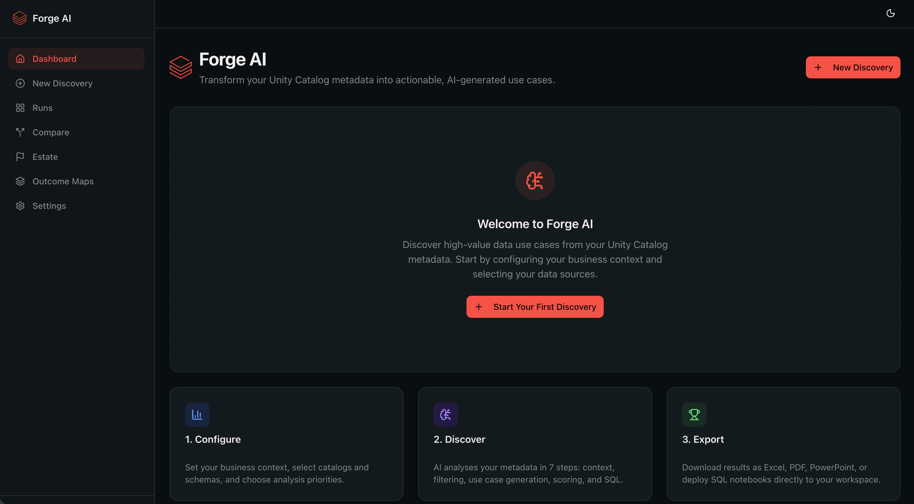

# Databricks Forge AI

> **IMPORTANT: This is NOT a Databricks product.** This project was built by the Databricks Field Engineering team as an internal accelerator. It is provided as-is under the Apache 2.0 license with no warranty, no official support, and no liability. **Status: Alpha** -- see [NOTICE](NOTICE) for full disclaimer.

**Transform your Unity Catalog metadata into actionable, AI-generated use cases.**

Databricks Forge AI is a web application deployed as a [Databricks App](https://docs.databricks.com/en/dev-tools/databricks-apps/index.html). Point it at your catalogs and schemas, and it uses LLM-powered analysis (via Databricks Model Serving) to discover, score, and export data-driven use cases -- without ever reading your actual data.

<p align="center">
  
</p>

---

## What It Does

1. **Configure** -- enter your business name, select Unity Catalog scope, and set priorities.
2. **Discover** -- a 7-step AI pipeline extracts metadata, generates use cases, clusters them into business domains, scores them, and generates runnable SQL. See [FORGE_ANALYSIS.md](FORGE_ANALYSIS.md) for the full breakdown.
3. **Export** -- download results as Excel, PowerPoint, or PDF, or deploy SQL notebooks directly to your workspace.

### Key Features

- Discovers both **AI** use cases (ai_forecast, ai_classify, ai_query, etc.) and **Statistical** use cases (anomaly detection, trend analysis, geospatial, etc.)
- Scores every use case on **priority**, **feasibility**, **impact**, and **overall value**
- Automatically clusters use cases into **business domains and subdomains**
- Deduplicates and ranks results so the highest-value opportunities surface first
- Supports **20+ languages** for generated documentation
- **Real-time status messages** during pipeline execution (e.g. "Filtering tables (batch 2 of 5)...")
- **Privacy-first**: reads only metadata by default (table/column names and schemas). Optional [data sampling](FORGE_ANALYSIS.md#data-sampling) can be enabled for improved SQL accuracy

---

## Tech Stack

| Layer | Technology |
| --- | --- |
| Frontend | Next.js 16 (App Router), React 19, shadcn/ui, Tailwind CSS 4 |
| Language | TypeScript (strict) |
| SQL Execution | Databricks SQL Statement Execution API via SQL Warehouse |
| LLM | Databricks Model Serving REST API (OpenAI-compatible chat completions) |
| Persistence | [Lakebase Autoscaling](https://docs.databricks.com/aws/en/oltp/projects/authentication) (Postgres-compatible) via Prisma ORM |
| Deployment | Databricks Apps (automatic OAuth, resource bindings) |
| Export | exceljs, pptxgenjs, Workspace REST API |

---

## Project Structure

```
databricks-forge/
  AGENTS.md                     # AI agent guidance
  app.yaml                      # Databricks App runtime config
  databricks.yml                # Databricks App manifest (bundles)
  prisma/
    schema.prisma               # Prisma schema (Lakebase tables)
  app/                          # Next.js routes + UI
    layout.tsx                  # Root layout with sidebar
    page.tsx                    # Dashboard
    configure/page.tsx          # Pipeline configuration form
    runs/page.tsx               # Runs list
    runs/[runId]/page.tsx       # Run detail + results
    api/
      runs/route.ts             # POST create / GET list
      runs/[runId]/route.ts     # GET run details
      runs/[runId]/execute/     # POST start pipeline
      metadata/route.ts         # GET Unity Catalog browser
      export/[runId]/route.ts   # GET export
      migrate/route.ts          # POST run Prisma migrations
  components/
    ui/                         # shadcn primitives
    pipeline/                   # Config form, progress, table, export
  lib/
    prisma.ts                   # Prisma client singleton (auto-provisioned or static URL)
    generated/prisma/           # Generated Prisma client (gitignored)
    dbx/                        # Databricks SQL client + Workspace API
    queries/                    # SQL text + row mappers
    domain/                     # TypeScript types + scoring
    ai/                         # Prompt templates + Model Serving client
    pipeline/                   # Engine + 6 step modules
    lakebase/                   # Prisma-based CRUD for runs + use cases
    export/                     # Excel, PPTX, PDF, notebook generators
  docs/
    ARCHITECTURE.md             # Ports-and-adapters design
    PIPELINE.md                 # Step-by-step pipeline reference
    PROMPTS.md                  # Full prompt template catalog
    DEPLOYMENT.md               # Deployment and local dev guide
    references/                 # Original Databricks notebook
```

---

## Pipeline Steps

The "Discover Usecases" pipeline runs 7 steps sequentially. The frontend polls for progress in real time.

| Step | Name | What it does | Progress |
| --- | --- | --- | --- |
| 1 | **Business Context** | Generates strategic goals, value chain, and revenue model via Model Serving | 10% |
| 2 | **Metadata Extraction** | Queries `information_schema` for tables, columns, and foreign keys | 20% |
| 3 | **Table Filtering** | Classifies tables as business-relevant vs technical via Model Serving (JSON mode) | 30% |
| 4 | **Use Case Generation** | Generates AI and statistical use cases in parallel batches via Model Serving (JSON mode) | 45% |
| 5 | **Domain Clustering** | Assigns domains and subdomains via Model Serving, merges small domains | 55% |
| 6 | **Scoring & Dedup** | Scores on priority/feasibility/impact, removes duplicates via Model Serving | 65% |
| 7 | **SQL Generation** | Generates runnable Databricks SQL per use case via Model Serving (streaming) | 95% |

Each step updates its status and a human-readable **status message** in Lakebase (e.g. "Scanning catalog main...", "Scoring domain: Customer Analytics (14 use cases)..."). The frontend polls every 3 seconds and displays the latest message alongside the progress stepper.

> For the full analysis methodology, scoring formulas, prompt engineering details, and data flow diagrams, see [FORGE_ANALYSIS.md](FORGE_ANALYSIS.md).

---

## Lakebase (Zero-Touch Auto-Provisioning)

The app persists all state (pipeline runs, use cases, exports) in [Lakebase Autoscaling](https://docs.databricks.com/aws/en/oltp/projects/authentication) -- a Postgres-compatible OLTP database managed by Databricks. The schema is managed by [Prisma ORM](https://www.prisma.io/).

### How it works

**No manual database setup is required.** When deployed as a Databricks App, the app automatically:

1. **Creates a Lakebase Autoscale project** (`databricks-forge`) on first boot using the platform-injected service principal credentials
2. **Generates short-lived OAuth DB credentials** for Postgres connections (rotated automatically every ~50 minutes)
3. **Pushes the Prisma schema** (`prisma db push`) to create all 15 tables on first deploy, and applies additive changes on subsequent deploys

There are no Databricks secrets, no password management, and no manual resource bindings for the database. The service principal that Databricks Apps injects (`DATABRICKS_CLIENT_ID` / `DATABRICKS_CLIENT_SECRET` / `DATABRICKS_HOST`) is all the app needs.

### First deploy vs subsequent deploys

| Scenario | What happens | Extra time |
| --- | --- | --- |
| **First deploy** | Creates Lakebase project, waits for it to be ready, creates all tables | ~30-60s |
| **Subsequent deploys** | Detects existing project, skips creation, syncs schema (no-op if unchanged) | ~1-2s |
| **After idle (scale-to-zero)** | Compute wakes automatically on first connection | ~200ms |

### Redeployments are safe

`prisma db push` is idempotent: if the tables already exist and match the schema, it does nothing. If new tables or columns were added to the Prisma schema, it creates them. It never drops existing tables or columns.

### Schema migration (automatic)

The database schema is pushed **automatically** every time the server starts. The startup script (`scripts/start.sh`) runs `prisma db push` before launching Next.js, creating tables on first deploy and applying additive changes on subsequent deploys.

If you ever need to push the schema manually (e.g. during local development):

```bash
DATABASE_URL="postgresql://..." npx prisma db push
```

---

## Quick Start (Local Development)

### Prerequisites

- **Node.js 18+**
- A **Databricks workspace** with:
  - A running **SQL Warehouse** (Serverless or Pro)
  - Access to **Unity Catalog** metadata you want to analyse
  - A **Model Serving endpoint** (e.g. `databricks-claude-sonnet-4-5`) with pay-per-token enabled
- A **Databricks Personal Access Token (PAT)**
- A **Lakebase Autoscaling** project (for local dev -- see [Lakebase setup](#lakebase-zero-touch-auto-provisioning); when deployed as a Databricks App this is created automatically)

### 1. Clone and install

```bash
git clone <repo-url> databricks-forge
cd databricks-forge
npm install
```

### 2. Configure environment

Create a `.env` file:

```env
# Lakebase connection (local dev only — auto-provisioned when deployed as a Databricks App)
DATABASE_URL="postgresql://<user>:<password>@<host>/databricks_postgres?sslmode=require"

# Databricks workspace (for SQL Warehouse + Model Serving)
DATABRICKS_HOST=https://your-workspace.cloud.databricks.com
DATABRICKS_TOKEN=dapi_your_personal_access_token
DATABRICKS_WAREHOUSE_ID=abc123def456
DATABRICKS_SERVING_ENDPOINT=databricks-claude-sonnet-4-5
```

| Variable | Where to find it |
| --- | --- |
| `DATABASE_URL` | Your Lakebase connection string (local dev only; auto-provisioned when deployed) |
| `DATABRICKS_HOST` | Your workspace URL |
| `DATABRICKS_TOKEN` | User Settings > Developer > Access Tokens > Generate New Token |
| `DATABRICKS_WAREHOUSE_ID` | SQL Warehouses > click your warehouse > Connection Details |
| `DATABRICKS_SERVING_ENDPOINT` | The Model Serving endpoint name (e.g. `databricks-claude-sonnet-4-5`) |

### 3. Generate Prisma client

```bash
npx prisma generate
```

> Schema is pushed automatically when the server starts (`npm run dev` or `npm start`). No manual `prisma db push` needed.

### 4. Run the app

```bash
npm run dev
```

Open [http://localhost:3000](http://localhost:3000) and click **Start New Discovery**.

---

## Deployment (Databricks Apps)

Databricks Apps runs your web application inside the workspace with **automatic OAuth authentication** and resource bindings. No PAT tokens or manual credential management required.

This section is a **complete, copy-paste guide** from zero to a running app. Follow every step in order.

---

### Prerequisites

Before you start, ensure you have:

- [ ] **Databricks CLI v0.200+** installed and authenticated against your target workspace
- [ ] **A Databricks workspace** with Unity Catalog enabled
- [ ] **A SQL Warehouse** (Serverless or Pro) running in that workspace
- [ ] **A Model Serving endpoint** (e.g. `databricks-claude-sonnet-4-5`) with pay-per-token enabled
- [ ] **Workspace previews enabled**: Both **Databricks Apps - On-Behalf-Of User Authorization** and **Databricks Apps - Install Apps from Git** must be turned on in your workspace Admin Settings under Previews

> **Lakebase is auto-provisioned.** The app creates its own Lakebase Autoscale project on first boot -- no manual database setup, no secret scopes, no resource bindings for the database.

<p align="center">
  
</p>

Verify your CLI is authenticated:

```bash
databricks auth describe
# Should show your workspace URL and authentication method
```

---

### Step 1: Create the Databricks App

In the Databricks workspace, navigate to **Compute > Apps** and click **Create app**. Choose **Create a custom app from scratch**, then configure the Git repository in step 2 of the wizard.

<p align="center">
  
</p>

You can also create the app via CLI:

```bash
databricks apps create databricks-forge \
  --description "Discover AI-powered use cases from Unity Catalog metadata"
```

> If the app already exists, skip this step.

---

### Step 2: Configure app resources

The app requires two Databricks resource bindings. These are configured in the **Databricks App UI** or via the CLI. The database (Lakebase) is auto-provisioned at startup -- no binding needed.

#### Option A: Configure via the App UI

Navigate to **Workspace > Apps > databricks-forge > Configure** and add:

| # | Resource type | Resource key | Configuration |
| --- | --- | --- | --- |
| 1 | **SQL Warehouse** | `sql-warehouse` | Select your warehouse. Permission: **Can use** |
| 2 | **Serving Endpoint** | `serving-endpoint` | Select your Model Serving endpoint. Permission: **Can query** |

<p align="center">
  
</p>

#### Option B: Configure via CLI

If you prefer to script everything:

```bash
# Bind the SQL Warehouse
databricks apps update-resources databricks-forge \
  --resource-name sql-warehouse \
  --resource-type sql_warehouse \
  --resource-id <YOUR_WAREHOUSE_ID>

# Bind the Model Serving endpoint
databricks apps update-resources databricks-forge \
  --resource-name serving-endpoint \
  --resource-type serving_endpoint \
  --resource-id <YOUR_SERVING_ENDPOINT_NAME>
```

---

### Step 2b: Configure User Authorization scopes

If **On-Behalf-Of User Authorization** is enabled (recommended), configure the API scopes the app needs to act on behalf of users. In the app's Configure page, under **User authorization**, add these scopes:

| Scope | Description |
| --- | --- |
| `sql` | Execute SQL and manage SQL resources |
| `files.files` | Manage files and directories (for notebook export) |
| `catalog.tables:read` | Read tables in Unity Catalog |
| `catalog.schemas:read` | Read schemas in Unity Catalog |
| `catalog.catalogs:read` | Read catalogs in Unity Catalog |

<p align="center">
  
</p>

---

### Step 3: Deploy the app

Deploy from the app details page by clicking **Deploy**, selecting **From Git**, and entering your branch (e.g. `main`).

The platform will:

1. **Install dependencies** -- runs `npm install`
2. **Build** -- runs `npm run build` (generates the Prisma client, builds the Next.js standalone server, and copies static assets)
3. **Inject** environment variables from resource bindings (see table below)
4. **Start** the app using `scripts/start.sh` (from `app.yaml`), which:
   - **Auto-provisions Lakebase** -- creates the `databricks-forge` project on first deploy (skipped on subsequent deploys)
   - Runs `prisma db push` automatically (creates all tables on first deploy, applies additive schema changes on subsequent deploys)
   - Starts the Next.js standalone server on port 8000

> First deploy takes 3-5 minutes. Subsequent deploys are faster.

Monitor the deployment:

```bash
# Check deployment status
databricks apps get databricks-forge

# Stream logs
databricks apps logs databricks-forge --follow
```

---

### Step 4: Verify the deployment

```bash
# Get the app URL
databricks apps get databricks-forge --output json | jq -r '.url'
```

Open the URL in your browser. You should see the Forge AI dashboard.

You can also hit the health endpoint:

```bash
APP_URL=$(databricks apps get databricks-forge --output json | jq -r '.url')
curl -s "$APP_URL/api/health" | jq .
```

A healthy response shows connectivity to both the SQL Warehouse and Lakebase:

```json
{
  "status": "healthy",
  "warehouse": "connected",
  "database": "connected"
}
```

---

### How it all fits together

The app uses two config files that map resources to environment variables:

**`databricks.yml`** (bundle manifest -- declares the app and its resource types):

```yaml
apps:
  databricks-forge:
    resources:
      - name: sql-warehouse        # → DATABRICKS_WAREHOUSE_ID
        type: sql_warehouse
      - name: serving-endpoint     # → DATABRICKS_SERVING_ENDPOINT
        type: serving_endpoint
```

**`app.yaml`** (runtime config -- startup command + env var mappings):

```yaml
command:
  - "sh"
  - "scripts/start.sh"           # auto-provisions Lakebase, runs prisma db push, then starts Next.js

env:
  - name: DATABRICKS_WAREHOUSE_ID
    valueFrom: sql-warehouse
  - name: DATABRICKS_SERVING_ENDPOINT
    valueFrom: serving-endpoint
```

### Environment variables at runtime

| Variable | Source | How it's set |
| --- | --- | --- |
| `DATABRICKS_HOST` | Workspace URL | Auto-injected by Databricks Apps platform |
| `DATABRICKS_CLIENT_ID` | Service principal OAuth client ID | Auto-injected by Databricks Apps platform |
| `DATABRICKS_CLIENT_SECRET` | Service principal OAuth client secret | Auto-injected by Databricks Apps platform |
| `DATABRICKS_WAREHOUSE_ID` | SQL Warehouse ID | From `sql-warehouse` resource binding |
| `DATABRICKS_SERVING_ENDPOINT` | Model Serving endpoint name | From `serving-endpoint` resource binding |
| `DATABASE_URL` | Lakebase connection string | Auto-generated at startup by `scripts/provision-lakebase.mjs` |

> `DATABRICKS_HOST`, `DATABRICKS_CLIENT_ID`, and `DATABRICKS_CLIENT_SECRET` are injected automatically by the Databricks Apps runtime. You never need to set these manually. `DATABASE_URL` is generated dynamically -- no secrets needed.

---

### Permissions summary

The app uses **two complementary auth models** ([docs](https://docs.databricks.com/aws/en/dev-tools/databricks-apps/auth)):

**User authorization (OBO)** -- the logged-in user's identity and UC permissions apply:

| API | Scope required | What runs as the user |
| --- | --- | --- |
| SQL Statement Execution | `sql` | All metadata queries, generated SQL, health check |
| Workspace REST API | `files.files` | Notebook export to `/Workspace/Users/<email>/` |
| Unity Catalog metadata | `catalog.catalogs:read`, `catalog.schemas:read`, `catalog.tables:read` | `SHOW CATALOGS/SCHEMAS/TABLES`, `information_schema` |

**App authorization (service principal)** -- the app's own identity for shared/background operations:

| Resource | Permission | What runs as the SP |
| --- | --- | --- |
| SQL Warehouse | **Can use** | Background pipeline tasks (SP fallback when no user context) |
| Model Serving endpoint | **Can query** | All LLM inference requests (chat completions) |
| Unity Catalog (catalogs/schemas) | **USE CATALOG / USE SCHEMA / SELECT** | Background metadata queries (SP fallback) |
| `system.access.table_lineage` | **SELECT** | Lineage graph walking |
| Genie Spaces | **Can manage** | Create, update, and trash Genie Spaces |

Grant Unity Catalog permissions to the app's service principal:

```sql
-- Replace <service_principal_name> with your app's service principal
-- Replace <catalog> with each catalog the app should discover

GRANT USE CATALOG ON CATALOG <catalog> TO `<service_principal_name>`;
GRANT USE SCHEMA ON CATALOG <catalog> TO `<service_principal_name>`;
GRANT SELECT ON CATALOG <catalog> TO `<service_principal_name>`;

-- Lineage access (required for lineage-based discovery)
GRANT USE SCHEMA ON SCHEMA system.access TO `<service_principal_name>`;
GRANT SELECT ON TABLE system.access.table_lineage TO `<service_principal_name>`;
```

> **Tip:** To find the service principal name, check the app's settings in the Databricks App UI, or run: `databricks apps get databricks-forge --output json | jq '.service_principal'`

---

### Updating the app

After making code changes, push to your Git repository and click **Deploy** from the app details page. Select **From Git** and enter your branch or tag.

Schema changes in `prisma/schema.prisma` are applied automatically on the next startup -- no manual migration step required.

---

### Troubleshooting

| Symptom | Cause | Fix |
| --- | --- | --- |
| "DATABASE_URL is not set and Lakebase auto-provisioning is not available" | Running locally without `.env` | Set `DATABASE_URL` in `.env` for local dev |
| "Lakebase provisioning returned empty URL" | SP lacks permission to create Lakebase projects | Ensure the app's service principal can manage Lakebase resources |
| "Create project failed (403)" | Lakebase Autoscale not available in region | Check [supported regions](https://docs.databricks.com/aws/en/oltp/projects/authentication); fall back to manual `DATABASE_URL` |
| Schema push fails at startup | Lakebase compute still waking from scale-to-zero | Restart the app -- compute wakes automatically and retries succeed |
| "Failed to connect to warehouse" | Warehouse binding missing or stopped | Verify `sql-warehouse` resource is configured and warehouse is running |
| "Model serving request failed" | Serving endpoint binding missing | Verify `serving-endpoint` resource is configured (Step 2) |
| "USE CATALOG denied" on discovery | User or SP lacks UC grants | With OBO auth, the logged-in user needs `USE CATALOG` / `USE SCHEMA` / `SELECT`. The SP needs the same grants as a fallback for background tasks. |
| Lineage discovery returns 0 tables | Missing lineage permissions | Grant `SELECT` on `system.access.table_lineage` to the user and/or SP |

View logs for detailed error messages:

```bash
databricks apps logs databricks-forge --follow
```

---

### Complete deployment checklist

```
[ ] 1. Databricks CLI installed and authenticated
[ ] 2. Workspace previews enabled (Apps OBO User Auth + Apps Install from Git)
[ ] 3. App created: databricks apps create databricks-forge
[ ] 4. SQL Warehouse resource bound (key: sql-warehouse, permission: Can use)
[ ] 5. Serving Endpoint resource bound (key: serving-endpoint, permission: Can query)
[ ] 6. User authorization scopes added: sql, files.files, catalog.catalogs:read,
       catalog.schemas:read, catalog.tables:read
[ ] 7. UC grants applied to the app's service principal
[ ] 8. Deployed from Git: click Deploy > From Git > enter branch (e.g. main)
[ ] 9. Health check passes: curl <app-url>/api/health
```

> Lakebase is auto-provisioned on first deploy -- no manual database, role, secret, or resource binding steps needed.

---

## API Reference

All API routes are server-side only. The frontend calls them via `fetch()`.

| Method | Route | Description |
| --- | --- | --- |
| `POST` | `/api/runs` | Create a new pipeline run |
| `GET` | `/api/runs` | List all runs (supports `?limit=` and `?offset=`) |
| `GET` | `/api/runs/[runId]` | Get run status, config, and use cases (if completed) |
| `POST` | `/api/runs/[runId]/execute` | Start pipeline execution asynchronously |
| `GET` | `/api/metadata?type=catalogs` | List Unity Catalog catalogs |
| `GET` | `/api/metadata?type=schemas&catalog=X` | List schemas in a catalog |
| `GET` | `/api/metadata?type=tables&catalog=X&schema=Y` | List tables |
| `GET` | `/api/export/[runId]?format=excel` | Download Excel workbook |
| `GET` | `/api/export/[runId]?format=pptx` | Download PowerPoint deck |
| `GET` | `/api/export/[runId]?format=pdf` | Download PDF catalog (JSON for now) |
| `GET` | `/api/export/[runId]?format=notebooks` | Deploy SQL notebooks to workspace |
| `POST` | `/api/migrate` | Trigger Prisma schema sync |

---

## Export Formats

| Format | Library | What you get |
| --- | --- | --- |
| **Excel** | exceljs | 3-sheet workbook: Summary, Use Cases (filterable), Domains |
| **PowerPoint** | pptxgenjs | Title slide, executive summary, domain breakdown, top 10 use cases |
| **PDF** | pdfkit | Databricks-branded A4 landscape report with cover page, executive summary, domain breakdown, and individual use case pages |
| **Notebooks** | Workspace REST API | One SQL notebook per use case, organised by domain, deployed to the user's workspace folder (via OBO auth) |

---

## Configuration Options

These map to the form fields on the `/configure` page:

| Field | Required | Default | Description |
| --- | --- | --- | --- |
| **Business Name** | Yes | -- | Organisation or project name |
| **UC Metadata** | Yes | -- | Unity Catalog scope: `catalog`, `catalog.schema`, or comma-separated list |
| **Business Priorities** | No | Increase Revenue | Multi-select from 10 predefined priorities |
| **Strategic Goals** | No | Auto-generated | Custom goals for scoring alignment |
| **Business Domains** | No | Auto-detected | Focus domains (e.g. "Risk, Finance, Marketing") |
| **AI Model** | No | databricks-claude-opus-4-6 | Model Serving endpoint for LLM calls (chat completions) |
| **Languages** | No | English | Target languages for generated documentation |

---

## Lakebase Schema (Prisma)

All app state is stored in 15 tables in the Lakebase `public` schema, managed by Prisma.

| Table | Purpose |
| --- | --- |
| `forge_runs` | Pipeline execution records (config, status, progress, business context) |
| `forge_use_cases` | Generated use cases (scores, domain, SQL, tables involved) |
| `forge_metadata_cache` | Cached UC metadata snapshots |
| `forge_exports` | Export history (format, path, timestamp) |
| `forge_prompt_logs` | LLM prompt/response audit trail |
| `forge_activity_log` | User activity feed |
| `forge_outcome_maps` | Industry outcome map definitions |
| `forge_genie_recommendations` | Generated Genie Space recommendations per domain |
| `forge_genie_engine_configs` | Genie Engine config versions per run |
| `forge_genie_spaces` | Tracked deployed Genie Spaces |
| `forge_environment_scans` | Estate scan records (scope, counts, aggregate scores) |
| `forge_table_details` | Per-table metadata + LLM enrichments from estate scans |
| `forge_table_history_summaries` | Delta table history insights |
| `forge_table_lineage` | Data lineage edges |
| `forge_table_insights` | Health scores, issues, and recommendations per table |

Schema is defined in `prisma/schema.prisma`. To update:

```bash
# Edit prisma/schema.prisma, then:
npx prisma generate  # regenerate the TypeScript client
# Schema is pushed automatically on next server start
```

See [docs/ARCHITECTURE.md](docs/ARCHITECTURE.md) for full column definitions.

---

## Development

### Available scripts

```bash
npm run dev      # Start development server (Turbopack)
npm run build    # Production build
npm run start    # Start production server
npm run lint     # Run ESLint
```

### Prisma commands

```bash
npx prisma generate    # Regenerate client after schema changes
npx prisma db push     # Push schema manually (auto-runs at startup)
npx prisma studio      # Open Prisma Studio (visual DB browser)
```

### Architecture

The app follows a **ports-and-adapters** pattern. See [docs/ARCHITECTURE.md](docs/ARCHITECTURE.md) for the full design, including:

- Layer responsibilities (`lib/dbx`, `lib/queries`, `lib/domain`, `lib/ai`, `lib/pipeline`, `lib/lakebase`, `lib/export`)
- Lakebase table schemas with column definitions
- Data flow from configuration to export
- Auth model for Databricks Apps vs local dev

### Pipeline reference

See [docs/PIPELINE.md](docs/PIPELINE.md) for detailed documentation of each pipeline step, including inputs, prompts used, expected outputs, and error handling strategies.

### Prompt templates

See [docs/PROMPTS.md](docs/PROMPTS.md) for a catalog of all 17+ prompt templates, their variables, output formats, and which pipeline step uses them.

### Adding shadcn components

```bash
npx shadcn@latest add <component-name>
```

---

## Privacy

By default, Forge reads **metadata only** -- schema names, table names, column names, data types, and comments. All LLM prompts contain only structural metadata.

When **Data Sampling** is enabled in Settings, the app reads a configurable number of rows (5-50) per table during SQL generation. Sampled data is sent to the AI model to improve SQL accuracy but is **not persisted** -- it exists only in memory during the generation step. See [FORGE_ANALYSIS.md - Privacy Model](FORGE_ANALYSIS.md#privacy-model) for the full breakdown.

---

## Further Documentation

| Document | Description |
| --- | --- |
| [docs/USER_GUIDE.md](docs/USER_GUIDE.md) | **User guide** -- step-by-step walkthrough of every feature with screenshots |
| [SECURITY_ARCHITECTURE.md](SECURITY_ARCHITECTURE.md) | **Security architecture** -- data flows, threat mitigations, auth model, compliance posture |
| [FORGE_ANALYSIS.md](FORGE_ANALYSIS.md) | **Comprehensive analysis guide** -- pipeline logic, scoring methodology, prompt engineering, data flow diagrams |
| [AGENTS.md](AGENTS.md) | AI agent guidance (folder contract, domain types, constraints) |
| [docs/ARCHITECTURE.md](docs/ARCHITECTURE.md) | System architecture and Lakebase schema |
| [docs/PIPELINE.md](docs/PIPELINE.md) | Pipeline step reference |
| [docs/PROMPTS.md](docs/PROMPTS.md) | Prompt template catalog |
| [docs/GENIE_ENGINE.md](docs/GENIE_ENGINE.md) | Genie Engine architecture, configuration, and best practices |
| [docs/DEPLOYMENT.md](docs/DEPLOYMENT.md) | Deployment and local dev guide |

---

## Disclaimer

**This project is NOT an official Databricks product, feature, or service.** It was developed by the Databricks Field Engineering team as an internal accelerator and is shared as-is for informational and experimental purposes.

- **Status**: Alpha -- incomplete, likely contains bugs, may change or be discontinued without notice
- **No warranty**: Provided "AS IS" without warranties of any kind
- **No support**: No official support, SLAs, or maintenance commitments from Databricks
- **No liability**: Databricks and its contributors accept no liability for any damages or consequences arising from use
- **Not reviewed**: This software has NOT been reviewed or approved by Databricks product, security, or legal teams for production use

**Use at your own risk.** You are solely responsible for evaluating fitness for your use case, testing, and ensuring compliance with your organisation's policies. See [NOTICE](NOTICE) for full details.

---

## License

Licensed under the [Apache License 2.0](LICENSE).

```
Copyright 2024-2026 Databricks, Inc.

Licensed under the Apache License, Version 2.0 (the "License");
you may not use this file except in compliance with the License.
You may obtain a copy of the License at

    http://www.apache.org/licenses/LICENSE-2.0

Unless required by applicable law or agreed to in writing, software
distributed under the License is distributed on an "AS IS" BASIS,
WITHOUT WARRANTIES OR CONDITIONS OF ANY KIND, either express or implied.
See the License for the specific language governing permissions and
limitations under the License.
```
