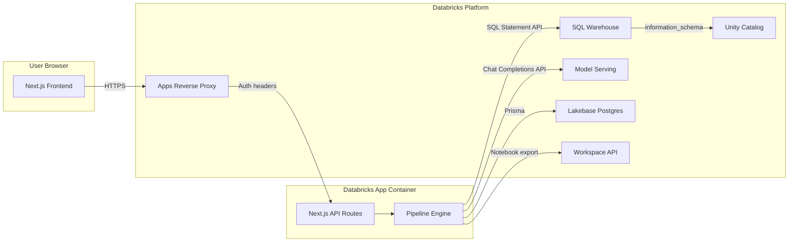
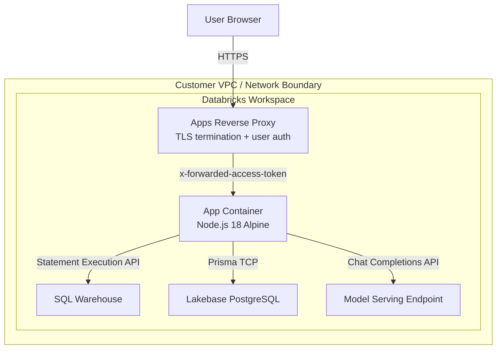
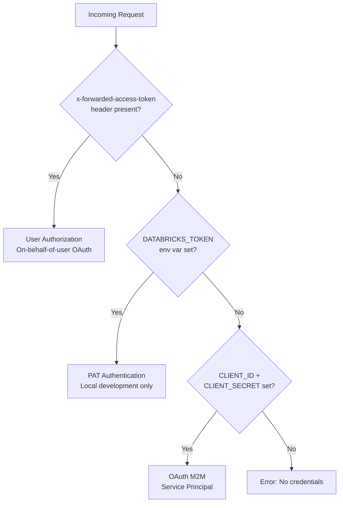
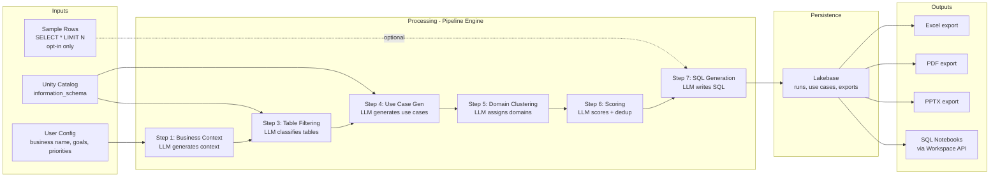
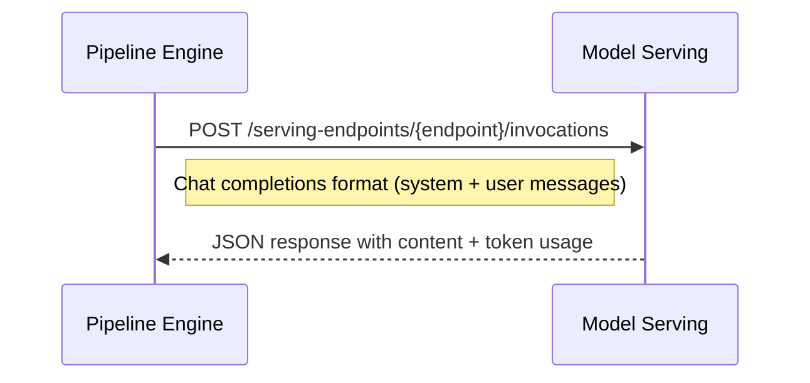
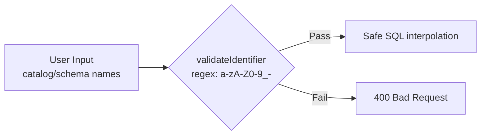
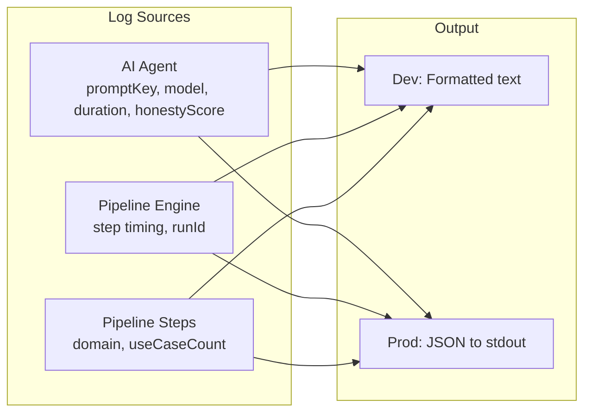
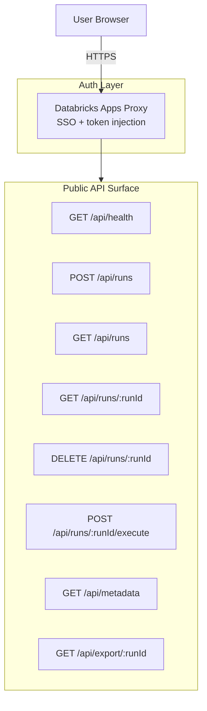

# Security Architecture -- Databricks Forge AI

> This document describes the security architecture, data flows, threat
> mitigations, and compliance posture of Databricks Forge AI. It is
> intended for security reviewers, architects, and compliance teams
> evaluating the application prior to deployment.

---

## Table of Contents

1. [Application Overview](#1-application-overview)
2. [Deployment Model](#2-deployment-model)
3. [Authentication and Authorization](#3-authentication-and-authorization)
4. [Network Architecture](#4-network-architecture)
5. [Data Classification and Flow](#5-data-classification-and-flow)
6. [LLM Security (Prompt Injection and AI Safety)](#6-llm-security-prompt-injection-and-ai-safety)
7. [Input Validation and Injection Prevention](#7-input-validation-and-injection-prevention)
8. [Secret Management](#8-secret-management)
9. [HTTP Security Headers](#9-http-security-headers)
10. [Error Handling and Information Leakage](#10-error-handling-and-information-leakage)
11. [Logging and Auditability](#11-logging-and-auditability)
12. [Resilience and Timeout Protection](#12-resilience-and-timeout-protection)
13. [Container and Build Security](#13-container-and-build-security)
14. [API Surface and Threat Model](#14-api-surface-and-threat-model)
15. [Data Privacy and GDPR Considerations](#15-data-privacy-and-gdpr-considerations)
16. [Known Limitations and Recommendations](#16-known-limitations-and-recommendations)

---

## 1. Application Overview

Databricks Forge AI is a web application that discovers data-driven
use cases from Unity Catalog metadata. Users configure a business context,
point at their Unity Catalog catalogs/schemas, and the application generates
scored, categorised use cases with optional SQL code.

**Key architectural principle:** The application reads **only metadata**
(table names, column names, data types, foreign keys) from Unity Catalog.
No row-level business data is accessed in the default configuration.
An optional "sample data" feature can be enabled per-run, which is
documented separately below.



---

## 2. Deployment Model

The application is designed exclusively for deployment as a **Databricks App**,
running inside the customer's Databricks workspace boundary.



| Property | Value |
|----------|-------|
| **Runtime** | Node.js 18 (Alpine Linux) |
| **Framework** | Next.js 16 (standalone output) |
| **Orchestration** | Databricks Apps (managed container) |
| **Network egress** | None -- all APIs are workspace-internal |
| **Public internet access** | Not required by the application |
| **Scaling** | Single-instance (Databricks Apps default) |

### Resource Bindings (`app.yaml`)

```yaml
env:
  - name: DATABRICKS_WAREHOUSE_ID
    valueFrom: sql-warehouse          # Bound SQL Warehouse resource
  - name: DATABRICKS_SERVING_ENDPOINT
    valueFrom: serving-endpoint       # Bound Model Serving endpoint
```

### User Authorization Scopes

The app uses on-behalf-of (OBO) user authorization for SQL queries and
(optionally) Genie Space management. Configure these scopes in the
Databricks App UI (**Configure** → **+Add Scope**):

| Scope | Purpose |
|-------|---------|
| `sql` | SQL Statement Execution API (metadata queries, generated SQL, health check) |
| `catalog.tables:read` | Read tables in Unity Catalog |
| `catalog.schemas:read` | Read schemas in Unity Catalog |
| `catalog.catalogs:read` | Read catalogs in Unity Catalog |
| `files.files` | Manage files and directories (notebook export) |
| `dashboards.genie` | Manage Genie Spaces (create, update, trash) |
| `iam.access-control:read` | (default -- auto-included) Access control resolution |
| `iam.current-user:read` | (default -- auto-included) User identity from proxy headers |

Model Serving and Workspace APIs use app authorization (service principal).
Genie Space management defaults to user OBO auth (so the user's UC permissions
apply to referenced tables) but can be switched to service principal in
**Settings > Genie Engine > Deploy Authentication**.

The `DATABRICKS_HOST`, `DATABRICKS_CLIENT_ID`, and `DATABRICKS_CLIENT_SECRET`
are automatically injected by the Databricks Apps runtime. Runtime Lakebase
access uses short-lived OAuth DB credentials plus startup-generated endpoint
metadata (`LAKEBASE_ENDPOINT_NAME`, `LAKEBASE_POOLER_HOST`, `LAKEBASE_USERNAME`)
from `scripts/provision-lakebase.mjs` -- no static runtime DB secrets or
manual bindings needed.
No credentials are hardcoded or bundled with the application image.

---

## 3. Authentication and Authorization

### Authentication Modes (Priority Order)



| Mode | When Used | UC Permissions |
|------|-----------|----------------|
| **User authorization** | Databricks App with user-auth scopes | Follow the logged-in user |
| **PAT** | Local development (`DATABRICKS_TOKEN`) | Follow the token owner |
| **OAuth M2M** | Service principal fallback / background tasks | Follow the service principal |

### User Identity Resolution

| Header | Purpose |
|--------|---------|
| `x-forwarded-access-token` | User's OAuth access token (injected by Apps proxy) |
| `x-forwarded-email` | User's email address |
| `x-forwarded-preferred-username` | Fallback username |

### Authorization Model

The application **does not implement its own authorization layer**. Access
control is fully delegated to the Databricks platform:

- **Unity Catalog permissions**: Metadata queries run as the authenticated user
  (or service principal). The user can only see catalogs, schemas, and tables
  they have `USE` or `SELECT` permissions on.
- **SQL Warehouse access**: The user must have `CAN USE` on the bound SQL Warehouse.
- **Workspace access**: Notebook export uses the logged-in user's OBO token
  (`getHeaders` with `files.files` scope) so notebooks are created under the
  user's identity and ownership. Falls back to service principal when no
  request context is available.
- **Model Serving**: LLM inference uses service principal credentials
  (`getAppHeaders`) because these operations are performed by the app.
- **Genie Space management**: Defaults to user OBO auth (`getHeaders` with
  `dashboards.genie` scope) so spaces are created under the user's identity
  and inherit their UC table permissions. Can be switched to service principal
  in Settings. The auth mode used to create each space is persisted and reused
  for subsequent updates and deletions.
- **Lakebase**: Application-level data (runs, use cases) is accessible to all
  authenticated users of the app. There is no per-user row-level isolation on
  pipeline runs.

### Session Management

The application is **stateless**. There are no sessions, cookies, or
server-side session stores. Each request is authenticated independently
via the forwarded token or environment credentials.

### OAuth Token Caching

Service principal OAuth tokens are cached in-memory with a 60-second
expiry buffer. The cache is process-local and not shared across instances.

---

## 4. Network Architecture

### External Connections

| Destination | Protocol | Port | Purpose |
|-------------|----------|------|---------|
| SQL Warehouse | HTTPS | 443 | Metadata queries, generated SQL execution |
| Model Serving | HTTPS | 443 | LLM inference (chat completions API) |
| Lakebase | TLS/TCP | 5432 | Pipeline run persistence (Prisma ORM) |
| Workspace API | HTTPS | 443 | Notebook export only |
| OIDC endpoint | HTTPS | 443 | OAuth M2M token exchange |

All connections remain **within the Databricks workspace boundary**. The
application makes zero calls to public internet endpoints.

### TLS

- All Databricks API calls use HTTPS (TLS 1.2+).
- TLS termination for inbound traffic is handled by the Databricks Apps
  reverse proxy.
- Lakebase connections use TLS via runtime-generated Postgres URLs.

---

## 5. Data Classification and Flow

### Data Classification

| Data Category | Classification | Examples |
|---------------|---------------|----------|
| **User configuration** | Internal | Business name, strategic goals, priorities |
| **UC metadata** | Internal / Confidential | Table names, column names, data types, FKs |
| **LLM-generated content** | Internal | Business context, use cases, SQL code |
| **Sample row data** (opt-in) | Confidential / Restricted | Actual table values (truncated to 60 chars) |

### Data Flow Diagram



### What Data is Sent to the LLM?

| Pipeline Step | Data Sent | Contains Row Data? |
|---------------|-----------|-------------------|
| Business Context | Business name, industry | No |
| Table Filtering | Table FQNs, types, comments + business context | No |
| Use Case Generation | Schema markdown (table/column names, types) + FK relationships | No |
| Domain Clustering | Use case names, statements (LLM-generated) | No |
| Scoring | Use case summaries (LLM-generated) | No |
| SQL Generation | Schema markdown + FK relationships + **sample rows (if enabled)** | **Only if opt-in** |
| SQL Fix | Original SQL + error message + schema | No |

### Sample Data Feature (Opt-in)

When `sampleRowsPerTable > 0` (configurable in Settings, range 0-50):

- `SELECT * FROM <table> LIMIT N` is executed for each table referenced by a
  use case during SQL generation.
- Values are truncated to 60 characters.
- Sample data is formatted as markdown and injected into the SQL-generation
  prompt only.
- **Sample data is NOT persisted** -- it exists only in-memory during the
  generation step and is discarded after the LLM call.
- **Sample data is NOT exported** -- it does not appear in Excel, PDF, PPTX,
  or notebook outputs.

### Data Retention

| Data | Storage | Retention |
|------|---------|-----------|
| Pipeline runs | Lakebase (forge_runs) | Until user deletes via UI |
| Use cases | Lakebase (forge_use_cases) | Cascade-deleted with run |
| Export records | Lakebase (forge_exports) | Cascade-deleted with run |
| Exported files (Excel/PDF/PPTX) | In-memory only | Not persisted on disk |
| Exported notebooks | Databricks Workspace | Governed by Workspace retention |

---

## 6. LLM Security (Prompt Injection and AI Safety)

### LLM Execution Model

All LLM calls are executed via direct REST calls to the Databricks Model
Serving chat completions API (`/serving-endpoints/{endpoint}/invocations`).
The application does **not** call external LLM APIs (OpenAI, Anthropic, etc.)
directly. The model endpoint is workspace-internal. The SQL Warehouse is used
only for metadata queries and generated SQL execution -- not for LLM inference.



### Prompt Injection Mitigations

| Control | Implementation |
|---------|----------------|
| **Delimiter wrapping** | User-supplied text is wrapped in `---BEGIN USER DATA---` / `---END USER DATA---` markers before injection into prompts |
| **Marker stripping** | Existing delimiter markers in user input are stripped to prevent delimiter escape attacks |
| **User variable identification** | A whitelist (`USER_INPUT_VARIABLES`) identifies which template variables contain user input and require sanitisation |
| **System/user separation** | Prompts use chat completions format with separate system and user messages, providing structural isolation between instructions and user data |
| **JSON mode** | Most pipeline steps use `response_format: json_object` which constrains LLM output to valid JSON, reducing attack surface |
| **Output validation** | LLM JSON outputs are parsed and validated with Zod schemas before use; malformed items are dropped |
| **Structured output formats** | Prompts request specific JSON array output formats, reducing free-text attack surface |

### Honesty Score Monitoring

Each LLM response that includes an honesty check is scored (0.0-1.0). The
agent logs a warning when the score falls below 0.3, indicating the LLM may
be uncertain about output quality. This provides a signal for detecting
adversarial or low-quality responses.

### AI Model Governance

- The model endpoint is configured per-run (`aiModel` field).
- The endpoint must be a Databricks Model Serving endpoint accessible from
  the workspace.
- Model selection is restricted to endpoints the service principal or user
  has `CAN QUERY` permissions on.

---

## 7. Input Validation and Injection Prevention

### SQL Injection Prevention



| Control | Detail |
|---------|--------|
| **Identifier validation** | All catalog/schema names pass through `validateIdentifier()` which enforces `/^[a-zA-Z0-9_\-]+$/` |
| **Length limits** | Identifiers capped at 255 characters |
| **UUID validation** | All `runId` parameters validated against UUID regex before database queries |
| **Zod schemas** | API request bodies validated with Zod: `CreateRunSchema` (field lengths, types, ranges), `MetadataQuerySchema` (enum types) |
| **Safe body parsing** | `safeParseBody()` wraps JSON parse + Zod validation, returning structured errors |

### Validation by Route

| Route | Validation Applied |
|-------|-------------------|
| `POST /api/runs` | `CreateRunSchema` (Zod), field length limits |
| `GET /api/runs` | `limit` (1-200), `offset` (>=0) |
| `GET /api/runs/[runId]` | `isValidUUID(runId)` |
| `DELETE /api/runs/[runId]` | `isValidUUID(runId)` |
| `POST /api/runs/[runId]/execute` | `isValidUUID(runId)` |
| `GET /api/metadata` | `validateIdentifier()` for catalog/schema |
| `GET /api/health` | No user input |

### LLM Output Validation

All LLM responses are validated before use:

| Output Type | Validation |
|-------------|------------|
| Business context JSON | `parseJSONResponse()` with try/catch fallback to defaults |
| Score items | `ScoreItemSchema` (Zod) -- validates no, priority_score, feasibility_score, impact_score, overall_score |
| Dedup items | `DedupItemSchema` (Zod) -- validates no, action, reason |
| Domain assignments | `DomainAssignmentSchema` (Zod) -- validates no, domain |
| Subdomain assignments | `SubdomainAssignmentSchema` (Zod) -- validates no, subdomain |
| Calibration items | `CalibrationItemSchema` (Zod) -- validates no, overall_score |
| Cross-domain dedup | `CrossDomainDedupItemSchema` (Zod) -- validates no, duplicate_of, reason |
| SQL output | Structural validation (keyword check, table reference check, column existence check) |
| CSV responses | Column count tolerance (+-2), try/catch with empty fallback |

Invalid items are logged and dropped; they do not crash the pipeline.

---

## 8. Secret Management

### Secrets Inventory

| Secret | Source | Scope |
|--------|--------|-------|
| `DATABRICKS_HOST` | Databricks Apps runtime | Platform-injected |
| `DATABRICKS_CLIENT_ID` | Databricks Apps runtime | Platform-injected |
| `DATABRICKS_CLIENT_SECRET` | Databricks Apps runtime | Platform-injected |
| `DATABRICKS_WAREHOUSE_ID` | `app.yaml` resource binding | Platform-injected |
| `LAKEBASE_ENDPOINT_NAME` | Auto-generated at startup | Lakebase endpoint resource name |
| `LAKEBASE_POOLER_HOST` | Auto-generated at startup | Lakebase runtime pooler host |
| `LAKEBASE_USERNAME` | Auto-generated at startup | Lakebase runtime username |
| `DATABASE_URL` | `.env.local` (local dev only) | Local fallback connection string |
| `DATABRICKS_TOKEN` | `.env.local` (local dev only) | Developer machine |

### Controls

| Control | Implementation |
|---------|----------------|
| **No hardcoded secrets** | All credentials from environment variables |
| **gitignore** | `.env*` files excluded (except `.env.local.example`) |
| **No secrets in Docker image** | Multi-stage build; env vars provided at runtime |
| **Token caching** | OAuth tokens cached in-memory with 60s expiry buffer; no disk persistence |
| **Secret rotation** | OAuth M2M tokens are short-lived (auto-refreshed); Databricks Apps rotates service principal credentials |

---

## 9. HTTP Security Headers

Applied to all routes via `next.config.ts`:

| Header | Value | Purpose |
|--------|-------|---------|
| `X-Frame-Options` | `DENY` | Prevent clickjacking |
| `X-Content-Type-Options` | `nosniff` | Prevent MIME-type sniffing |
| `Referrer-Policy` | `strict-origin-when-cross-origin` | Limit referrer information |
| `Permissions-Policy` | `camera=(), microphone=(), geolocation=()` | Disable unnecessary browser APIs |
| `X-Powered-By` | (removed) | `poweredByHeader: false` hides server technology |

### Additional Next.js Defaults

- `reactStrictMode: true` -- enables strict React rendering checks
- `output: "standalone"` -- minimal production bundle

---

## 10. Error Handling and Information Leakage

### Error Boundaries

| Boundary | File | Behaviour |
|----------|------|-----------|
| Route error | `app/error.tsx` | Displays `error.message` + `error.digest` (opaque hash) |
| Global error | `app/global-error.tsx` | Displays `error.message` + `error.digest` |
| Not found | `app/not-found.tsx` | Generic 404 -- no sensitive information |

### API Error Responses

- API routes return generic error messages (e.g. "Failed to create run").
- Full error details are logged server-side via the structured logger.
- Stack traces are never included in HTTP responses.
- The health endpoint may expose database/warehouse error messages in the
  `checks.*.error` field (connection-level errors only).

### Production Considerations

In production (`NODE_ENV=production`):
- Next.js automatically sanitises error messages in error boundaries, replacing
  them with generic text and an opaque `digest` hash.
- Server-side logs use structured JSON format for log aggregation.

---

## 11. Logging and Auditability

### Structured Logging



| Field | Logged With |
|-------|------------|
| `runId` | All pipeline and engine logs |
| `promptKey` | Every LLM call |
| `promptVersion` | SHA-256 hash of the template used |
| `model` | Model endpoint name |
| `durationMs` | LLM call duration |
| `responseChars` | LLM response size |
| `honestyScore` | LLM self-assessment (0.0-1.0) |
| `temperature` | LLM temperature parameter |

### Run-Level Audit Trail

Each pipeline run stores:

| Field | Purpose |
|-------|---------|
| `appVersion` | Application version at time of execution |
| `promptVersions` | SHA-256 hash of every prompt template used |
| `stepLog[]` | Per-step timing: `startedAt`, `completedAt`, `durationMs`, `error` |
| `aiModel` | Model endpoint used |
| `config` | Full run configuration (business name, metadata path, options) |
| `createdAt` / `completedAt` | Timestamps |

This provides full reproducibility: given a run's `promptVersions` and
`appVersion`, you can reconstruct exactly which prompt text and application
code produced the results.

---

## 12. Resilience and Timeout Protection

### Fetch Timeouts

All external API calls use `AbortController`-based timeouts to prevent
indefinite hangs:

| Operation | Timeout |
|-----------|---------|
| OAuth token exchange | 15 seconds |
| SQL statement submission | 30 seconds |
| SQL statement polling | 15 seconds |
| SQL chunk fetching | 30 seconds |
| Workspace API calls | 30 seconds |

### Retry Policy

| Condition | Behaviour |
|-----------|-----------|
| 5xx errors | Retry with exponential backoff (2s, 4s, 8s, max 10s) |
| Timeout / network errors | Retry |
| 4xx errors | No retry (non-retryable) |
| `INSUFFICIENT_PERMISSIONS` | No retry |
| SQL syntax errors (`SQLSTATE: 42`) | No retry |
| Default max retries | 1 (configurable per call) |

### Pipeline Resilience

Each pipeline step has independent error handling:

| Step | Failure Behaviour |
|------|------------------|
| Business context | Falls back to default context |
| Table filtering | Fail-open: includes all tables |
| Use case generation | Failed batches skipped; successful batches kept |
| Domain clustering | Falls back to "General" domain |
| Scoring | Default scores (0.5) on failure |
| Cross-domain dedup | Skipped on failure (no removals) |
| SQL generation | Per-use-case: marks as "failed"; attempts fix via `USE_CASE_SQL_FIX_PROMPT` |

---

## 13. Container and Build Security

### Multi-Stage Docker Build

```dockerfile
# Stage 1: Build (builder) -- install deps, generate Prisma, build Next.js
FROM node:18-alpine AS builder

# Stage 2: Run (runner) -- minimal runtime with standalone output only
FROM node:18-alpine AS runner
ENV NODE_ENV=production
```

| Control | Detail |
|---------|--------|
| **Base image** | `node:18-alpine` (minimal attack surface) |
| **Multi-stage** | Build dependencies not included in runtime image |
| **No secrets in image** | All credentials provided at runtime via env vars |
| **Production mode** | `NODE_ENV=production` -- disables dev tooling |
| **Standalone output** | Only the minimum files needed to run are copied |
| **No root user** | Runs as default Node.js user in Alpine |

### Dependency Management

- Dependencies pinned via `package-lock.json` (`npm ci` for deterministic installs).
- No post-install scripts beyond Prisma client generation.

---

## 14. API Surface and Threat Model

### API Endpoints



### Threat Model

| Threat | Mitigation | Residual Risk |
|--------|-----------|---------------|
| **Unauthenticated access** | Databricks Apps proxy requires SSO login | None when deployed as Databricks App |
| **SQL injection via catalog/schema** | `validateIdentifier()` with strict regex | Low |
| **Prompt injection via user input** | Delimiter wrapping + marker stripping | Medium -- LLMs are inherently susceptible |
| **Cross-site scripting (XSS)** | React auto-escaping + `X-Content-Type-Options: nosniff` | Low |
| **Clickjacking** | `X-Frame-Options: DENY` | None |
| **Denial of service** | Fetch timeouts + SQL Warehouse concurrency limits | Medium -- no app-level rate limiting |
| **Data exfiltration via LLM** | Only metadata sent; sample data opt-in; no PII by design | Low |
| **Insecure deserialization** | Zod validation on all API inputs | Low |
| **Broken access control** | UC permissions enforced by Databricks; no multi-tenant isolation in app | Medium -- all app users see all runs |
| **Information leakage** | Error boundaries show opaque digests in production; health endpoint may expose connection errors | Low |
| **Supply chain** | Pinned deps via lockfile; Alpine base image | Low |

---

## 15. Data Privacy and GDPR Considerations

### Personal Data Handling

| Category | Handling |
|----------|---------|
| **User identity** | Email read from proxy headers; used only for notebook export path (`/Users/<email>/`). Not stored in Lakebase. |
| **Business data (row-level)** | Not accessed in default mode. When sampling is enabled, values are truncated, used transiently in-memory, and never persisted or exported. |
| **Metadata** | Table/column names may be considered business-confidential but are not personal data. |
| **LLM-generated content** | Contains no personal data; derived from metadata and business configuration. |

### Data Processing Principles

| Principle | Implementation |
|-----------|----------------|
| **Data minimisation** | Only metadata is read by default; sample data is opt-in with configurable limits (0-50 rows) |
| **Purpose limitation** | Data is used exclusively for use case discovery and SQL generation |
| **Storage limitation** | Runs can be deleted via UI; cascade deletes remove all associated data |
| **No external transfers** | All processing occurs within the Databricks workspace; no data leaves the customer's environment |
| **Right to erasure** | `DELETE /api/runs/:runId` removes all associated data |

### Data Residency

All data processing and storage occurs within the customer's Databricks
workspace. The application does not transmit data to any external service,
third-party API, or cross-region endpoint.

---

## 16. Known Limitations and Recommendations

### Current Limitations

| Area | Limitation | Risk Level |
|------|-----------|------------|
| **App-level rate limiting** | No rate limiting on API routes | Medium |
| **CSP header** | No Content-Security-Policy header configured | Low |
| **HSTS header** | No Strict-Transport-Security header (TLS handled by proxy) | Low |
| **Multi-tenant isolation** | All app users can see/modify all pipeline runs | Medium |
| **Health endpoint exposure** | Database/warehouse error messages visible without auth | Low |
| **Error message sanitisation** | `error.message` shown in error boundaries (sanitised in production by Next.js) | Low |
| **Prompt injection** | Delimiter-based mitigation reduces but cannot eliminate risk | Medium |

### Recommendations for Hardening

1. **Add Content-Security-Policy header** -- restrict script sources to `self`.
2. **Add rate limiting** -- use middleware to limit API requests per IP/user.
3. **Add HSTS header** -- enforce HTTPS at the application level as defense-in-depth.
4. **Implement run-level access control** -- associate runs with the creating user
   and restrict visibility.
5. **Restrict health endpoint** -- return only `status` for unauthenticated callers;
   detailed checks behind auth.
6. **Audit sample data usage** -- when sampling is enabled, log which tables were
   sampled and by whom.
7. **Regular dependency audits** -- run `npm audit` in CI to catch known vulnerabilities.

---

## Appendix A: Environment Variables

| Variable | Required | Source | Description |
|----------|----------|--------|-------------|
| `DATABRICKS_HOST` | Yes | Platform | Workspace URL (e.g. `https://workspace.cloud.databricks.com`) |
| `DATABRICKS_WAREHOUSE_ID` | Yes | app.yaml | Bound SQL Warehouse ID |
| `LAKEBASE_ENDPOINT_NAME` | Auto | Startup script | Lakebase endpoint resource name used by `/api/2.0/postgres/credentials` |
| `LAKEBASE_POOLER_HOST` | Auto | Startup script | Pooler hostname for runtime queries |
| `LAKEBASE_USERNAME` | Auto | Startup script | Cached runtime username (service principal identity) |
| `DATABASE_URL` | Dev only | `.env.local` | Local development Lakebase PostgreSQL connection string |
| `DATABRICKS_CLIENT_ID` | Auto | Platform | Service principal client ID |
| `DATABRICKS_CLIENT_SECRET` | Auto | Platform | Service principal client secret |
| `DATABRICKS_TOKEN` | Dev only | `.env.local` | Personal access token for local development |
| `DATABRICKS_APP_PORT` | Optional | Platform | Listen port (default: 3000) |
| `LOG_LEVEL` | Optional | `.env` | Minimum log level: debug, info, warn, error |
| `NODE_ENV` | Auto | Dockerfile | `production` in deployed image |

## Appendix B: Compliance Mapping

| Control | OWASP Top 10 | SOC 2 | Implementation |
|---------|-------------|-------|----------------|
| Authentication | A07:2021 | CC6.1 | Databricks SSO via Apps proxy |
| Input validation | A03:2021 | CC6.1 | Zod schemas + regex validation |
| Injection prevention | A03:2021 | CC6.1 | `validateIdentifier()` + parameterised patterns |
| Security headers | A05:2021 | CC6.6 | X-Frame-Options, X-Content-Type-Options, etc. |
| Logging | A09:2021 | CC7.2 | Structured JSON logging with run correlation |
| Error handling | A04:2021 | CC7.3 | Error boundaries with opaque digests |
| Secrets management | A02:2021 | CC6.1 | Environment-only; no hardcoded credentials |
| Data minimisation | -- | CC6.5 | Metadata-only by default; row access opt-in |
