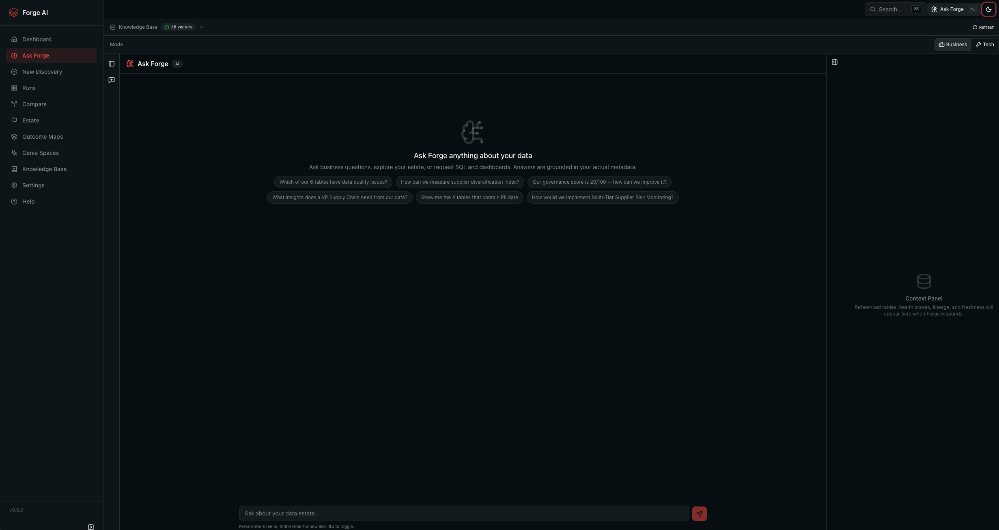

# Why Forge AI?

## Turn Databricks metadata into business value in days, not quarters

You already invested in Databricks. Forge AI helps you get more value from that investment faster by turning your Unity Catalog metadata into a prioritized, execution-ready roadmap of analytics and AI opportunities.

In one flow, your team can discover high-impact use cases, align them to business outcomes, and deploy what matters first, without weeks of workshops or manual discovery.

  

---

## Why Customers Use Forge AI

- **Speed to value:** Move from "what should we build?" to a ranked backlog in minutes.
- **Better prioritization:** Score opportunities by business impact, feasibility, and strategic fit.
- **Immediate activation:** Convert recommendations into runnable SQL, Genie Spaces, and AI/BI dashboards.
- **Executive clarity:** Give leaders a clear, defensible view of where to invest next.
- **Trusted by design:** Keep processing inside your Databricks workspace with metadata-first analysis.

---

## What You Can Achieve

### 1) Find the best opportunities faster

Forge AI scans your Unity Catalog metadata and generates a curated set of AI and analytics use cases, already grouped by business domain and ranked by value.

  

### 2) Prioritize with confidence

Each use case is transparently scored across impact, feasibility, and priority so teams can align on what to deliver first, and why.

  

### 3) Activate insights immediately

Forge AI helps teams move from recommendation to execution with deployable artifacts and natural language exploration.

- Deploy **Genie Spaces** per domain for business-friendly exploration.
- Generate **AI/BI dashboard recommendations** to accelerate decision support.
- Produce **runnable SQL notebooks** to speed engineering handoff.
- Use **Ask Forge** to query findings in natural language and propose SQL actions.

  

---

## Built for Databricks Customers

### Works with your platform, not around it

Forge AI is designed for teams already running on Databricks:

- Uses your **Unity Catalog** metadata as the source of truth.
- Runs SQL on your **SQL Warehouse**.
- Uses your **Model Serving** endpoints for AI generation.
- Deploys as a **Databricks App** in your workspace.

No new platform to adopt. No extra infrastructure to maintain.

### Enterprise-ready trust and governance

- **Metadata-first by default:** Schema and table metadata only, unless you explicitly enable sampling.
- **Workspace-native processing:** Data remains in your Databricks environment.
- **Transparent outputs:** AI-generated recommendations are traceable and reviewable.

---

## Key Capabilities Customers Care About

### Prioritized Use Case Catalog

A single, scored backlog your business and data teams can align on quickly.

### Industry-Aligned Recommendations

Map opportunities to strategic outcomes and identify gaps in coverage.

  

### Ask Forge (Conversational Assistant)

Let teams explore recommendations, ask follow-up questions, and move into action from one conversational interface.

  

### Data Estate Intelligence

Understand data maturity, governance gaps, table health, and lineage before you commit delivery resources.

  

### Executive-Ready Outputs

Share results quickly in the format each stakeholder group expects.

| Output | Customer Outcome |
| --- | --- |
| **Excel** | Detailed, analyst-ready backlog and scoring data |
| **PowerPoint** | Executive narrative for investment and prioritization decisions |
| **PDF** | Structured report for governance and steering reviews |
| **SQL Notebooks** | Fast handoff from strategy to implementation |
| **Comparison Reports** | Clear view of progress across iterations |

---

## Simple Customer Journey

1. **Connect scope:** Select catalogs and business priorities.
2. **Run discovery:** Generate scored opportunities and domain insights.
3. **Activate value:** Export, deploy, and operationalize the highest-value use cases.

  

---

## Who Benefits Most

| Team | Value Delivered |
| --- | --- |
| **Data and AI Leadership** | A defensible roadmap tied to business value |
| **Analytics and BI Teams** | Faster path from idea to deployed insight |
| **Data Platform Teams** | Better visibility into data quality, readiness, and governance |
| **Engineering Teams** | Clear, execution-ready artifacts instead of ambiguous requests |

---

## Start Unlocking More Value from Databricks

If your organization wants faster time to value from data and AI investments, Forge AI gives you a practical way to turn metadata into momentum and momentum into measurable outcomes.

---

**Disclaimer** -- Databricks Forge AI is provided subject to the [Databricks License](LICENSE). It is NOT an official Databricks product, feature, or service. It is provided "as-is" without warranty of any kind. Databricks and its contributors accept no liability for damages arising from the use of this software. Use of the Licensed Materials requires an active Databricks Services agreement. See [NOTICE](NOTICE) for support policy and [SECURITY](SECURITY.md) for vulnerability reporting.

