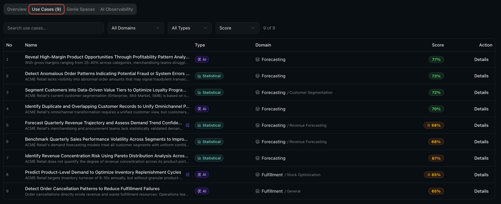
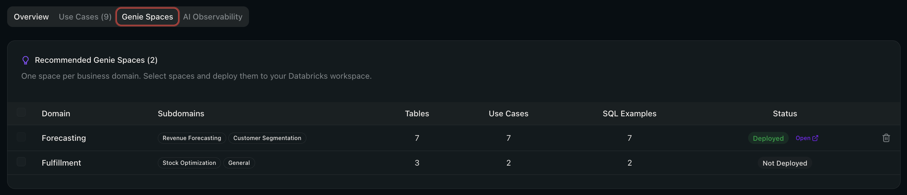

# Why Forge AI?

### Turn your Unity Catalog into a use case engine.

Every enterprise sits on a growing lake of data -- tables, schemas, catalogs -- and the same question keeps coming up: **"What should we build with all of this?"**

Databricks Forge AI answers that question automatically. Point it at your Unity Catalog, and in minutes you have a scored, prioritised backlog of AI and analytics use cases -- complete with runnable SQL, executive reports, and deployable Genie Spaces.

  

---

## The Problem

Data leaders face the same challenges across every industry:

**Discovery takes too long.** Identifying high-value use cases from hundreds of tables requires weeks of workshops, interviews, and manual data profiling. Most organisations never finish.

**Prioritisation is subjective.** Without a consistent scoring framework, decisions default to the loudest voice in the room -- not the highest-value opportunity.

**Insights stay locked in slide decks.** Even when use cases are identified, turning them into something actionable (queries, dashboards, Genie Spaces) requires a second wave of engineering effort.

**Data estates are opaque.** Leadership lacks a clear picture of what data exists, how healthy it is, and where the governance gaps are.

---

## How It Works

Forge AI runs entirely inside your Databricks workspace. Three steps. No data leaves your environment.

 

<table>
<tr>
<td width="33%" align="center">

### 1. Configure

Select your catalogs, set business priorities, and choose an industry context. One form, two minutes.

</td>
<td width="33%" align="center">

### 2. Discover

A 7-step AI pipeline scans your metadata, generates use cases, clusters them into business domains, scores them, and writes SQL -- all in real time.

</td>
<td width="33%" align="center">

### 3. Export & Deploy

Download Excel, PowerPoint, or PDF reports. Deploy SQL notebooks. Launch Genie Spaces. Share results with stakeholders immediately.

</td>
</tr>
</table>

---

## What You Get

### A Prioritised Use Case Catalog

Every use case is scored on **Priority**, **Feasibility**, and **Impact** using a transparent methodology. Filter by domain, type (AI vs Statistical), or score. Edit names, refine scores, and curate the backlog before sharing.

  

---

### Scored and Ranked by Business Value

A multi-dimensional scoring model evaluates every use case against your stated priorities and strategic goals. The radar chart gives executives an instant read on where each opportunity stands.

  

---

### Industry-Aligned Analysis

Choose from 10+ built-in industry outcome maps (Banking, Retail, Manufacturing, Healthcare, and more) or ingest your own. The pipeline uses curated strategic objectives, KPIs, and reference use cases to steer generation and scoring toward industry-specific patterns.

  

---

### Ready-to-Deploy Genie Spaces

For every business domain discovered, Forge AI generates a complete Genie Space recommendation -- pre-configured with tables, join relationships, sample questions, SQL examples, and a knowledge store. Deploy with one click. Business users can start asking questions in natural language immediately.

  

---

### Executive-Ready Exports

Share findings in the format your stakeholders expect:

| Format | What It Contains |
| --- | --- |
| **Excel** | Multi-sheet workbook with summary, scored use cases, and domain breakdown |
| **PowerPoint** | Presentation-ready deck with executive summary and top opportunities |
| **PDF** | Branded report with cover page, domain pages, and individual use case details |
| **SQL Notebooks** | Runnable Databricks notebooks deployed to the workspace, organised by domain |
| **Executive Briefing** | Combined estate + use case deck for VP-level stakeholders |

  

---

### Data Estate Intelligence

Before discovering use cases, understand what you have. The estate scanner profiles your entire Unity Catalog and delivers:

- **Data Maturity Score** -- governance, architecture, operations, and analytics readiness
- **AI-generated executive summary** -- business and technical findings in plain language
- **Health scoring** -- per-table health with actionable recommendations
- **PII detection** -- automated sensitivity classification across every column
- **Lineage mapping** -- visual entity-relationship diagrams showing how tables connect
- **Governance gaps** -- missing owners, undocumented tables, stale assets

  

---

### Compare and Iterate

Run multiple discoveries with different scopes, depths, or models. Compare them side by side to see what changed -- metrics, use case overlap, configuration differences, and quality improvements.

  

---

## Privacy First

Forge AI reads **metadata only** by default -- schema names, table names, column names, and data types. No row-level data is accessed unless explicitly enabled by the user.

All processing happens **inside your Databricks workspace**. LLM calls go to your Model Serving endpoint. SQL runs on your SQL Warehouse. Data never leaves your environment.

When optional data sampling is enabled (for improved SQL accuracy), sampled rows are held in memory only during generation and are never persisted.

---

## Deploys in Minutes

Forge AI runs as a **Databricks App** -- deployed directly from a Git repository with no infrastructure to provision or manage.

| What | How |
| --- | --- |
| **Database** | Auto-provisioned Lakebase (zero setup) |
| **Compute** | Your existing SQL Warehouse |
| **AI Model** | Your existing Model Serving endpoint |
| **Auth** | Automatic via Databricks Apps platform |
| **Updates** | Push to Git, click Deploy |

No VMs. No containers. No secrets management. The entire app runs on platform services your customer already has.

---

## Built on the Databricks Platform

Forge AI is a showcase for the breadth of the Databricks Data Intelligence Platform:

| Capability | Databricks Service |
| --- | --- |
| Metadata discovery | **Unity Catalog** |
| SQL execution | **SQL Warehouse** (Serverless) |
| AI inference | **Model Serving** (Foundation Models) |
| Natural language analytics | **Genie Spaces** |
| Application hosting | **Databricks Apps** |
| OLTP persistence | **Lakebase** (Autoscaling) |
| Data lineage | **System Tables** (`system.access.table_lineage`) |
| Notebook deployment | **Workspace REST API** |

Everything runs inside the customer's workspace. No external services. No third-party dependencies for core functionality.

---

## Who Is It For?

| Persona | What They Get |
| --- | --- |
| **Chief Data Officer** | A data-driven roadmap of AI opportunities, scored and prioritised against strategic goals |
| **VP of Analytics** | A curated backlog of use cases with business domains, ready for sprint planning |
| **Data Platform Lead** | Estate intelligence -- health scores, governance gaps, lineage, and maturity benchmarks |
| **Account Executive** | A compelling demo that turns a catalog walkthrough into a scored opportunity map in minutes |
| **Solutions Architect** | Production-ready SQL, Genie Spaces, and notebooks that accelerate proof-of-concept delivery |

---

## Get Started

<table>
<tr>
<td width="33%" align="center">

### Step 1
**Request Access**

Contact your Databricks account team to get the Forge AI repository and deployment guide.

</td>
<td width="33%" align="center">

### Step 2
**Deploy**

Create a Databricks App from the Git repo, bind a SQL Warehouse and Model Serving endpoint, and deploy. First run takes under 5 minutes.

</td>
<td width="33%" align="center">

### Step 3
**Discover**

Point Forge AI at your customer's Unity Catalog and run a discovery. Share the results in the format that resonates -- Excel, PowerPoint, PDF, or a live Genie Space.

</td>
</tr>
</table>

---

**Disclaimer** -- Databricks Forge AI is NOT an official Databricks product, feature, or service. It was developed by the Databricks Field Engineering team as a field accelerator and is provided as-is under the Apache 2.0 license. No warranty, no official support, no SLAs. See [NOTICE](NOTICE) for full details.

---

> **Note for AEs:** Screenshots are sourced from `docs/images/`. To refresh them, capture new screenshots from a running Forge AI instance and save to that directory with the same filenames.
