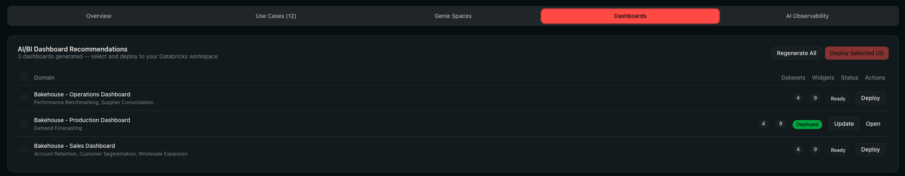
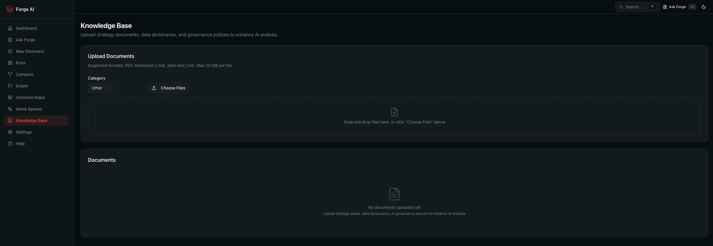

# Why Forge AI?

### Turn your Unity Catalog into a use case engine.

Every enterprise sits on a growing lake of data -- tables, schemas, catalogs -- and the same question keeps coming up: **"What should we build with all of this?"**

Databricks Forge AI answers that question automatically. Point it at your Unity Catalog, and in minutes you have a scored, prioritised backlog of AI and analytics use cases -- complete with runnable SQL, executive reports, deployable Genie Spaces, AI/BI dashboards, and a conversational assistant that knows your data estate.

  

---

## The Problem

Data leaders face the same challenges across every industry:

**Discovery takes too long.** Identifying high-value use cases from hundreds of tables requires weeks of workshops, interviews, and manual data profiling. Most organisations never finish.

**Prioritisation is subjective.** Without a consistent scoring framework, decisions default to the loudest voice in the room -- not the highest-value opportunity.

**Insights stay locked in slide decks.** Even when use cases are identified, turning them into something actionable (queries, dashboards, Genie Spaces) requires a second wave of engineering effort.

**Data estates are opaque.** Leadership lacks a clear picture of what data exists, how healthy it is, and where the governance gaps are.

**Asking questions about your own data requires expertise.** Business users can't explore findings without waiting for an analyst. They need a way to ask questions in natural language and get grounded, contextual answers.

---

## How It Works

Forge AI runs entirely inside your Databricks workspace. Three steps. No data leaves your environment.

 

<table>
<tr>
<td width="33%" align="center">

### 1. Configure

Select your catalogs, set business priorities, and choose an industry context. One form, two minutes.

</td>
<td width="33%" align="center">

### 2. Discover

A 7-step AI pipeline scans your metadata, generates use cases, clusters them into business domains, scores them, and writes SQL -- all in real time.

</td>
<td width="33%" align="center">

### 3. Export & Deploy

Download reports, deploy SQL notebooks, launch Genie Spaces, generate AI/BI dashboards, or ask questions in natural language. Share results with stakeholders immediately.

</td>
</tr>
</table>

---

## What You Get

### A Prioritised Use Case Catalog

Every use case is scored on **Priority**, **Feasibility**, and **Impact** using a transparent methodology. Filter by domain, type (AI vs Statistical vs Geospatial), or score. Edit names, refine scores, and curate the backlog before sharing.

  

---

### Scored and Ranked by Business Value

A multi-dimensional scoring model evaluates every use case against your stated priorities and strategic goals. The radar chart gives executives an instant read on where each opportunity stands.

  

---

### Industry-Aligned Analysis

Choose from 10+ built-in industry outcome maps (Banking, Retail, Manufacturing, Healthcare, and more) or upload your own. The pipeline uses curated strategic objectives, KPIs, personas, and reference use cases to steer generation and scoring toward industry-specific patterns. A gap report highlights which strategic outcomes are covered and where blind spots remain.

  

---

### Ask Forge -- Conversational AI Assistant

Ask Forge is a conversational assistant that knows your entire data estate, pipeline results, and uploaded knowledge. Ask questions in natural language and get grounded, contextual answers with cited sources.

- **Propose and run SQL** against your warehouse directly from the chat
- **Deploy SQL notebooks** to the workspace with one click
- **Create AI/BI dashboards** from a conversation
- **Launch Genie Spaces** for specific domains on the fly
- **Switch personas** between business and technical response styles
- **Conversation history** persisted per user with full context recall

  

---

### Ready-to-Deploy Genie Spaces

For every business domain discovered, Forge AI generates a complete Genie Space recommendation -- pre-configured with tables, join relationships, sample questions, SQL examples, metric views, and a knowledge store. Deploy with one click. Business users can start asking questions in natural language immediately.

A standalone **Meta Data Genie** mode lets you generate Genie Spaces directly from your catalog metadata without running a full discovery pipeline -- ideal for targeted domain exploration or rapid deployment.

  

---

### AI/BI Dashboard Generation

For each business domain, Forge AI generates AI/BI dashboard recommendations with pre-built visualisations. Preview the layout, then deploy directly to your Databricks workspace. No manual dashboard building required.

  

---

### Executive-Ready Exports

Share findings in the format your stakeholders expect:

| Format | What It Contains |
| --- | --- |
| **Excel** | Multi-sheet workbook with summary, scored use cases, and domain breakdown |
| **PowerPoint** | Presentation-ready deck with executive summary and top opportunities |
| **PDF** | Branded report with cover page, domain pages, and individual use case details |
| **SQL Notebooks** | Runnable Databricks notebooks deployed to the workspace, organised by domain |
| **Executive Briefing** | Combined estate + use case deck for senior stakeholders |
| **Gap Report** | Industry coverage gap analysis highlighting strategic blind spots |
| **Comparison Report** | Side-by-side run comparison showing improvements across iterations |

  

---

### Data Estate Intelligence

Before discovering use cases, understand what you have. The estate scanner profiles your entire Unity Catalog and delivers:

- **Data Maturity Score** -- governance, architecture, operations, and analytics readiness
- **AI-generated executive summary** -- business and technical findings in plain language
- **Health scoring** -- per-table health with actionable recommendations
- **PII detection** -- automated sensitivity classification across every column
- **Lineage mapping** -- visual entity-relationship diagrams showing how tables connect
- **Governance gaps** -- missing owners, undocumented tables, stale assets
- **Table drill-down** -- schema details, Delta history, lineage graph, and linked use cases per table
- **Scan trends** -- track how your estate evolves across multiple scans over time

  

---

### Knowledge Base

Upload strategy documents, data dictionaries, governance policies, or architecture specs (PDF, Markdown, or plain text). Forge AI indexes them for intelligent retrieval, so both the conversational assistant and the discovery pipeline can ground their analysis in your organisation's specific context -- not just generic patterns.

  

---

### Compare and Iterate

Run multiple discoveries with different scopes, depths, or models. Compare them side by side to see what changed -- metrics, use case overlap, configuration differences, and quality improvements over time. Export the comparison as Excel.

  

---

### Full Transparency and Auditability

Every AI-generated insight is traceable. Forge AI logs each step of the pipeline with full detail -- what was asked, what was returned, and how long it took. This gives your governance and compliance teams the visibility they need to trust AI-generated recommendations before acting on them.

  

---

## Privacy First

Forge AI reads **metadata only** by default -- schema names, table names, column names, and data types. No row-level data is accessed unless explicitly enabled by the user.

All processing happens **inside your Databricks workspace**. LLM calls go to your Model Serving endpoint. SQL runs on your SQL Warehouse. Data never leaves your environment.

When optional data sampling is enabled (for improved SQL accuracy), sampled rows are held in memory only during generation and are never persisted.

---

## Deploys in Minutes

Forge AI runs as a **Databricks App** -- deployed directly from a Git repository with no infrastructure to provision or manage.

| What | How |
| --- | --- |
| **Database** | Auto-provisioned Lakebase (zero setup) |
| **Compute** | Your existing SQL Warehouse |
| **AI Model** | Your existing Model Serving endpoint |
| **Auth** | Automatic via Databricks Apps platform |
| **Updates** | Push to Git, click Deploy |

No VMs. No containers. No secrets management. The entire app runs on platform services you already have.

---

## Built on the Databricks Platform

Forge AI is built entirely on the Databricks Data Intelligence Platform:

| Capability | Databricks Service |
| --- | --- |
| Metadata discovery | **Unity Catalog** |
| SQL execution | **SQL Warehouse** (Serverless) |
| AI inference | **Model Serving** (Foundation Models) |
| Semantic search | **Model Serving** + **Lakebase** |
| Natural language analytics | **Genie Spaces** |
| Dashboard generation | **AI/BI Dashboards** |
| Application hosting | **Databricks Apps** |
| OLTP persistence | **Lakebase** (Autoscaling) |
| Data lineage | **System Tables** |
| Notebook deployment | **Workspace REST API** |

Everything runs inside your workspace. No external services. No third-party dependencies for core functionality.

---

## Who Is It For?

| Persona | What They Get |
| --- | --- |
| **Chief Data Officer** | A data-driven roadmap of AI opportunities, scored and prioritised against strategic goals |
| **VP of Analytics** | A curated backlog of use cases with business domains, ready for sprint planning |
| **Data Platform Lead** | Estate intelligence -- health scores, governance gaps, lineage, and maturity benchmarks |
| **Head of Data Science** | Scored AI and ML use cases grounded in actual data availability, not hypotheticals |
| **Data Engineering Lead** | Production-ready SQL, deployed notebooks, and Genie Spaces that accelerate time to value |

---

## Get Started

<table>
<tr>
<td width="33%" align="center">

### Step 1
**Request Access**

Contact your Databricks account team to get access to Forge AI and the deployment guide.

</td>
<td width="33%" align="center">

### Step 2
**Deploy**

Deploy as a Databricks App in your workspace. Bind a SQL Warehouse and Model Serving endpoint. First run takes under 5 minutes.

</td>
<td width="33%" align="center">

### Step 3
**Discover**

Point Forge AI at your Unity Catalog and run a discovery. Review scored use cases, explore your estate, and share findings in the format that works for your team.

</td>
</tr>
</table>

---

**Disclaimer** -- Databricks Forge AI is provided subject to the [Databricks License](LICENSE). It is NOT an official Databricks product, feature, or service. It is provided "as-is" without warranty of any kind. Databricks and its contributors accept no liability for damages arising from the use of this software. Use of the Licensed Materials requires an active Databricks Services agreement. See [NOTICE](NOTICE) for support policy and [SECURITY](SECURITY.md) for vulnerability reporting.

