# Why Forge?

## Turn Databricks metadata into business value in days, not quarters

You already invested in Databricks. Forge helps you get more value from that investment faster by turning your Unity Catalog metadata into a prioritised, execution-ready roadmap of analytics and AI opportunities -- complete with financial quantification, stakeholder mapping, and deployable artifacts.

In one flow, your team can discover high-impact use cases, quantify their business value, align them to strategy, and deploy what matters first -- without weeks of workshops or manual discovery.

  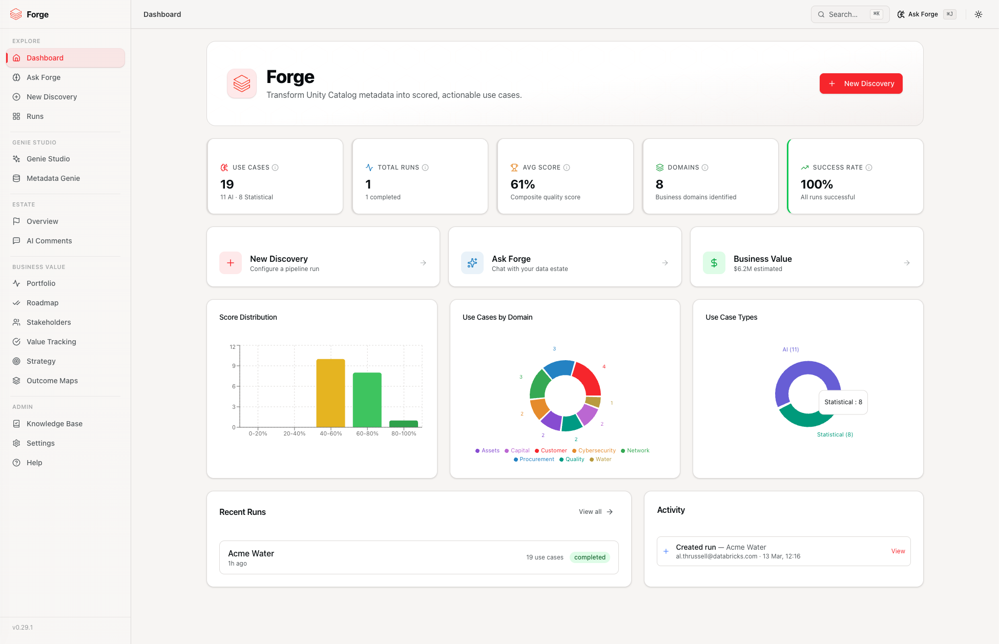

---

## Why Customers Choose Forge

- **Speed to value:** Move from "what should we build?" to a financially-quantified, ranked backlog in minutes -- not months.
- **Better prioritisation:** Score every opportunity by business impact, feasibility, and strategic fit, with dollar-range estimates attached.
- **Immediate activation:** Convert recommendations into runnable Genie Spaces, AI/BI dashboards, SQL notebooks, and metric views without handoff delays.
- **Executive clarity:** Give leaders board-ready findings, recommendations, and risk callouts backed by real data -- in the format they expect.
- **Continuous tracking:** Follow every opportunity from discovery through delivery to measured value with built-in lifecycle management.
- **Trusted by design:** Processing stays inside your Databricks workspace. Forge reads metadata only -- never your row-level data.

---

## What You Can Achieve

### 1. Discover the best opportunities faster

Forge scans your Unity Catalog metadata and generates a curated set of analytics and AI use cases, grouped by business domain and ranked by value. No manual workshops, no spreadsheet wrangling -- just point at your catalogs, set your business priorities, and let the engine work.

  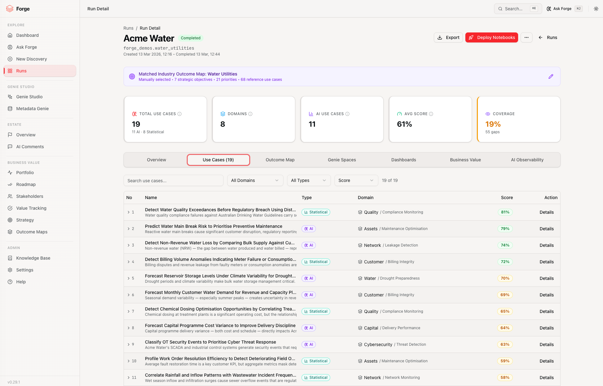

### 2. Prioritise with confidence

Every use case is transparently scored across impact, feasibility, and priority. Teams can quickly align on what to deliver first -- and articulate why to stakeholders.

  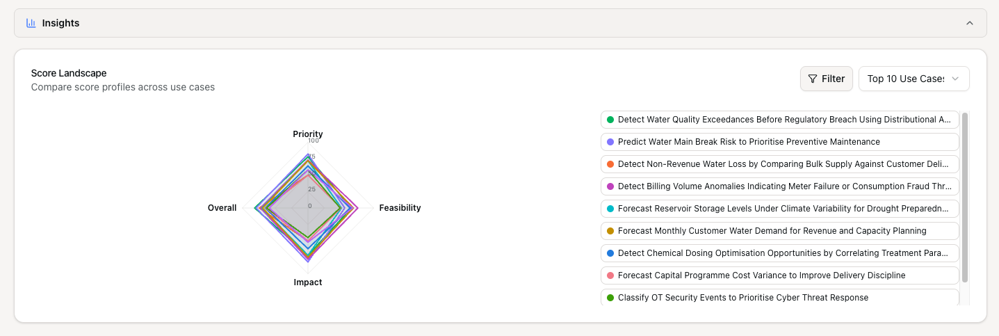

### 3. Quantify the business case

Forge goes beyond discovery. Each opportunity receives dollar-range financial estimates, categorised as cost savings, revenue uplift, risk reduction, or efficiency gain. Delivery phases (Quick Wins, Foundation, Transformation) come with effort estimates and dependencies -- turning technical findings into investment decisions leaders can act on.

  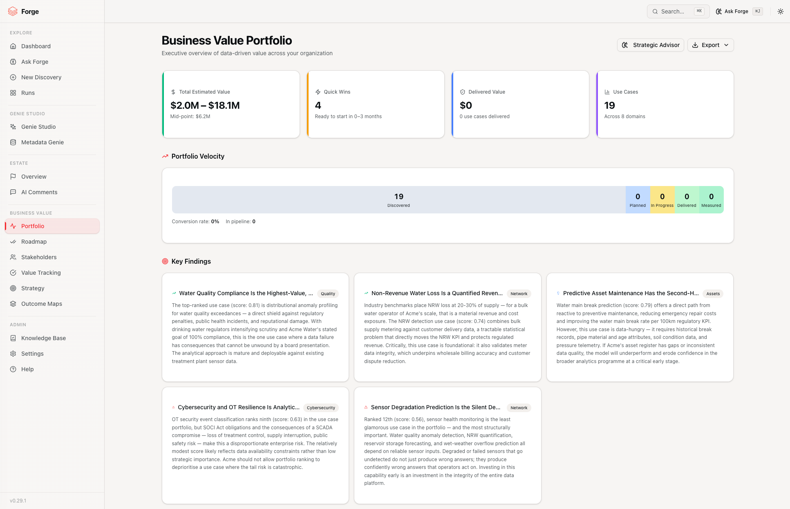

### 4. Activate insights immediately

Recommendations without activation are just reports. Forge bridges the gap between insight and execution:

- **Genie Spaces** for natural language data exploration, created from five different starting points.
- **AI/BI dashboards** generated from domain insights and deployed to Databricks.
- **SQL notebooks** per domain, ready for engineering handoff.
- **Metric views** for governed, reusable KPI definitions.
- **AI catalog comments** that improve metadata discoverability across your estate.
- **Ask Forge** for conversational follow-up, SQL proposals, and ad-hoc space creation.

  

### 5. Track value from discovery to delivery

Follow every use case through its lifecycle -- Discovered, Planned, In Progress, Delivered, Measured -- with stalled alerts, ownership tracking, and value capture so you can prove the return on your data investment.

  

---

## Business Value Intelligence

Most discovery tools stop at a list. Forge delivers a complete business case.

### Portfolio Overview

A single view of your entire data and AI opportunity landscape -- total estimated value, phase distribution, domain heatmaps, and strategic themes -- so leadership can see the picture at a glance and drill into what matters.

  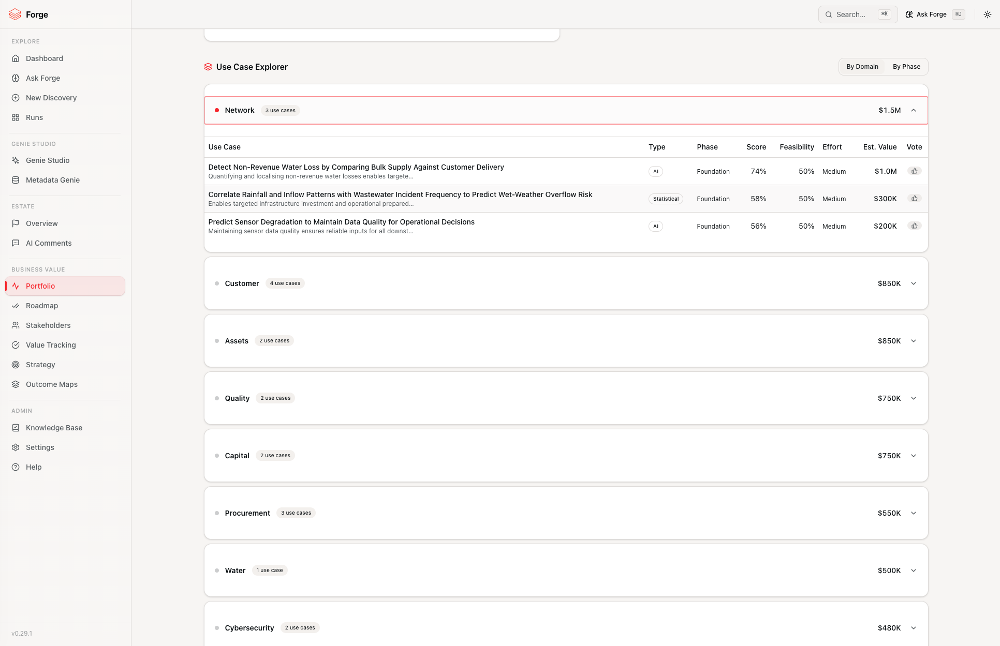

### Implementation Roadmap

Every use case is assigned to a delivery phase -- Quick Wins (weeks), Foundation (months), or Transformation (quarters) -- with effort estimates, dependencies, and enablers. This gives engineering and programme managers a clear view of what to tackle and in what order.

  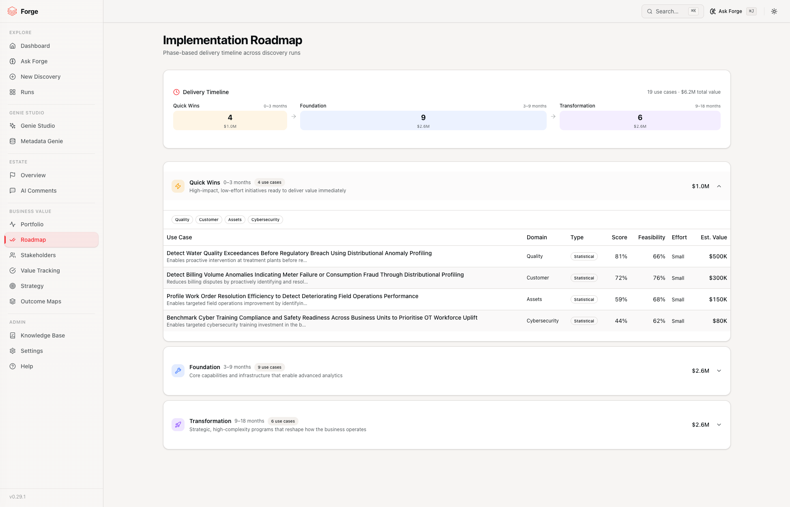

### Stakeholder Intelligence

Know who cares, who benefits, and who should champion each initiative. Forge maps organisational impact by department, identifies recommended champions, and highlights skills requirements -- so change management starts alongside delivery, not after.

  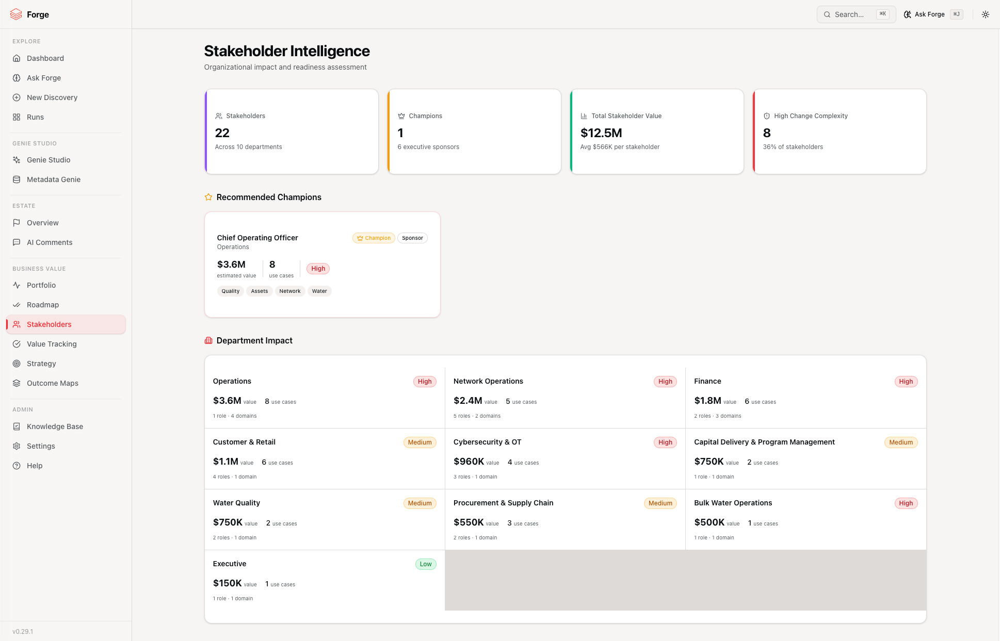

### Strategy Alignment

Upload your organisation's strategy documents and see how discovered opportunities map to strategic initiatives. Gap analysis shows which initiatives are Supported, Partially supported, or Blocked -- so you can direct resources where they close real strategic gaps.

  

### Use Case Voting

Bring your team into the prioritisation process. Workshop-style voting lets stakeholders weigh in on which opportunities matter most to them, blending data-driven scores with human judgement.

### Executive-Ready Exports

Share results in the format each audience expects:

| Export | Who It Serves |
| --- | --- |
| **Portfolio Excel** | Analysts: 8-sheet workbook with executive summary, findings, recommendations, risks, domains, delivery pipeline, use cases with ROI, and stakeholders |
| **Portfolio PowerPoint** | Executives: 8-slide Databricks-branded deck with KPIs, findings, recommendations, risks, pipeline, and stakeholder views |
| **Executive PDF** | Leadership: 2-page brief with KPIs, key findings, recommendations, pipeline chart, domain heatmap, and risk callouts |
| **D4B Workshop Pack** | Field teams: 5-section workshop deck with Case for Change, Executive Findings, Delivery Roadmap, Recommended Genie Spaces, and Workshop Agenda |
| **Per-Run Excel** | Data teams: detailed, analyst-ready backlog with business value and stakeholder sheets |
| **Per-Run PowerPoint** | Steering committees: narrative deck with optional synthesis slides |
| **Per-Run PDF** | Governance: structured report for review and sign-off |
| **SQL Notebooks** | Engineers: one notebook per domain deployed to your workspace |
| **Comparison Reports** | Programme managers: progress across iterations |

---

## Genie Studio

Genie Studio is the unified hub for creating, managing, and continuously improving Databricks Genie Spaces. Whether your starting point is a schema, a document, a conversation, or an existing space, Forge meets you where you are.

### Five Ways to Create a Genie Space

| Starting Point | Best For |
| --- | --- |
| **Scan Schema** | Point at a catalog and schema. Forge scans the data, profiles tables, selects the most relevant ones, and builds a production-grade space. |
| **Upload Requirements** | Drop in a PDF, markdown, or text document. Forge extracts tables, questions, SQL patterns, and instructions, then generates a space that matches your brief. |
| **Describe Your Space** | Tell Ask Forge what you need in plain language. The assistant gathers requirements through conversation and builds the space for you. |
| **Pipeline Run** | Run the full discovery pipeline and let the Genie Engine produce domain-based space recommendations from your use case results. |
| **Import JSON** | Paste the JSON of any existing Genie Space for instant health analysis and improvement recommendations. |

  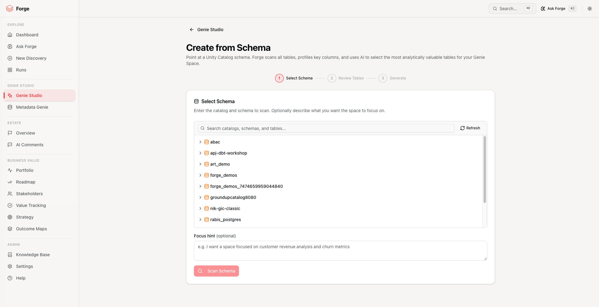

### Deep Knowledge Stores, Not Shallow Wrappers

Each Genie Space Forge creates includes column intelligence, semantic SQL expressions (measures, filters, dimensions), join definitions, trusted example queries, natural language instructions, benchmark questions, and optional metric view proposals -- all grounded to the physical schema. The result is a space that understands your data, not just its column names.

### Health Checks and Grades

Every space receives a deterministic health score across four categories: Data Sources, Instructions, Semantic Richness, and Quality Assurance. Letter grades (A through F) and actionable quick wins make it clear where a space stands and what to improve -- without guesswork.

  

### Continuous Improvement

Forge doesn't just build spaces -- it helps you keep making them better:

- **Fix workflow:** Target failing health checks with engine-generated improvements. Review suggestions in a diff preview before applying.
- **Benchmark evaluation:** Send test questions to a deployed space, compare results, and label accuracy. Forge maps failures to targeted fix strategies.
- **Auto-improve:** Set a target score and let Forge iterate -- benchmark, fix, re-benchmark -- until the space meets your quality bar.

  

### Workspace Sync

Already have Genie Spaces in your Databricks workspace? Sync them into Forge for health scoring, benchmarking, and improvement -- no rebuild required.

---

## Data Estate Intelligence

Before committing delivery resources, understand where you stand.

Forge scans your Unity Catalog estate and provides:

- **Data Maturity Score** -- a composite 0--100 rating across four pillars: Governance, Architecture, Operations, and Analytics Readiness.
- **Table-level health** -- per-table scores with issues and recommendations (comments, OPTIMIZE, VACUUM, small files, clustering).
- **Lineage and relationships** -- entity-relationship graphs and lineage paths to understand data flow.
- **Domain classification** -- automatic grouping of tables by business domain, role, and tier.
- **PII detection and governance gaps** -- flag sensitive data and surface documentation shortfalls.

  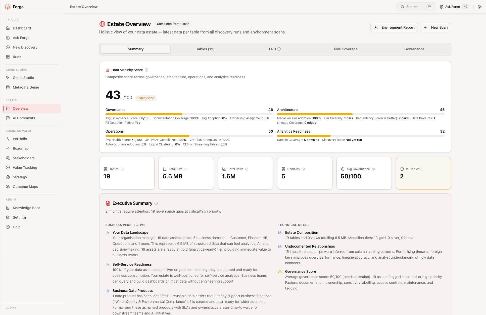

---

## AI Catalog Comments

Well-documented data is more discoverable, more trustworthy, and more useful to Genie Spaces. Forge generates industry-aware table and column descriptions that are optimised for discoverability:

- Schema-wide context analysis with domain, role, and tier classification.
- Industry Reference Data Asset linkages for richer, more meaningful descriptions.
- Cross-schema consistency review to ensure uniform terminology.
- Bulk apply with one click -- and full undo if needed.

  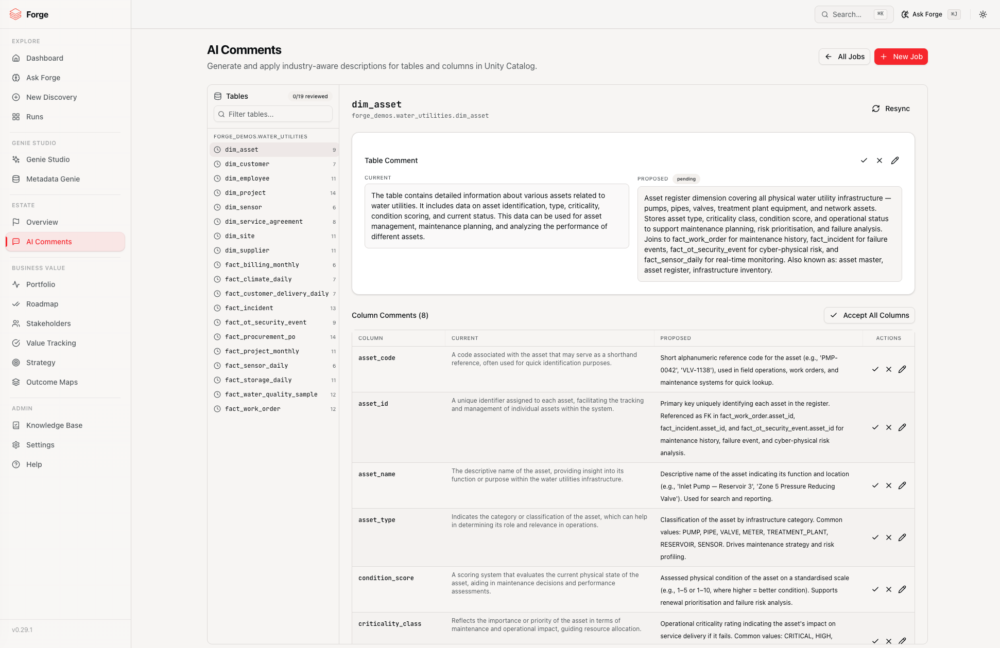

---

## Ask Forge

Explore your findings, ask follow-up questions, propose SQL, and trigger actions from one conversational interface. Ask Forge is RAG-powered with context from your data estate, pipeline results, knowledge base documents, and Genie recommendations.

Use it to answer ad-hoc questions, create Genie Spaces through conversation, deploy dashboards and notebooks, or generate executive memos -- all without leaving the chat.

  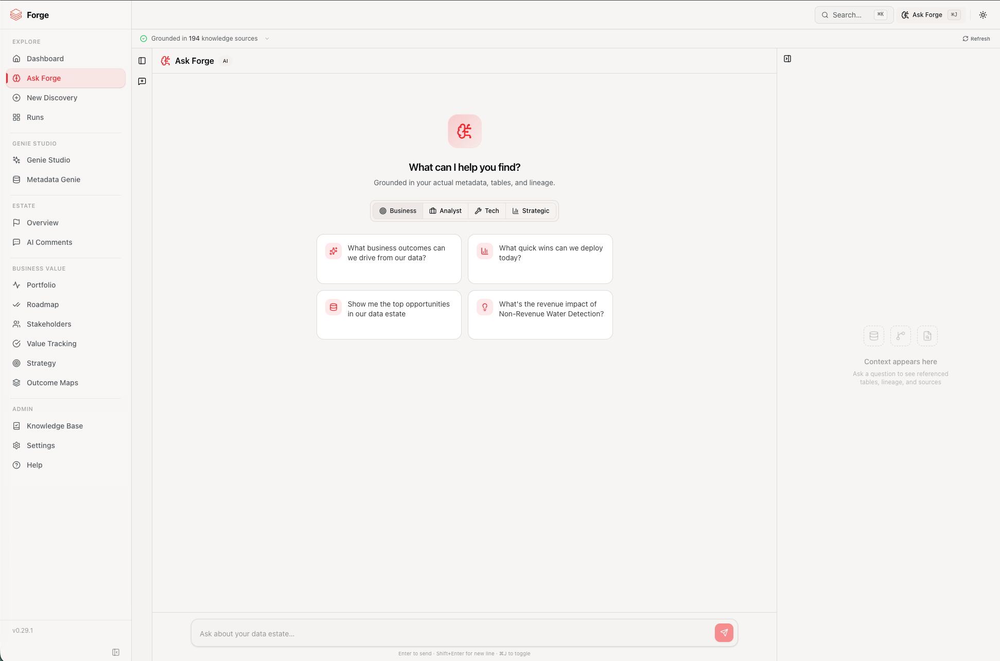

---

## Industry-Aligned Intelligence

### Outcome Maps

Map discovered opportunities to strategic industry outcomes across 11 industries. Identify gaps in coverage and see which outcomes your current data estate can support today versus where investment is needed.

  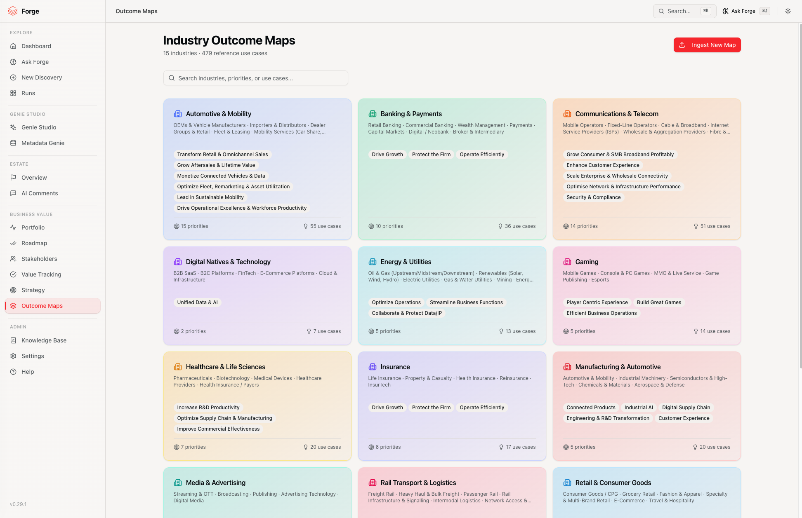

---

## Knowledge Base

Upload strategy packs, data dictionaries, governance policies, and architecture documents. Forge chunks, embeds, and indexes them so that Ask Forge, the pipeline, and the Genie Engine can draw on your organisation-specific context -- making every recommendation more relevant.

  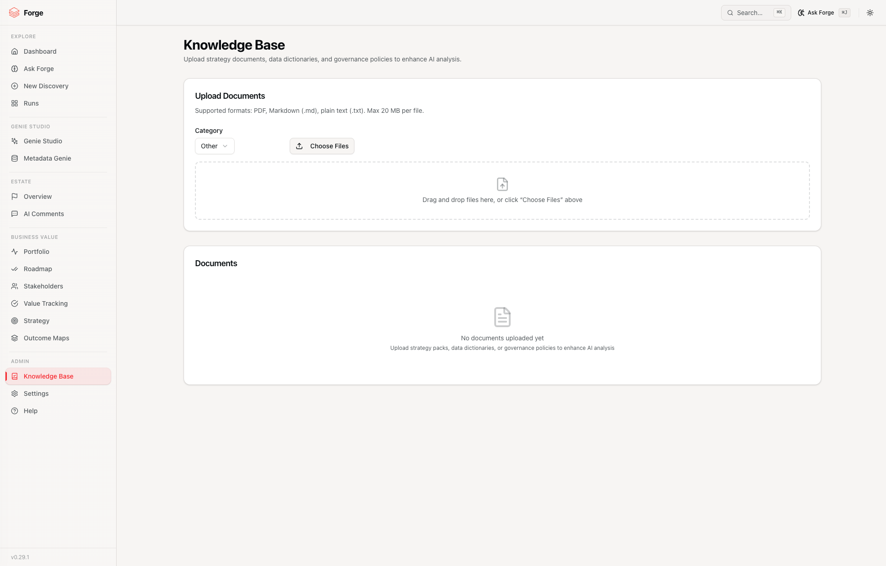

---

## Built for Databricks Customers

### Works with your platform, not around it

Forge is designed for teams already running on Databricks:

- Uses your **Unity Catalog** metadata as the source of truth.
- Runs SQL on your **SQL Warehouse**.
- Uses your **Model Serving** endpoints for AI generation.
- Stores state in **Lakebase** (auto-provisioned Postgres).
- Deploys as a **Databricks App** in your workspace.

No new platform to adopt. No extra infrastructure to maintain.

### Enterprise-ready trust and governance

- **Metadata-first by default:** Schema and table metadata only -- no row-level data access unless you explicitly enable sampling.
- **Workspace-native processing:** Data never leaves your Databricks environment.
- **Transparent outputs:** Every AI-generated recommendation is traceable and reviewable.

---

## Simple Customer Journey

1. **Connect:** Select catalogs, set business priorities, and choose your industry.
2. **Discover:** Generate scored opportunities, financial estimates, and domain insights.
3. **Refine:** Explore results, vote on priorities, align to strategy, upload context documents.
4. **Activate:** Deploy Genie Spaces, dashboards, notebooks, and metric views. Export executive deliverables.
5. **Track:** Follow use cases from discovery to measured business impact.

  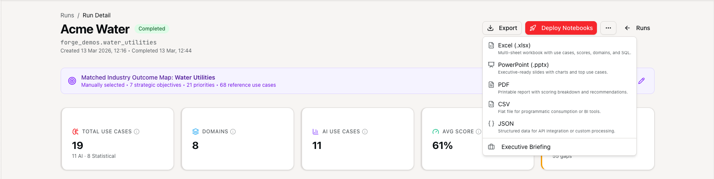

---

## Who Benefits Most

| Team | Value Delivered |
| --- | --- |
| **Data and AI Leadership** | A defensible, financially-quantified roadmap tied to business strategy -- with board-ready briefings |
| **Analytics and BI Teams** | Faster path from idea to deployed Genie Spaces, dashboards, and governed metric views |
| **Data Platform Teams** | Visibility into data quality, maturity, governance gaps, and catalog health across the estate |
| **Engineering Teams** | Execution-ready artifacts -- SQL, notebooks, metric views, DDL -- instead of ambiguous requirements |
| **Finance and Strategy** | Dollar-range estimates, ROI projections, delivery phasing, and risk callouts they can take to the board |
| **Change Management** | Stakeholder mapping with champion identification, department impact, and skills assessment |

---

## Start Unlocking More Value from Databricks

If your organisation wants faster time to value from data and AI investments, Forge gives you a practical way to turn metadata into momentum -- and momentum into measurable outcomes.

---

**Disclaimer** -- Databricks Forge is provided subject to the [Databricks License](LICENSE). It is NOT an official Databricks product, feature, or service. It is provided "as-is" without warranty of any kind. Databricks and its contributors accept no liability for damages arising from the use of this software. Use of the Licensed Materials requires an active Databricks Services agreement. See [NOTICE](NOTICE) for support policy and [SECURITY](SECURITY.md) for vulnerability reporting.