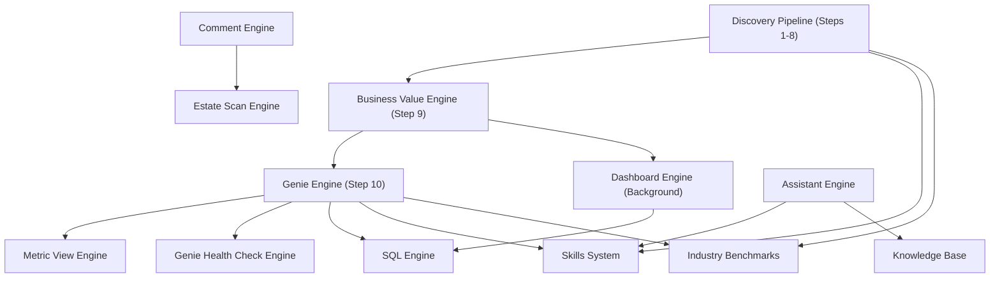

# Forge Engines

> Overview of the engine architecture in Databricks Forge.

## What is an Engine?

An **engine** in Forge is a self-contained module that orchestrates one or more
LLM passes (or deterministic analysis) to produce a specific class of output.
Engines share a common architectural pattern:

1. **Accept structured input** -- metadata, use cases, config, and optional
   dependencies
2. **Run one or more passes** -- LLM calls, SQL queries, or deterministic rules
3. **Validate and post-process** -- schema grounding, SQL validation, auto-fixes
4. **Return structured output** -- typed results persisted to Lakebase

Engines are designed for **portability**: each accepts an optional `deps` object
for dependency injection (`LLMClient`, `Logger`, etc.), so they can run inside
the Forge app, in tests with mocks, or extracted as standalone packages.

---

## Engine Catalog

### Pipeline Engines

These engines run as part of the discovery pipeline or are triggered from
pipeline results.

| Engine | Purpose | Pipeline Step | Documentation |
|--------|---------|---------------|---------------|
| **Genie Engine** | Multi-pass Genie Space generator with column intelligence, semantic SQL, trusted queries, benchmarks, and metric views | Step 10 (background) | [GENIE_ENGINE.md](GENIE_ENGINE.md) |
| **Dashboard Engine** | AI/BI (Lakeview) dashboard recommendation generator | Background (parallel with Genie) | [DASHBOARD_ENGINE.md](DASHBOARD_ENGINE.md) |
| **Business Value Engine** | Financial quantification, roadmap phasing, executive synthesis, stakeholder analysis | Step 9 | [BUSINESS_VALUE.md](BUSINESS_VALUE.md) |
| **Comment Engine** | Industry-aware table and column description generator (4-phase) | Standalone | [COMMENT_ENGINE.md](COMMENT_ENGINE.md) |
| **Metric View Engine** | Unity Catalog metric view generation, validation, and deployment | Within Genie (parallel pass) | [METRIC_VIEW_ENGINE.md](METRIC_VIEW_ENGINE.md) |
| **Estate Scan Engine** | Environment intelligence: health scoring, lineage, governance analysis | Standalone pipeline | [ESTATE_ANALYSIS.md](../ESTATE_ANALYSIS.md) |

### Infrastructure Engines

These engines provide shared capabilities consumed by the pipeline and
standalone engines.

| Engine | Purpose | Documentation |
|--------|---------|---------------|
| **SQL Engine** | Unified SQL generation, validation (EXPLAIN), and LLM-as-reviewer repair | [SQL_ENGINE.md](SQL_ENGINE.md) |
| **Genie Health Check Engine** | Deterministic scoring (20 checks, A-F grade), automated fix workflow, benchmark feedback loop | [GENIE_HEALTHCHECK_ENGINE.md](GENIE_HEALTHCHECK_ENGINE.md) |
| **Assistant Engine (Ask Forge)** | RAG-powered conversational AI with intent classification, context building, SQL proposals, and actions | [ASK_FORGE.md](../ASK_FORGE.md) |

### Supporting Systems

These are not engines per se, but provide domain knowledge and context that
engines consume.

| System | Purpose | Documentation |
|--------|---------|---------------|
| **Skills System** | Composable domain knowledge blocks resolved by intent, Genie pass, or pipeline step | [SKILLS_KNOWLEDGE_BASE.md](SKILLS_KNOWLEDGE_BASE.md) |
| **Knowledge Base** | User-uploaded documents chunked and embedded for RAG | [SKILLS_KNOWLEDGE_BASE.md](SKILLS_KNOWLEDGE_BASE.md) |
| **Industry Benchmarks** | 562 reference use cases across 11 industries grounding LLM outputs | [BENCHMARKS.md](BENCHMARKS.md) |

---

## Shared Architecture

### Port Interfaces

All engines communicate through abstract port interfaces defined in
`lib/ports/`. This enables dependency injection and testability.

| Port | Interface | Purpose |
|------|-----------|---------|
| `LLMClient` | `chat(messages, options)` | LLM calls (chat completions) |
| `SqlExecutor` | `execute(sql, options)` | SQL statement execution |
| `Logger` | `info/warn/error/debug` | Structured logging |
| `SkillResolver` | `resolveForIntent/GeniePass/PipelineStep` | Domain knowledge injection |
| `EngineProgressTracker` | `update(phase, pct, detail)` | Progress reporting |

Default Databricks implementations live in `lib/ports/defaults/` and wire the
ports to Model Serving, SQL Warehouse, and the app logger.

### Shared Toolkit

Engines share cross-cutting utilities from `lib/toolkit/`:

| Utility | Purpose |
|---------|---------|
| `cachedChatCompletion` | In-memory LLM response cache (SHA-256 key, 10min TTL) with 429/5xx retry |
| `mapWithConcurrency` | Bounded-concurrency parallel execution |
| `parseLLMJson` | Robust JSON extraction from LLM responses |
| `buildTokenAwareBatches` | Size LLM input batches by estimated token count |

### Engine Contract

The standard engine contract (`lib/ports/ENGINE_CONTRACT.md`) defines the
capabilities each engine should implement:

| Capability | Description | Engines |
|------------|-------------|---------|
| DI via deps | Accept optional deps with LLMClient, Logger | Comment, Dashboard, Genie, Health Check |
| AbortSignal | Accept signal for cancellation | Comment, Genie |
| Progress callback | Report phase + percent + detail | Comment, Dashboard, Genie |
| Structured counters | Report granular progress (items found/processed) | Comment |
| Facade separation | Engine returns result; separate module handles persistence | Comment |
| In-memory progress | Singleton Map with TTL for polling | Comment, Genie, Dashboard |

---

## How Engines Connect

### Data Flow

1. **Discovery Pipeline** (Steps 1-8) produces scored use cases with SQL
2. **Business Value Engine** (Step 9) adds financial estimates, roadmap, synthesis
3. **Genie Engine** (Step 10) and **Dashboard Engine** run in parallel, consuming
   use cases, metadata, and business value outputs
4. **Metric View Engine** runs within Genie as a parallel pass
5. **SQL Engine** validates and repairs SQL across Genie and Dashboard outputs
6. **Health Check Engine** scores deployed Genie Spaces post-generation
7. **Comment Engine** and **Estate Scan Engine** run independently (standalone)
8. **Ask Forge** consumes all outputs via RAG, enriched by Skills and Knowledge Base

---

## Model Routing

Engines use a dual-endpoint strategy to balance quality and cost:

| Tier | Endpoint | Default Model | Used By |
|------|----------|---------------|---------|
| **Premium** | `serving-endpoint` | `databricks-claude-opus-4-6` | SQL generation, scoring, creative generation |
| **Fast** | `serving-endpoint-fast` | `databricks-claude-sonnet-4-6` | Classification, enrichment, structured extraction |
| **Review** | `serving-endpoint-review` | `databricks-gpt-5-4` | SQL quality review (LLM-as-reviewer) |
| **Embedding** | `serving-endpoint-embedding` | `databricks-qwen3-embedding-0-6b` | Vector embeddings for RAG |

If a fast or review endpoint is not configured, it falls back to the premium
endpoint.

---

## Adding a New Engine

See the [New Feature Integration Checklist](../AGENTS.md#new-feature-integration-checklist)
in AGENTS.md. For engines specifically:

1. Define the engine function accepting typed input + optional `deps`
2. Use port interfaces (`LLMClient`, `Logger`) not concrete implementations
3. Implement progress reporting via callback or in-memory tracker
4. Separate engine logic from persistence (facade pattern)
5. Add API routes for triggering, polling status, and retrieving results
6. Document in a `docs/<ENGINE_NAME>.md` file
7. Add to this catalog
