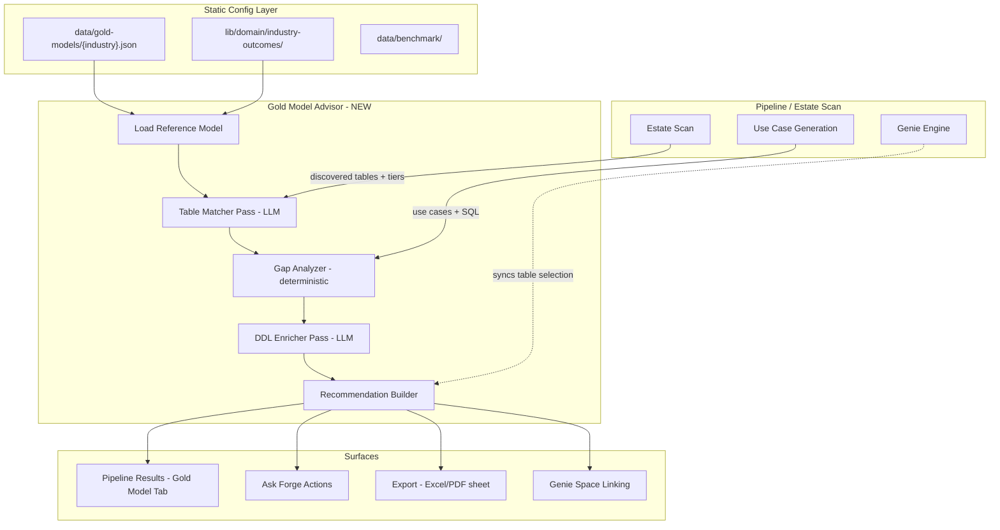

# Industry Gold Data Model Advisor

> Status: **Future Feature** | Created: 2026-03-07

## Summary

Extend Databricks Forge AI to recommend industry best-practice gold data models,
perform gap analysis against a customer's existing estate, and generate actionable
DDL/pipeline recommendations -- complementing the existing Genie Space and Dashboard
advisory capabilities.

---

## Current State

Forge already has strong industry knowledge but stops short of recommending
**what gold tables to build**:

- **15 industry outcome maps** (`lib/domain/industry-outcomes/`) define objectives,
  reference use cases, KPIs, personas, and `typicalDataEntities` (string names only
  -- no schema definitions)
- **14 benchmark packs** (`data/benchmark/`) store KPIs, principles, and advisory
  themes as JSON config
- **Estate scan** (`lib/pipeline/standalone-scan.ts`) classifies tables into
  bronze/silver/gold tiers and detects domains, relationships, and governance gaps
- **Fabric Gold Proposer** (`lib/fabric/gold-proposer.ts`) already generates Gold DDL
  from Power BI metadata -- a proven pattern we can reuse
- **Genie Engine** selects tables per domain and generates recommendations with full
  DDL-aware assembly

**The gap:** We never say *"here is the gold data model you should build for your
industry."*

---

## Core Idea

A new **Gold Data Model Advisor** that:

1. Stores **reference gold data models** per industry as config (JSON/YAML)
2. Compares a customer's discovered tables against the reference model (**gap analysis**)
3. Recommends specific tables to build, with DDL, relationships, and lineage suggestions
4. Surfaces recommendations in the pipeline results, Ask Forge, and exports

---

## Do We Need Example Data Models as Config?

**Yes -- a hybrid approach is best.** Pure LLM generation is too unconstrained and
hallucination-prone for structural DDL. Pure static config is too rigid. The sweet spot:

- **Static config** defines the skeleton: table names, key columns, grain,
  relationships, and canonical measures -- the "80% that every customer in that
  industry needs"
- **LLM passes** customize, enrich, and map the skeleton to the customer's actual
  metadata (column name mapping, source system detection, missing table recommendations)

### Proposed config structure (`data/gold-models/{industry}.json`)

Follow the proven benchmark pack pattern:

```json
{
  "model_id": "banking-retail-gold",
  "industry": "banking",
  "sub_vertical": "Retail Banking",
  "version": "2026.03",
  "standard_references": ["BIAN v12", "Basel III reporting"],
  "domains": [
    {
      "name": "Customer 360",
      "tables": [
        {
          "name": "dim_customer",
          "description": "Conformed customer dimension with demographics, segmentation, and lifecycle attributes.",
          "grain": "One row per customer",
          "table_type": "dimension",
          "columns": [
            { "name": "customer_id", "type": "BIGINT", "is_key": true, "description": "Surrogate key" },
            { "name": "customer_segment", "type": "STRING", "description": "High/Medium/Low value segment" },
            { "name": "onboarding_date", "type": "DATE", "description": "Date customer was onboarded" },
            { "name": "kyc_status", "type": "STRING", "description": "KYC verification status" }
          ],
          "typical_sources": ["Core Banking", "CRM", "KYC Platform"],
          "related_kpis": ["Customer Lifetime Value", "Churn Rate", "NPS"]
        },
        {
          "name": "fact_transactions",
          "description": "Daily transaction fact table at the individual transaction level.",
          "grain": "One row per transaction",
          "table_type": "fact",
          "columns": [
            { "name": "transaction_id", "type": "BIGINT", "is_key": true, "description": "Unique transaction identifier" },
            { "name": "customer_id", "type": "BIGINT", "description": "FK to dim_customer" },
            { "name": "transaction_date", "type": "DATE", "description": "Transaction date" },
            { "name": "amount", "type": "DECIMAL(18,2)", "description": "Transaction amount in local currency" },
            { "name": "transaction_type", "type": "STRING", "description": "Debit/Credit/Transfer/Fee" }
          ],
          "relationships": [
            { "column": "customer_id", "references": "dim_customer.customer_id", "type": "many_to_one" }
          ],
          "typical_sources": ["Core Banking", "Card Processing"]
        }
      ]
    }
  ]
}
```

### Why not pure LLM?

- DDL structure needs to be **deterministic and grounded** -- hallucinated column
  names are worse than no recommendation
- Industry standards (BIAN, OMOP, TM Forum) have specific schemas that should be
  curated, not invented
- Config is versionable, reviewable, and customizable per sub-vertical
- The LLM's job becomes **mapping and gap-filling**, not inventing from scratch

---

## Architecture



---

## Implementation Approach

### 1. Reference Model Config (`data/gold-models/`)

- One JSON file per industry (or per sub-vertical for large industries)
- TypeScript types in `lib/domain/gold-models.ts`
- Loader + registry in `lib/domain/gold-models-server.ts` (same pattern as benchmark packs)
- Start with 3-4 industries (banking, retail, manufacturing, healthcare) and expand

### 2. Gold Model Advisor Engine (`lib/gold-model/`)

New module with these passes:

- **Table Matcher** (LLM): Map customer's discovered tables to reference model tables
  (fuzzy name + column matching)
- **Gap Analyzer** (Deterministic): Diff reference model vs matched tables; score
  coverage; identify missing tables, columns, relationships
- **DDL Enricher** (LLM): Generate CREATE TABLE DDL for missing tables, customized to
  customer's catalog/schema naming conventions
- **Lineage Proposer** (LLM): Suggest bronze-to-silver-to-gold pipeline lineage for
  each gap
- **Priority Ranker** (Deterministic): Rank gaps by use-case dependency (which use
  cases need this table?) and KPI coverage

### 3. Pipeline Integration

Two entry points:

- **Post estate-scan step** (new step after environment intelligence): Compare
  discovered gold tables to reference model
- **Standalone advisor** (like standalone estate scan): Run without a full pipeline

Store results in Lakebase: `ForgeGoldModelRecommendation` table (run_id, industry,
domain, reference_table, matched_table, gap_type, ddl, priority, etc.)

### 4. UI Surfaces

- **New tab** on pipeline results: "Gold Data Model" alongside Use Cases and Genie
  Spaces
- **Ask Forge action**: `recommend_gold_model` action card when data model questions
  are detected
- **Export sheet**: New sheet in Excel/PDF exports with the gap analysis and DDL
- **Genie Space linking**: "This Genie space would benefit from these missing gold
  tables"

---

## Design Considerations

### Sub-vertical divergence

Banking retail vs. investment banking vs. payments have radically different gold
models. The config needs a sub-vertical dimension (the industry outcomes already have
`subVerticals` -- leverage this). A single "banking" model is too generic to be
credible.

### Industry standard alignment

Many industries have published reference data models:

- **Banking**: BIAN (Banking Industry Architecture Network), Basel III reporting
  schemas
- **Healthcare**: OMOP Common Data Model, HL7 FHIR
- **Telco**: TM Forum SID (Shared Information/Data Model)
- **Retail**: NRF data standards
- **Insurance**: ACORD data standards

Citing these standards in the recommendation adds enormous credibility ("this aligns
with BIAN v12 Customer domain").

### Incremental adoption / priority scoring

Customers cannot build 40 gold tables at once. The advisor should rank
recommendations:

- **Dependency scoring**: Which gold tables unblock the most use cases?
- **Quick wins**: Tables where 80%+ of columns already exist in silver
- **KPI coverage**: Which tables are needed for the highest-value KPIs?
- **Genie space dependency**: Which missing tables would improve existing Genie spaces?

### Medallion lineage, not just gold

Advising on gold tables alone is incomplete. The real value is the full path:

- "You have these bronze tables from SAP --> Here's the silver conformed layer -->
  Here's the gold model"
- Source system awareness: `typicalSourceSystems` in industry outcomes maps directly
  to this

### Metric view synergy

Gold tables are the foundation for metric views. The existing metric view proposal
pass in the Genie Engine could be **seeded from the reference model's `related_kpis`**
rather than generating from scratch. This creates a coherent story: "Build this gold
table, then create these metric views on top of it, then this Genie space queries
both."

### Custom / uploaded reference models

Some customers have their own target data models (e.g., from a data architecture
team). Supporting user-uploaded reference models (same JSON schema) would make this
enterprise-ready. This parallels the custom outcome maps feature.

### DDL deployment

The Fabric Gold Proposer already generates DDL. Extending this to a "Deploy Gold
Table" action (like "Deploy Genie Space") that creates the table + sets up a basic
pipeline skeleton in a notebook would be compelling.

### Gold Model Maturity Score

A per-domain score (0-100) based on:

- Table coverage (what % of reference tables exist?)
- Column completeness (what % of columns are present?)
- Relationship completeness (are FKs defined?)
- Freshness (are gold tables being updated?)
- Governance (descriptions, owners, tags?)

This follows the existing health check scoring pattern in `lib/genie/health-checks/`.

---

## Existing Infrastructure to Leverage

- `data/benchmark/*.json` pattern -- Config file storage + loader pattern for gold
  models
- `lib/domain/industry-outcomes/` `typicalDataEntities` -- Seed reference model table
  names
- `lib/fabric/gold-proposer.ts` -- DDL generation pattern (type mapping, name
  normalization, relationship encoding)
- `lib/genie/passes/` pattern -- LLM pass architecture (table matcher, DDL enricher)
- `lib/genie/health-checks/` scoring -- Gap scoring / maturity scoring
- Estate scan medallion classification -- Identify which customer tables are already
  gold
- `lib/embeddings/` -- Embed gold model recommendations for Ask Forge RAG
- Action cards pattern -- Surface `recommend_gold_model` in Ask Forge
- Export sheets pattern -- Add Gold Model tab to Excel/PDF exports

---

## Gaps to Fill Before Building

1. **Curating reference models** is the biggest effort -- this is domain expertise,
   not code. Start with 3-4 industries where you have the deepest knowledge. Each
   model is ~200-500 lines of JSON.
2. **Table matching heuristics** need tuning -- customer table names are wildly
   inconsistent. The LLM pass needs good few-shot examples.
3. **Sub-vertical selection UI** -- the config form currently picks an industry but not
   a sub-vertical. Need a cascading dropdown.
4. **Lakebase schema** -- new table(s) for storing gold model recommendations per run.

---

## Suggested Phasing

- **Phase 1**: Reference model config schema + loader + 3 industry models (banking,
  retail, manufacturing). Deterministic gap analyzer (no LLM). New pipeline results
  tab.
- **Phase 2**: LLM table matcher + DDL enricher. Ask Forge integration. Export sheet.
- **Phase 3**: Lineage proposer. Metric view synergy. Deploy action. Maturity scoring.
  Custom model upload.
