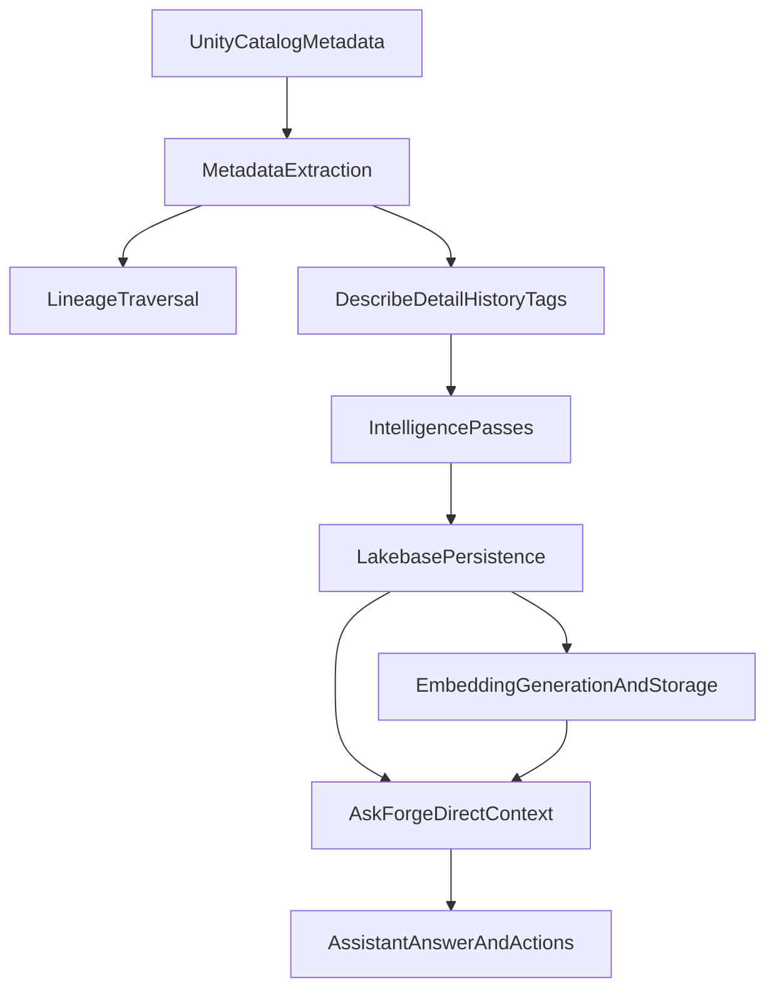

# Metadata and Ask Forge Deep Analysis

## Executive intent

Databricks Forge AI is designed to convert Unity Catalog metadata into high-confidence, execution-ready intelligence:

- Discover what data a customer actually has.
- Transform that into use cases, estate insights, and governance signals.
- Ground Ask Forge responses and actions in that real estate context.

This document captures where the system is strong today, where methodology gaps remain, and what to harden next to deliver consultant-grade reliability rather than generic AI output.

## What the platform does today

At a high level, Forge runs a metadata intelligence pipeline and then serves that intelligence via retrieval-augmented assistant interactions.

## Current architecture by layer

### 1) Metadata acquisition

Primary entry points:

- `lib/pipeline/standalone-scan.ts`
- `lib/pipeline/steps/metadata-extraction.ts`

Core data collected from Unity Catalog:

- Tables, columns, and explicit foreign keys from `information_schema`.
- Table details and history (`DESCRIBE DETAIL`, `DESCRIBE TABLE EXTENDED`, `DESCRIBE HISTORY`).
- Lineage edges via `system.access.table_lineage`.
- Tags via UC `table_tags` and `column_tags`.

Strengths:

- Resilient by design: many failures are non-fatal so scans still complete.
- Scope pre-filtering based on access permissions reduces hard-fail rates.
- Lineage expansion adds non-selected but related tables for better estate visibility.

### 2) Intelligence enrichment

Primary modules:

- `lib/ai/environment-intelligence.ts`
- `lib/domain/health-score.ts`

What is produced:

- Domain and subdomain categorization.
- Sensitivity/PII signals.
- Governance gaps.
- Redundancy and implicit relationships.
- Data product suggestions.
- Rule-based health scores with issues and recommendations.

Strengths:

- Separation of deterministic health rules and LLM inference allows mixed reliability.
- Per-pass status tracking (`passResults`) provides partial observability.

### 3) Persistence model

Primary modules:

- `lib/lakebase/environment-scans.ts`
- `prisma/schema.prisma`

Persisted entities:

- `ForgeEnvironmentScan` (scan-level summary)
- `ForgeTableDetail` (per-table metadata)
- `ForgeTableHistorySummary` (operational history + health)
- `ForgeTableLineage` (graph edges)
- `ForgeTableInsight` (LLM and inferred insights)

Strengths:

- Strong normalized model with clear entity boundaries.
- Aggregation helpers support latest-state estate views across multiple scans.

### 4) Vectorization and retrieval

Primary modules:

- `lib/embeddings/embed-estate.ts`
- `lib/embeddings/store.ts`
- `lib/embeddings/retriever.ts`

Behavior:

- Estate artifacts are embedded into `forge_embeddings` (pgvector, HNSW).
- Ask Forge retrieves chunks by semantic similarity and injects provenance labels.

Strengths:

- Good semantic coverage across structural and derived intelligence kinds.
- Separation of scope-based retrieval and kind-based retrieval APIs.

### 5) Ask Forge orchestration

Primary modules:

- `lib/assistant/engine.ts`
- `lib/assistant/context-builder.ts`
- `lib/assistant/prompts.ts`
- `lib/assistant/sql-proposer.ts`

Flow:

- Classify user intent.
- Build dual context (direct Lakebase + vector retrieval).
- Generate answer (streaming).
- Extract actions (run SQL, dashboard/genie actions, etc.).

Strengths:

- Fast no-data short-circuit avoids ungrounded generic responses.
- Provenance-aware context framing is already present in prompts and retriever.

## Critical gaps (as of this analysis baseline)

### P0 trust and safety

- SQL execution endpoint allows assistant-generated SQL execution without mandatory read-only enforcement and preflight validation.
- Embedding store operations rely heavily on interpolated raw SQL pathways.

### P1 data completeness

- Tags are collected during scans but not persisted into `ForgeTableDetail` tag JSON fields.
- Scan-level asset coverage fields exist in schema but are not consistently populated.
- Scan upsert update semantics are minimal in save path.

### P1 grounding quality in Ask Forge

- Context strategy is broad; scoping to the most relevant run/scan can be stronger.
- Retrieval quality thresholds are not consistently converted into confidence/guardrail behavior.
- Citation quality depends on model compliance instead of deterministic enforcement.

### P2 methodology robustness

- Some parsing assumptions (e.g., strict three-part FQN in certain paths) can drop valid context.
- Hardcoded thresholds in health/governance can misfit specific customer operating models.
- Partial-failure behavior is resilient, but not always visible enough for downstream trust scoring.

## Why this matters for customer outcomes

For this product category, trust is the product:

- If metadata is incomplete, recommendations look shallow.
- If grounding is weak, answers feel generic and non-actionable.
- If actions are unsafe, enterprise adoption stalls.

The platform’s mission is not just to answer questions; it is to produce defensible, estate-specific advisory output that a data leader can act on.

## Where we need to go

Target operating standard:

- Evidence-first answers: deterministic links to real customer metadata.
- Safe-by-default actions: strong SQL and execution guardrails.
- Complete estate memory: no silently dropped metadata dimensions.
- Explicit confidence posture: system should know when it does not know.
- Measurable quality: benchmarked grounding and action safety over representative enterprise prompts.

This baseline document supports the implementation phases now underway across safety hardening, metadata completeness, Ask Forge grounding, methodology calibration, and evaluation.
