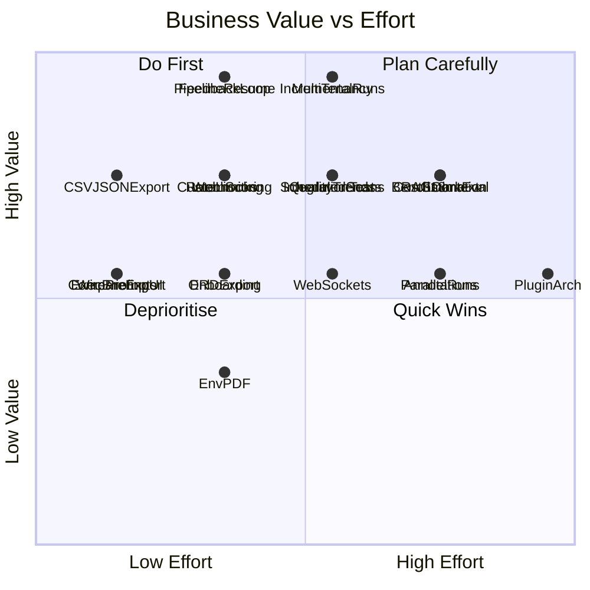

# Databricks Forge AI -- Feature Roadmap

> Created: 2026-02-24 | Baseline: v0.4.0

## Current State (v0.4.0)

The product has a mature 8-step discovery pipeline, Genie Engine (7 LLM passes), Dashboard Engine, estate scanning with 8 LLM intelligence passes, 6 export formats, run comparison, industry outcome maps, and a full settings page. The codebase is well-structured but has known gaps in multi-tenancy, testing, internationalization, and advanced analytics.

---

## Scoring Methodology

Each feature is scored on two axes:

- **Business Value** (1--5): Customer adoption impact, competitive differentiation, revenue potential
- **Effort** (1--5): Engineering complexity, where 1 = days, 5 = months
- **Priority Score** = Business Value / Effort (higher is better)

---

## Tier 1: Quick Wins (Priority Score >= 2.0)

These deliver high value for low effort and should be tackled first.

### 1. Pipeline Resume from Failed Step

- **Value: 5 | Effort: 2 | Score: 2.5**
- Currently a failed run must restart from scratch. Allow resuming from the last successful step.
- Leverage existing step-level progress in `forge_runs.progress_json`. Add a `resume` flag to `POST /api/runs` that loads prior step outputs from Lakebase.
- Key files: `lib/pipeline/engine.ts`, `app/api/runs/route.ts`

### 2. Use Case Feedback Loop (Thumbs Up/Down)

- **Value: 5 | Effort: 2 | Score: 2.5**
- Let users rate use cases (accept/reject/edit). Store ratings in Lakebase. Feed accepted patterns back into future prompts as few-shot examples.
- New Lakebase table `forge_use_case_feedback`. PATCH endpoint on use case. Inject top-rated examples into `USE_CASE_GEN_PROMPT`.
- Key files: `lib/lakebase/usecases.ts`, `components/pipeline/use-case-table.tsx`, `lib/ai/templates.ts`

### 3. CSV/JSON Export for Programmatic Consumption

- **Value: 4 | Effort: 1 | Score: 4.0**
- Add CSV and JSON export options to the export toolbar. Use case data is already structured -- just serialize it.
- Key files: `lib/export/`, `components/pipeline/export-toolbar.tsx`

### 4. Executive Briefing in Export Toolbar

- **Value: 3 | Effort: 1 | Score: 3.0**
- The combined estate + discovery PPTX already exists at `/api/export/executive-briefing` but is not surfaced in the UI. Wire it into the export toolbar.
- Key files: `components/pipeline/export-toolbar.tsx`, `lib/export/executive-briefing.ts`

### 5. Run Comparison Export

- **Value: 3 | Effort: 1 | Score: 3.0**
- The compare page has no export option. Add Excel/PDF export of comparison metrics, overlap analysis, and config diffs.
- Key files: `app/runs/compare/page.tsx`, `lib/lakebase/run-comparison.ts`

### 6. Rate Limiting Middleware

- **Value: 4 | Effort: 2 | Score: 2.0**
- Identified as a medium-risk security gap. Add per-user/IP rate limiting on API routes using a simple in-memory token bucket (sufficient for single-instance deployment).
- Key files: new `lib/middleware/rate-limit.ts`, `next.config.ts` or Next.js middleware

### 7. Wire Unwired Prompt Templates (Summaries)

- **Value: 3 | Effort: 1 | Score: 3.0**
- `SUMMARY_GEN_PROMPT` is defined in `docs/PROMPTS.md` but not implemented. Wire it to generate executive and per-domain summaries for PDF/PPTX exports.
- Key files: `lib/ai/templates.ts`, `lib/export/pdf.ts`, `lib/export/pptx.ts`

---

## Tier 2: Medium-Term Investments (Priority Score 1.0--1.9)

These require moderate effort but deliver strong strategic value.

### 8. Per-User Run Isolation (Multi-Tenancy)

- **Value: 5 | Effort: 3 | Score: 1.67**
- Currently all users see all runs (identified as a medium security risk). Associate runs with the creating user (email from Databricks Apps auth), filter by user, add optional "shared" flag for team visibility.
- Key files: `lib/lakebase/runs.ts`, all API routes that list runs, `app/api/runs/route.ts`

### 9. Incremental Pipeline Runs (Delta Discovery)

- **Value: 5 | Effort: 3 | Score: 1.67**
- When metadata hasn't changed significantly, skip re-extraction and re-filtering. Compare current UC metadata against `forge_metadata_cache`, only process new/changed tables through the pipeline.
- Key files: `lib/pipeline/steps/metadata-extraction.ts`, `lib/lakebase/metadata-cache.ts`

### 10. Custom Scoring Weights

- **Value: 4 | Effort: 2 | Score: 2.0**
- Let users adjust scoring dimension weights (feasibility, business value, innovation, data readiness) per run in the config form. Currently hardcoded in scoring logic.
- Key files: `lib/domain/scoring.ts`, `components/pipeline/config-form.tsx`

### 11. Webhook / Notification on Pipeline Completion

- **Value: 4 | Effort: 2 | Score: 2.0**
- Long-running pipelines need async notification. Add optional webhook URL in settings. Fire on run completion/failure. Also support Slack/Teams webhook format.
- Key files: new `lib/notifications/`, `lib/pipeline/engine.ts`, settings page

### 12. Scheduled / Recurring Scans

- **Value: 4 | Effort: 3 | Score: 1.33**
- Allow users to schedule periodic estate scans (daily/weekly) to track metadata drift over time. Leverage Databricks Jobs API for scheduling, trigger the scan API endpoint.
- Key files: new `lib/scheduling/`, `app/api/environment-scan/route.ts`, settings page

### 13. ERD Export (PNG/SVG/PDF)

- **Value: 3 | Effort: 2 | Score: 1.5**
- The ERD viewer uses React Flow but has no export. Add server-side Mermaid-to-SVG rendering (mermaid-js CLI) and client-side React Flow screenshot.
- Key files: `components/pipeline/erd-viewer.tsx`, `lib/export/erd-generator.ts`

### 14. Integration Test Suite

- **Value: 4 | Effort: 3 | Score: 1.33**
- Only unit tests exist (11 files, ~45 tests). Add integration tests for API routes (mock Databricks APIs), pipeline step composition, and export generation.
- Key files: `__tests__/`, `.github/workflows/ci.yml`

### 15. Onboarding / Guided Tour

- **Value: 3 | Effort: 2 | Score: 1.5**
- First-time users see empty states but no guided walkthrough. Add a step-by-step tour (react-joyride or similar) covering: configure discovery, view results, export, scan estate.
- Key files: `app/page.tsx`, new `components/onboarding/`

### 16. Data Quality Trend Dashboard

- **Value: 4 | Effort: 3 | Score: 1.33**
- Track health scores, table counts, and governance metrics across scans over time. Visualize trends on the Environment page. Data already exists in `forge_table_details` across scans.
- Key files: `app/environment/page.tsx`, `lib/lakebase/environment-scans.ts`, `app/api/environment/trends/route.ts`

---

## Tier 3: Strategic Bets (Priority Score < 1.0)

These are high-value but high-effort features that should be planned for later milestones.

### 17. Multi-Language Support (i18n)

- **Value: 4 | Effort: 4 | Score: 1.0**
- Prompt templates for keyword and use case translation already exist in `docs/PROMPTS.md` (`KEYWORDS_TRANSLATE_PROMPT`, `USE_CASE_TRANSLATE_PROMPT`) but are not wired. Full i18n requires UI string extraction (next-intl), prompt translation pipeline, and locale-aware exports.
- Key files: `lib/ai/templates.ts`, all UI pages, `lib/export/`

### 18. Genie Benchmark Evaluation

- **Value: 4 | Effort: 4 | Score: 1.0**
- Benchmarks are generated and stored but not executed. Integrate with the Databricks Evaluation API to auto-run benchmarks against deployed Genie Spaces and report accuracy/quality scores.
- Key files: `lib/genie/passes/benchmark-generation.ts`, new `lib/genie/evaluation.ts`, `components/pipeline/genie-workbench.tsx`

### 19. Custom Pipeline Steps (Plugin Architecture)

- **Value: 3 | Effort: 5 | Score: 0.6**
- Allow customers to inject custom steps (e.g., compliance tagging, cost estimation) into the pipeline. Define a step interface, registry, and configuration UI.
- Key files: `lib/pipeline/engine.ts`, new `lib/pipeline/plugins/`

### 20. RAG-Enhanced Business Context

- **Value: 4 | Effort: 4 | Score: 1.0**
- Enhance business context generation by ingesting company documentation (strategy docs, data dictionaries) via Databricks Vector Search. Feed retrieved context into business context and use case generation prompts.
- Key files: `lib/pipeline/steps/business-context.ts`, `lib/ai/templates.ts`, new `lib/rag/`

### 21. Real-Time Progress via WebSockets

- **Value: 3 | Effort: 3 | Score: 1.0**
- 7 pages currently poll for status (3--5s intervals). Replace with WebSocket/SSE push for real-time progress updates, reducing server load and improving UX.
- Key files: all polling pages (`app/runs/[runId]/page.tsx`, etc.), `lib/pipeline/engine.ts`

### 22. Collaborative Annotations

- **Value: 3 | Effort: 4 | Score: 0.75**
- Allow team members to comment on use cases, tag them for review, assign owners. Builds on multi-tenancy (#8). New Lakebase tables for comments and assignments.
- Key files: `components/pipeline/use-case-table.tsx`, new `lib/lakebase/annotations.ts`

### 23. Cost Estimation per Use Case

- **Value: 4 | Effort: 4 | Score: 1.0**
- Estimate compute and storage costs for implementing each use case based on table sizes, query complexity, and warehouse pricing. Add cost column to use case table and cost breakdown in detail view.
- Key files: `lib/pipeline/steps/scoring.ts`, `lib/ai/templates.ts`

### 24. Parallel Pipeline Runs

- **Value: 3 | Effort: 4 | Score: 0.75**
- Currently only one pipeline run can execute at a time (semaphore-gated LLM calls). Allow multiple runs with independent progress tracking and resource-aware concurrency.
- Key files: `lib/pipeline/engine.ts`, `lib/ai/agent.ts`

### 25. Environment Scan PDF Report

- **Value: 2 | Effort: 2 | Score: 1.0**
- Environment reports are Excel-only. Add a PDF report with executive summary, domain breakdown, health heatmap, and ERD. Leverage existing `pdfkit` dependency.
- Key files: new `lib/export/environment-pdf.ts`, `app/api/environment-scan/[scanId]/export/route.ts`

---

## Priority Summary

| # | Feature | Value | Effort | Score | Target |
|---|---------|-------|--------|-------|--------|
| 3 | CSV/JSON Export | 4 | 1 | 4.0 | v0.5.0 |
| 4 | Executive Briefing in Toolbar | 3 | 1 | 3.0 | v0.5.0 |
| 5 | Run Comparison Export | 3 | 1 | 3.0 | v0.5.0 |
| 7 | Wire Summary Prompts | 3 | 1 | 3.0 | v0.5.0 |
| 1 | Pipeline Resume | 5 | 2 | 2.5 | v0.5.0 |
| 2 | Feedback Loop | 5 | 2 | 2.5 | v0.5.0 |
| 6 | Rate Limiting | 4 | 2 | 2.0 | v0.5.0 |
| 10 | Custom Scoring Weights | 4 | 2 | 2.0 | v0.6.0 |
| 11 | Webhooks | 4 | 2 | 2.0 | v0.6.0 |
| 8 | Multi-Tenancy | 5 | 3 | 1.67 | v0.6.0 |
| 9 | Incremental Runs | 5 | 3 | 1.67 | v0.6.0 |
| 13 | ERD Export | 3 | 2 | 1.5 | v0.7.0 |
| 15 | Onboarding Tour | 3 | 2 | 1.5 | v0.7.0 |
| 12 | Scheduled Scans | 4 | 3 | 1.33 | v0.7.0 |
| 14 | Integration Tests | 4 | 3 | 1.33 | v0.7.0 |
| 16 | Quality Trends | 4 | 3 | 1.33 | v0.7.0 |
| 17 | i18n | 4 | 4 | 1.0 | v1.0.0 |
| 18 | Benchmark Eval | 4 | 4 | 1.0 | v1.0.0 |
| 20 | RAG Context | 4 | 4 | 1.0 | v1.0.0 |
| 21 | WebSockets | 3 | 3 | 1.0 | v1.0.0 |
| 23 | Cost Estimation | 4 | 4 | 1.0 | v1.0.0 |
| 25 | Env PDF Report | 2 | 2 | 1.0 | v1.0.0 |
| 22 | Annotations | 3 | 4 | 0.75 | v1.0.0 |
| 24 | Parallel Runs | 3 | 4 | 0.75 | v1.0.0 |
| 19 | Plugin Architecture | 3 | 5 | 0.6 | v1.0.0 |

---

## Suggested Release Cadence

### v0.5.0 -- Quick Wins (2--3 weeks)

Items 1--7: Pipeline resume, feedback loop, CSV/JSON export, executive briefing in toolbar, comparison export, rate limiting, summary prompt wiring.

### v0.6.0 -- Enterprise Foundations (3--4 weeks)

Items 8--11: Multi-tenancy, incremental runs, custom scoring weights, webhook notifications.

### v0.7.0 -- Intelligence & Quality (3--4 weeks)

Items 12--16: Scheduled scans, ERD export, integration tests, onboarding tour, data quality trends.

### v1.0.0 -- Platform (6--8 weeks)

Items 17--25: i18n, benchmark evaluation, RAG context, cost estimation, WebSockets, collaborative annotations, plugin architecture, parallel runs, environment PDF.

---

## Roadmap Visualisation

