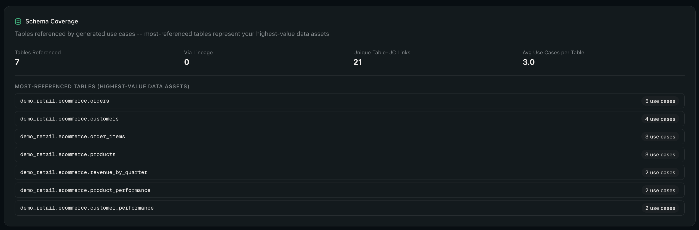
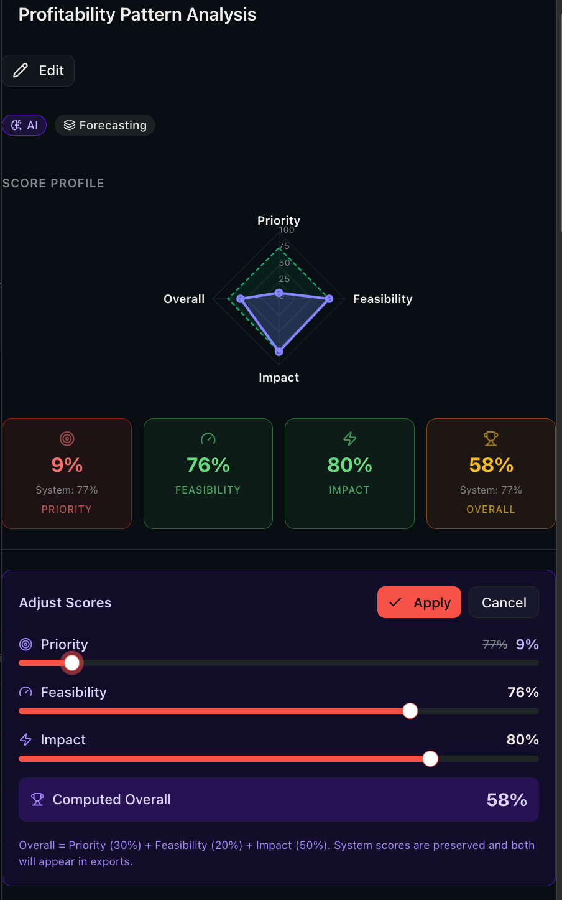
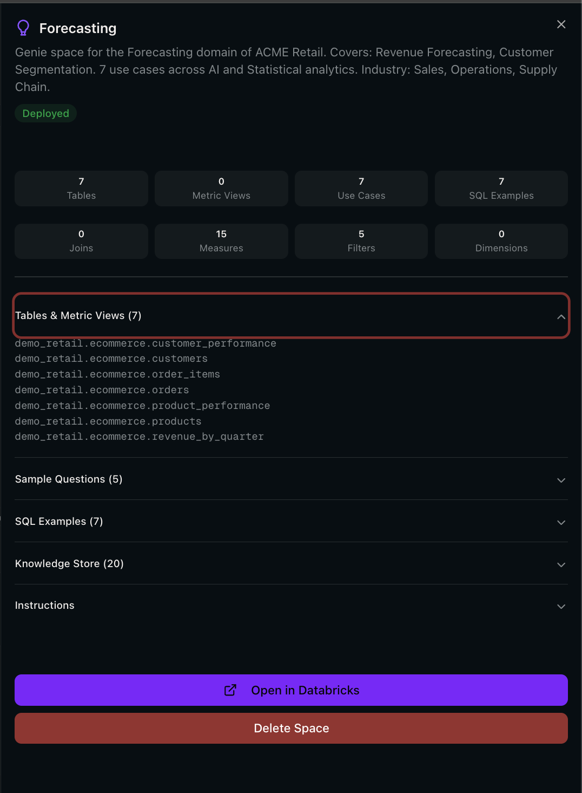
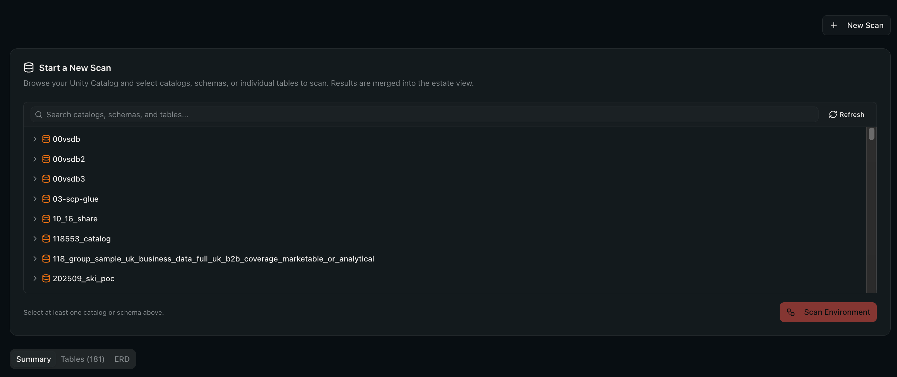
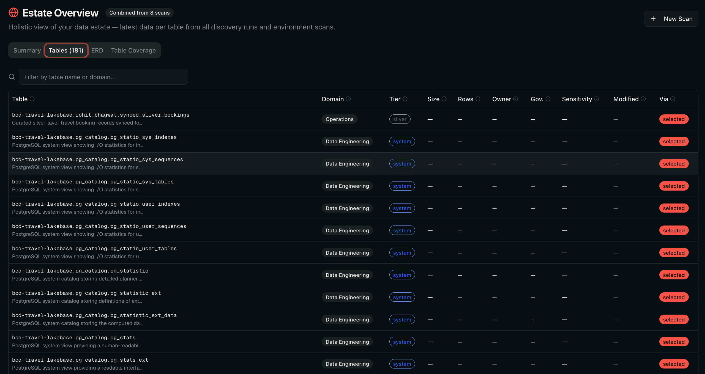
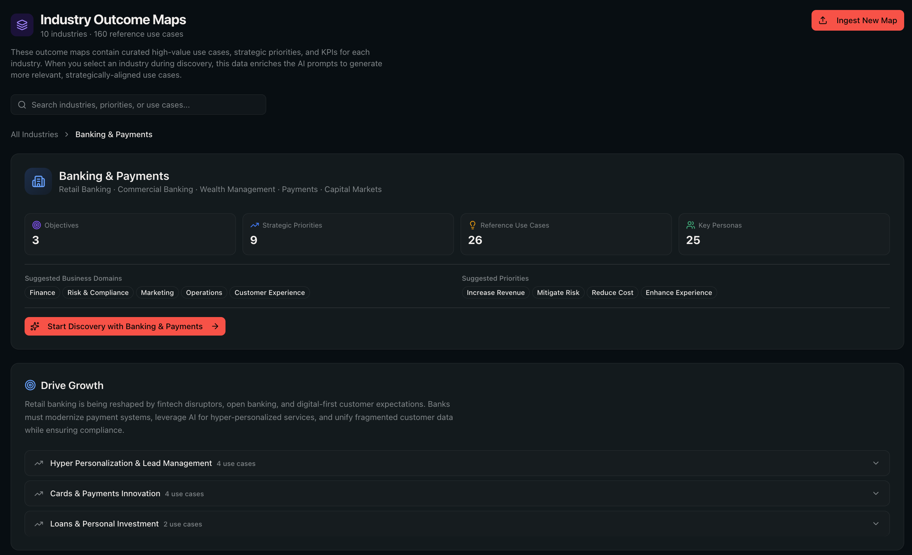

# Databricks Forge AI -- User Guide

This guide walks through every feature of Databricks Forge AI. It assumes the app is already deployed and you can access it in your browser. For deployment instructions, see the [README](../README.md).

---

## Table of Contents

- [1. Navigation](#1-navigation)
- [2. Dashboard](#2-dashboard)
- [3. Starting a New Discovery](#3-starting-a-new-discovery)
- [4. Pipeline Progress](#4-pipeline-progress)
- [5. Run Results](#5-run-results)
  - [5.1 Overview Tab](#51-overview-tab)
  - [5.2 Use Cases Tab](#52-use-cases-tab)
  - [5.3 Exporting Results](#53-exporting-results)
- [6. Genie Spaces](#6-genie-spaces)
- [7. AI Observability](#7-ai-observability)
- [8. Comparing Runs](#8-comparing-runs)
- [9. Managing Runs](#9-managing-runs)
- [10. Estate Scanning](#10-estate-scanning)
- [11. Industry Outcome Maps](#11-industry-outcome-maps)
- [12. Settings](#12-settings)
- [13. Tips and Best Practices](#13-tips-and-best-practices)

---

## 1. Navigation

The sidebar on the left provides access to all areas of the app:

| Menu Item | Purpose |
| --- | --- |
| **Dashboard** | Home page with KPIs, charts, and recent activity |
| **New Discovery** | Configure and launch a discovery pipeline run |
| **Runs** | View and manage all pipeline runs |
| **Compare** | Compare two completed runs side by side |
| **Estate** | Scan and explore your Unity Catalog data estate |
| **Outcome Maps** | Browse industry outcome maps and reference use cases |
| **Settings** | Configure data sampling, discovery depth, and export preferences |

The sidebar also shows the app version at the bottom.

---

## 2. Dashboard

The dashboard is the landing page. It gives you an at-a-glance summary of all discovery activity.

  

**What you see:**

- **KPI cards** -- total runs, total use cases discovered, average overall score, number of business domains, and pipeline success rate.
- **Charts** -- score distribution across all use cases, domain breakdown, and AI vs Statistical type split.
- **Recent runs** -- the most recent pipeline runs with status, business name, use case count, and score. Click any row to open the run detail.
- **Activity feed** -- a timeline of recent events (runs started, completed, exports).

**Actions:**

- Click **Start New Discovery** to go to the configuration form.
- Click **View All** to see the full runs list.
- Click any run row to jump to its results.

> If you have no runs yet, the dashboard shows an empty state with a guided "Configure, Discover, Export" flow.

---

## 3. Starting a New Discovery

Navigate to **New Discovery** in the sidebar to configure and launch a pipeline run.

  

### Required Fields

1. **Business Name** -- the organisation or project name. This is used in all LLM prompts to ground the analysis in your business context.

2. **Unity Catalog Scope** -- which catalogs, schemas, or tables to analyse. You have two modes:

   **Catalog Browser** (recommended) -- browse your Unity Catalog tree, expand catalogs and schemas, and select the scope. Selected items appear as badges below.

  

   **Manual mode** -- toggle to manual input and type comma-separated identifiers (e.g. `main.sales, main.finance`).

  

### Discovery Depth

Controls the volume and thoroughness of the analysis.

  

| Depth | Best for | Behaviour |
| --- | --- | --- |
| **Focused** | Quick scans, demos | Fewer use cases, higher quality floor, faster execution |
| **Balanced** | Most workloads (default) | Good balance of coverage and quality |
| **Comprehensive** | Full estate analysis | Maximum use case generation, deeper lineage walking |

### Optional Fields

- **Industry** -- select your industry to auto-suggest relevant business domains and priorities. The pipeline can also auto-detect this from your metadata.
- **Business Priorities** -- multi-select from 10 options (e.g. Increase Revenue, Reduce Cost, Mitigate Risk). These steer scoring so the most strategically aligned use cases rank highest.
- **Business Domains** -- optionally focus the analysis on specific domains (e.g. Finance, Marketing). Suggested domains appear as quick-add buttons; you can also type custom ones.
- **Strategic Goals** -- free-text goals for fine-grained prioritisation (auto-generated if left blank).
- **Document Languages** -- choose which languages the generated documentation should use (default: English).

### Launching the Run

Click **Start Discovery** at the bottom. You will be redirected to the run detail page where you can watch the pipeline execute in real time.

---

## 4. Pipeline Progress

Once a run starts, the run detail page shows a real-time progress view.

  

The pipeline has 8 steps, executed sequentially:

| Step | Name | What it does |
| --- | --- | --- |
| 1 | **Business Context** | Generates strategic goals, value chain, and revenue model via the LLM |
| 2 | **Metadata Extraction** | Queries Unity Catalog `information_schema` for tables, columns, and foreign keys |
| 3 | **Table Filtering** | Classifies each table as business-relevant or technical using the LLM |
| 4 | **Use Case Generation** | Generates AI and statistical use cases in parallel batches |
| 5 | **Domain Clustering** | Groups use cases into business domains and subdomains |
| 6 | **Scoring & Dedup** | Scores every use case on priority, feasibility, and impact; removes duplicates |
| 7 | **SQL Generation** | Generates runnable Databricks SQL for each use case |
| 8 | **Genie Spaces** | Builds Genie Space recommendations per domain |

**Visual indicators:**

- Green circle with checkmark -- step completed
- Blue pulsing circle -- step currently running (with a status message, e.g. "Filtering tables (batch 3 of 5)...")
- Red circle -- step failed
- Grey circle -- step pending

The progress bar and status message update every few seconds. You do not need to stay on the page -- the pipeline runs server-side and you can return later.

> If a step fails, the error message is displayed and the run status changes to **Failed**. You can review what went wrong and start a new discovery with adjusted settings.

---

## 5. Run Results

When a pipeline run completes, the run detail page shows the full results across multiple tabs.

### 5.1 Overview Tab

  

The overview tab provides a high-level summary:

- **Summary cards** -- Total Use Cases, Domains, AI Use Cases, Average Score.
- **Business Context** -- the LLM-generated business context: industries, strategic goals, priorities, value chain, and revenue model.
- **Run Configuration** -- the settings used for this run (depth, model, industry, languages, priorities).

**Charts:**

  

- **Score Distribution** -- histogram of overall scores across all use cases.
- **Domain Breakdown** -- bar chart showing use case counts per business domain.
- **Type Split** -- AI vs Statistical use case breakdown.
- **Pipeline Timeline** -- duration of each pipeline step.

**Schema Coverage:**

  

Shows which tables from your Unity Catalog scope are referenced by generated use cases, how many were discovered via lineage, and the most frequently referenced tables.

### 5.2 Use Cases Tab

Click the **Use Cases** tab to see the full table of generated use cases.

  

**Filtering and sorting:**

- **Search** -- type to filter by use case name or statement.
- **Domain filter** -- select a specific business domain.
- **Type filter** -- show only AI or Statistical use cases.
- **Sort** -- by overall score, name, or domain.

**Use case detail:**

Click any row to open the detail sheet.

  

The detail sheet shows:

- **Name** and **type** (AI or Statistical)
- **Problem statement** -- what business problem this use case addresses
- **Solution** -- how the use case solves the problem
- **Business value** -- the expected benefit
- **Beneficiary** and **Sponsor**
- **Analytics technique** (e.g. ai_forecast, anomaly_detection)
- **Tables involved** -- the Unity Catalog tables referenced
- **Scores** -- Priority, Feasibility, Impact, and Overall (0--100)
- **SQL code** -- the generated Databricks SQL query

You can copy any section using the copy buttons.

**Editing use cases:**

Click the **Edit** button to modify the name, statement, or tables involved.

  

**Adjusting scores:**

Click **Adjust Scores** to override the system-generated scores with your own judgment using the sliders.

  

- Drag the **Priority**, **Feasibility**, and **Impact** sliders.
- The **Overall** score updates automatically.
- Click **Apply** to save, or **Reset to System** to revert to the AI-generated scores.

### 5.3 Exporting Results

The export toolbar is available in the Overview tab.

  

| Export | What you get |
| --- | --- |
| **Excel** | Multi-sheet workbook with summary, all use cases (filterable), and domain breakdown |
| **PowerPoint** | Presentation deck with title slide, executive summary, domain breakdown, and top use cases |
| **PDF** | Branded A4 landscape report with cover page, executive summary, domain pages, and individual use case pages |
| **Deploy Notebooks** | One SQL notebook per use case, deployed to your Databricks workspace organised by domain |
| **Deploy Genie** | Switches to the Genie Spaces tab (see below) |
| **Environment Report** | Excel export of the linked estate scan (if one was run) |

> Notebook deployment creates folders in your workspace at the configured path (default: `./forge_gen/`). A toast notification with a link to the workspace folder appears on success.

---

## 6. Genie Spaces

The **Genie Spaces** tab shows AI-generated recommendations for [Databricks Genie Spaces](https://docs.databricks.com/en/genie/index.html) -- one per business domain.

  

Each recommendation includes:

- The **domain** and subdomains it covers
- **Table count** -- how many Unity Catalog tables are included
- **Use case count** and **SQL example count**
- **Deployment status** -- Not Deployed, Deployed, or Updated

**Deploying Genie Spaces:**

1. Check the boxes next to the domains you want to deploy.
2. Click **Deploy Selected**.
3. The app creates the Genie Spaces in your Databricks workspace with pre-configured tables, sample questions, SQL examples, join relationships, and knowledge store entries.

**Viewing details:**

Click any row to open the detail sheet.

  

The detail sheet shows:

- **Stats** -- tables, metric views, use cases, SQL examples, joins, measures, filters, dimensions.
- **Tables & Metric Views** -- the full list of Unity Catalog tables included in the space.
- **Sample Questions** -- natural language questions derived from the top use cases.
- **SQL Examples** -- example queries pre-loaded into the Genie Space.
- **Knowledge Store** -- measures, filters, and dimension expressions extracted from generated SQL.
- **Join Relationships** -- foreign key joins between tables in this domain.
- **Instructions** -- text instructions for the Genie Space describing the business context.

Once deployed, you can **Open in Databricks** to go directly to the Genie Space, or **Delete Space** to move it to trash.

---

## 7. AI Observability

The **AI Observability** tab provides transparency into every LLM call made during the pipeline run.

  

**Summary stats:**

- Total LLM calls, success rate, failure count, average call duration, and total LLM time.

**Prompt logs:**

Each row shows a pipeline step, the prompt template used, status (success/error), and duration. Expand any row to see:

- **Rendered prompt** -- the full prompt sent to the model (with your business context and metadata injected).
- **Raw response** -- the LLM's response.
- **Error details** -- if the call failed, the error message.

> This is useful for debugging unexpected results, understanding why certain use cases were generated, or tuning prompt quality.

---

## 8. Comparing Runs

Navigate to **Compare** in the sidebar, or click **Compare** from a run's header.

  

**How to compare:**

1. Select **Run A** and **Run B** from the dropdowns (only completed runs are shown).
2. The page shows a side-by-side comparison:
   - **Metrics** -- use case count, average score, domain count, AI vs Statistical counts, with diff indicators.
   - **Use case overlap** -- how many use cases are unique to Run A, shared between both, and unique to Run B. Shared use cases are listed by name.
   - **Configuration differences** -- business name, UC metadata, AI model, priorities, and languages, highlighted when they differ.

> Comparing runs is useful after changing the scope, depth, or model to see what improved.

---

## 9. Managing Runs

Navigate to **Runs** in the sidebar.

  

**Features:**

- **Search** -- filter runs by business name.
- **Status filter** -- show All, Completed, Running, Pending, or Failed runs.
- **Sort** -- by date (newest/oldest) or by name.
- **Pagination** -- 15 runs per page.

**Actions:**

- Click any row to open the run detail.
- Click the **trash icon** to delete a run (with confirmation dialog). This permanently removes the run and all its use cases.
- Click **New Discovery** to start a new run.
- Click **Compare Runs** to go to the comparison page (requires at least 2 completed runs).

**Run header actions** (on the run detail page):

- **Duplicate Config** -- copies the run's configuration and opens the New Discovery form with all fields pre-filled. Useful for re-running with minor tweaks.
- **Compare** -- opens the Compare page with this run pre-selected.

---

## 10. Estate Scanning

Navigate to **Estate** in the sidebar. Estate scanning provides a holistic view of your Unity Catalog data estate, independent of discovery runs.

### Starting a Scan

Click **New Scan** and use the Catalog Browser to select which catalogs or schemas to scan.

  

Click **Scan Environment** to start. The scan runs through several phases: listing tables, fetching metadata (DESCRIBE DETAIL/HISTORY), walking lineage, enriching with LLM intelligence, scoring health, and saving results.

### Aggregate View

The aggregate view merges data from all scans to give you the latest picture of every table.

**Summary tab:**

  

- **Data Maturity Score** -- a composite score across governance, architecture, operations, and analytics readiness.
- **Executive Summary** -- AI-generated business and technical findings about your data estate.
- **Stats** -- total tables, total size, total rows, domains, average governance score, PII table count.
- **Scan trends** -- how metrics have changed across scans (when you have 2 or more).

**Tables tab:**

  

A searchable, sortable list of every table in your estate with:

- Domain, tier (gold/silver/bronze), size, rows, owner, governance score, sensitivity level, last modified date, and discovery source.

**ERD tab:**

  

An interactive entity-relationship diagram showing tables as nodes and foreign key / lineage relationships as edges.

**Table Coverage tab:**

Links estate tables to discovered use cases from your pipeline runs. Tables with no use cases are highlighted as "untapped" opportunities.

**Exporting:**

From a single scan view, click **Download Excel Report** to get a comprehensive 12-sheet workbook covering executive summary, inventory, domains, PII, relationships, redundancy, governance, health, and lineage.

---

## 11. Industry Outcome Maps

Navigate to **Outcome Maps** in the sidebar.

  

Outcome maps are curated reference frameworks for specific industries. Each map contains strategic objectives, business priorities, and reference use cases that guide the discovery pipeline.

**Browsing maps:**

- Search by industry name, priority, or use case.
- Click an industry card to see its detail view.

  

The detail view shows:

- **Objectives** -- strategic business objectives for the industry.
- **Priorities** -- expandable sections with associated reference use cases, KPIs, and target personas.
- **Reference use cases** -- examples of what the pipeline should generate for this industry.

**Using an outcome map:**

Click **Start Discovery with [Industry]** to go to the New Discovery form with that industry pre-selected. The pipeline will use the outcome map to guide use case generation and scoring.

**Ingesting new maps:**

Click **Ingest New Map** to upload a markdown-formatted outcome map. The AI parses it into structured objectives, priorities, and use cases. You can review and edit before saving.

---

## 12. Settings

Navigate to **Settings** in the sidebar.

  

### Profile

Shows your user email and the Databricks workspace host the app is connected to.

### Data Sampling

Configure how many rows per table to sample during discovery and SQL generation.

| Setting | Effect |
| --- | --- |
| **0 (disabled)** | Metadata only -- no row-level data is read (most private) |
| **5--50 rows** | Sample rows are sent to the AI model for improved SQL accuracy |

> When sampling is enabled, row-level data is sent to the AI model but is never persisted. It exists only in memory during the generation step.

### Discovery Depth Defaults

Set the default discovery depth and fine-tune per-depth parameters:

- **Batch target** (min/max) -- how many use cases per batch the LLM generates.
- **Quality floor** -- minimum score threshold below which use cases are filtered out.
- **Adaptive cap** -- maximum total use cases per run.
- **Lineage depth** -- how many hops to walk in the data lineage graph.

Each depth (Focused, Balanced, Comprehensive) has independent defaults. Click **Reset** to restore factory settings.

### Export Preferences

- **Default export format** -- which format is pre-selected when you export (Excel, PDF, PowerPoint, or Notebooks).
- **Notebook deployment path** -- the workspace folder where SQL notebooks are deployed (default: `./forge_gen/`).

### Clear Local Settings

Click **Clear local settings** to reset all preferences to defaults. This only affects browser-local settings -- your Lakebase data (runs, use cases) is not affected.

---

## 13. Tips and Best Practices

### Choosing the Right Scope

- **Start small** -- begin with a single schema to understand the output quality before scanning your entire catalog.
- **Business-relevant schemas** -- focus on schemas that contain business data rather than system or staging tables. The table filtering step will remove technical tables, but a tighter scope means faster runs and more relevant results.
- **Multiple catalogs** -- you can select across catalogs in a single run. Use this when business data spans multiple catalogs.

### Discovery Depth

- **Focused** is ideal for demos, quick assessments, or when you only have a few schemas. Runs complete in minutes.
- **Balanced** is the default and works well for most production workloads. Good balance of breadth and quality.
- **Comprehensive** generates the most use cases but takes longer and may require score adjustment to surface the best results. Use this for full estate analysis.

### Improving Results

- **Set business priorities** -- the more priorities you select, the better the scoring aligns with your strategic goals.
- **Add business domains** -- if you know what domains matter (e.g. Finance, Customer, Supply Chain), adding them helps the clustering step produce cleaner groups.
- **Select an industry** -- choosing an industry outcome map provides reference use cases that steer generation toward industry-specific patterns.
- **Enable data sampling** -- even 5 rows per table significantly improves SQL accuracy by giving the LLM real column values and data patterns.

### Working with Results

- **Adjust scores** -- the AI scores are a starting point. Use the score sliders to reflect your team's priorities and knowledge. User-adjusted scores override the system scores in all exports.
- **Edit use cases** -- refine names and statements to match your organisation's terminology before exporting.
- **Compare runs** -- run the same scope with different depths or models, then compare to find the best configuration for your data.
- **Deploy Genie Spaces** -- Genie Spaces give your business users a natural language interface to the data described by the use cases. Deploy them to make discoveries immediately actionable.

### Estate Scanning

- **Run estate scans regularly** -- scanning builds a historical view of your data estate. With 2+ scans, the dashboard shows trends in table counts, governance, and data maturity.
- **Use Table Coverage** -- after running both an estate scan and a discovery, the Table Coverage tab highlights tables that are not yet covered by any use case -- these are untapped opportunities.

---

*For deployment and configuration, see the [README](../README.md). For technical details on the analysis pipeline, see [FORGE_ANALYSIS.md](../FORGE_ANALYSIS.md).*
