# Databricks Forge -- User Guide

This guide walks through every feature of Databricks Forge. It assumes the app is already deployed and you can access it in your browser. For deployment instructions, see the [Deployment Guide](DEPLOYMENT.md).

---

## Table of Contents

- [1. Navigation](#1-navigation)
- [2. Dashboard](#2-dashboard)
- [3. Starting a New Discovery](#3-starting-a-new-discovery)
- [4. Pipeline Progress](#4-pipeline-progress)
- [5. Run Results](#5-run-results)
  - [5.1 Overview Tab](#51-overview-tab)
  - [5.2 Use Cases Tab](#52-use-cases-tab)
  - [5.3 Outcome Map Tab](#53-outcome-map-tab)
  - [5.4 Genie Spaces Tab](#54-genie-spaces-tab)
  - [5.5 Dashboards Tab](#55-dashboards-tab)
  - [5.6 Business Value Tab](#56-business-value-tab)
  - [5.7 AI Observability Tab](#57-ai-observability-tab)
  - [5.8 Exporting Results](#58-exporting-results)
- [6. Business Value](#6-business-value)
  - [6.1 Portfolio](#61-portfolio)
  - [6.2 Implementation Roadmap](#62-implementation-roadmap)
  - [6.3 Stakeholder Intelligence](#63-stakeholder-intelligence)
  - [6.4 Value Tracking](#64-value-tracking)
  - [6.5 Strategy Alignment](#65-strategy-alignment)
  - [6.6 Use Case Voting](#66-use-case-voting)
  - [6.7 Portfolio Exports](#67-portfolio-exports)
- [7. Genie Studio](#7-genie-studio)
  - [7.1 Creating Genie Spaces](#71-creating-genie-spaces)
  - [7.2 The Genie Studio Hub](#72-the-genie-studio-hub)
  - [7.3 Space Detail View](#73-space-detail-view)
  - [7.4 Health Scoring](#74-health-scoring)
  - [7.5 Fix Workflow](#75-fix-workflow)
  - [7.6 Improve with Genie Engine](#76-improve-with-genie-engine)
  - [7.7 Benchmark Test Runner](#77-benchmark-test-runner)
  - [7.8 Auto-Improve](#78-auto-improve)
  - [7.9 Workspace Sync](#79-workspace-sync)
- [8. Ask Forge](#8-ask-forge)
- [9. AI Comments](#9-ai-comments)
- [10. Estate Intelligence](#10-estate-intelligence)
- [11. Industry Outcome Maps](#11-industry-outcome-maps)
- [12. Knowledge Base](#12-knowledge-base)
- [13. Comparing Runs](#13-comparing-runs)
- [14. Managing Runs](#14-managing-runs)
- [15. Settings](#15-settings)
- [16. Tips and Best Practices](#16-tips-and-best-practices)

---

## 1. Navigation

The sidebar on the left provides access to all areas of the app, organised into sections.

| Section | Menu Item | Purpose |
| --- | --- | --- |
| **Explore** | Dashboard | Home page with KPIs, charts, and recent activity |
| **Explore** | Ask Forge | Conversational AI assistant with RAG-powered context |
| **Explore** | New Discovery | Configure and launch a discovery pipeline run |
| **Explore** | Runs | View and manage all pipeline runs |
| **Genie Studio** | Genie Studio | Create, manage, and improve Genie Spaces |
| **Genie Studio** | Metadata Genie | Genie Space scoped to your metadata for ad-hoc exploration |
| **Estate** | Overview | Scan and explore your Unity Catalog data estate |
| **Estate** | AI Comments | Generate and apply AI-powered catalog descriptions |
| **Business Value** | Portfolio | Cross-run portfolio with financial estimates and strategy themes |
| **Business Value** | Roadmap | Delivery phases with effort, dependencies, and timeline |
| **Business Value** | Stakeholders | Champion identification and department impact mapping |
| **Business Value** | Value Tracking | Lifecycle tracking from discovery to measured value |
| **Business Value** | Strategy | Upload strategy documents and align to discovered opportunities |
| **Business Value** | Outcome Maps | Industry-aligned reference outcome frameworks |
| **Admin** | Knowledge Base | Upload documents to enrich AI context (RAG) |
| **Admin** | Settings | Sampling, depth, Genie, export, and data management |
| **Admin** | Help | Feature overview and getting started guidance |

> Some items are conditionally visible. Ask Forge and Knowledge Base require an embedding endpoint to be configured.

The sidebar also shows the app version at the bottom.

---

## 2. Dashboard

The dashboard is the landing page. It gives you an at-a-glance summary of all discovery activity.

  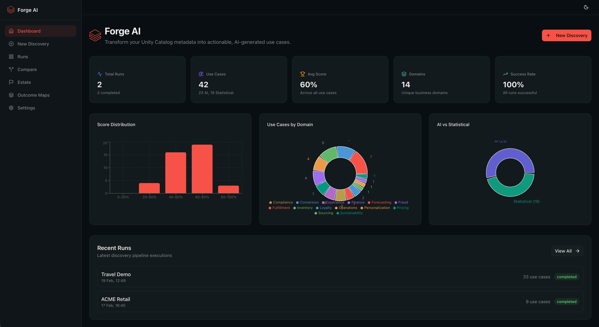

**What you see:**

- **KPI cards** -- total runs, total use cases discovered, average overall score, number of business domains, and pipeline success rate.
- **Business Value summary** -- total estimated value across all runs (links to the Portfolio).
- **Charts** -- score distribution across all use cases, domain breakdown, and AI vs Statistical type split.
- **Recent runs** -- the most recent pipeline runs with status, business name, use case count, and score. Click any row to open the run detail.
- **Activity feed** -- a timeline of recent events (runs started, completed, exports, Genie deployments).

**Actions:**

- Click **Start New Discovery** to go to the configuration form.
- Click **View All** to see the full runs list.
- Click any run row to jump to its results.

> If you have no runs yet, the dashboard shows an empty state with a guided "Configure, Discover, Export" flow.

---

## 3. Starting a New Discovery

Navigate to **New Discovery** in the sidebar to configure and launch a pipeline run.

  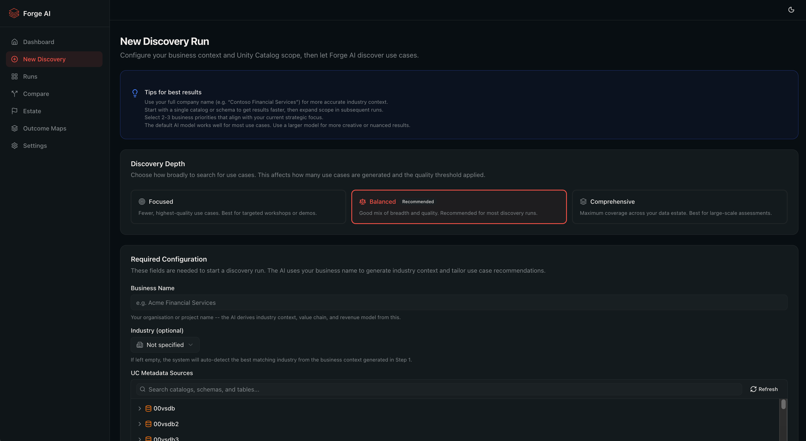

### Required Fields

1. **Business Name** -- the organisation or project name. This is used in all LLM prompts to ground the analysis in your business context.

2. **Unity Catalog Scope** -- which catalogs, schemas, or tables to analyse. You have two modes:

   **Catalog Browser** (recommended) -- browse your Unity Catalog tree, expand catalogs and schemas, and select the scope. Selected items appear as badges below.

  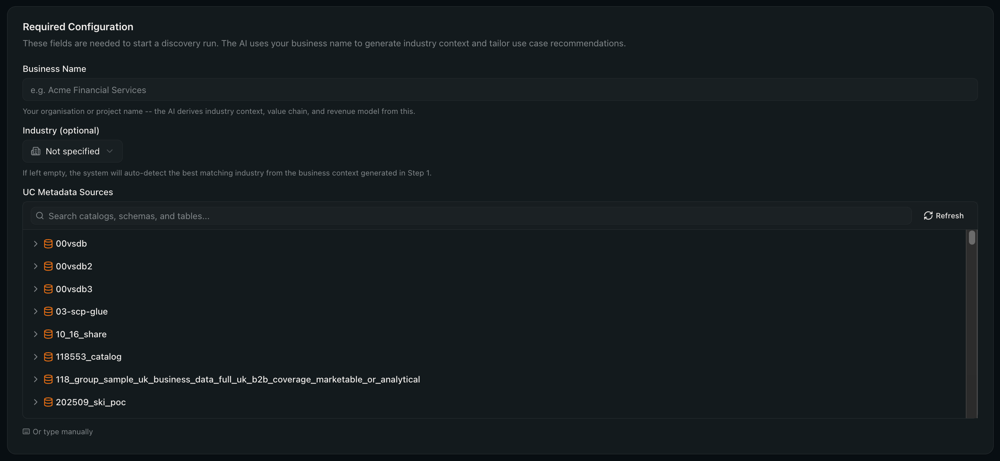

   **Manual mode** -- toggle to manual input and type comma-separated identifiers (e.g. `main.sales, main.finance`).

  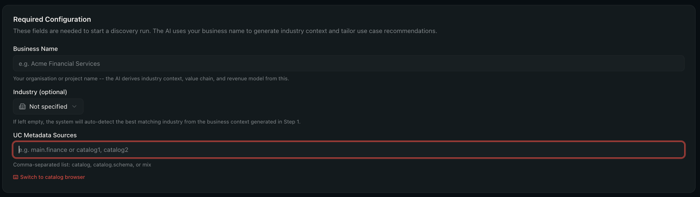

### Discovery Depth

Controls the volume and thoroughness of the analysis.

  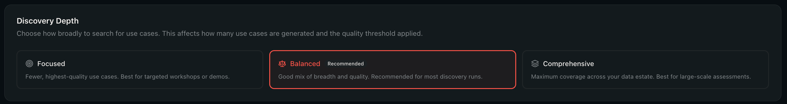

| Depth | Best for | Behaviour |
| --- | --- | --- |
| **Focused** | Quick scans, demos | Fewer use cases, higher quality floor, faster execution |
| **Balanced** | Most workloads (default) | Good balance of coverage and quality |
| **Comprehensive** | Full estate analysis | Maximum use case generation, deeper lineage walking |

### Optional Fields

- **Industry** -- select your industry to auto-suggest relevant business domains and priorities. The pipeline can also auto-detect this from your metadata.
- **Business Priorities** -- multi-select from 10 options (e.g. Increase Revenue, Reduce Cost, Mitigate Risk). These steer scoring so the most strategically aligned use cases rank highest.
- **Business Domains** -- optionally focus the analysis on specific domains (e.g. Finance, Marketing). Suggested domains appear as quick-add buttons; you can also type custom ones.
- **Strategic Goals** -- free-text goals for fine-grained prioritisation (auto-generated if left blank).
- **Document Languages** -- choose which languages the generated documentation should use (default: English).

### Launching the Run

Click **Start Discovery** at the bottom. You will be redirected to the run detail page where you can watch the pipeline execute in real time.

---

## 4. Pipeline Progress

Once a run starts, the run detail page shows a real-time progress view.

  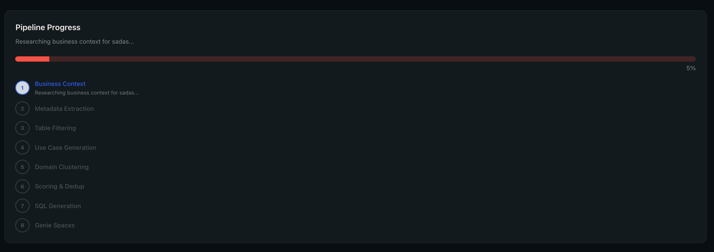

The pipeline has 8 steps, executed sequentially:

| Step | Name | What it does |
| --- | --- | --- |
| 1 | **Business Context** | Generates strategic goals, value chain, and revenue model via the LLM |
| 2 | **Metadata Extraction** | Queries Unity Catalog `information_schema` for tables, columns, and foreign keys |
| 3 | **Table Filtering** | Classifies each table as business-relevant or technical using the LLM |
| 4 | **Use Case Generation** | Generates AI and statistical use cases in parallel batches |
| 5 | **Domain Clustering** | Groups use cases into business domains and subdomains |
| 6 | **Scoring & Dedup** | Scores every use case on priority, feasibility, and impact; removes duplicates |
| 7 | **SQL Generation** | Generates runnable Databricks SQL for each use case |
| 8 | **Business Value Analysis** | Financial quantification, roadmap phasing, executive synthesis, and stakeholder analysis |

**Visual indicators:**

- Green circle with checkmark -- step completed
- Blue pulsing circle -- step currently running (with a status message, e.g. "Filtering tables (batch 3 of 5)...")
- Red circle -- step failed
- Grey circle -- step pending

The progress bar and status message update every few seconds. You do not need to stay on the page -- the pipeline runs server-side and you can return later.

> If a step fails, the error message is displayed and the run status changes to **Failed**. You can review what went wrong and start a new discovery with adjusted settings.

---

## 5. Run Results

When a pipeline run completes, the run detail page shows the full results across multiple tabs: **Overview**, **Use Cases**, **Outcome Map** (if an industry was selected), **Genie Spaces**, **Dashboards**, **Business Value**, and **AI Observability**.

### 5.1 Overview Tab

  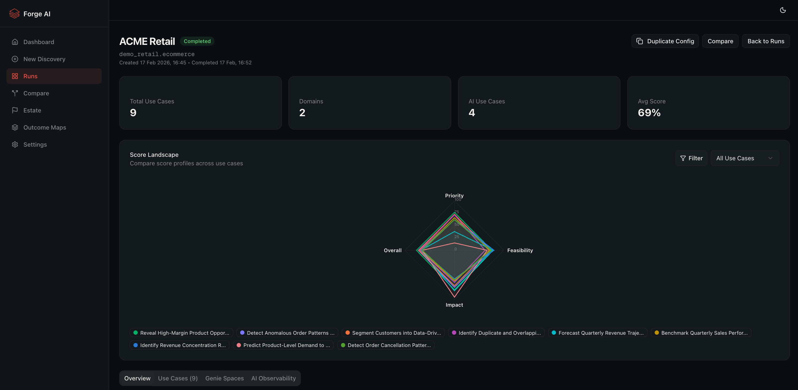

The overview tab provides a high-level summary:

- **Summary cards** -- Total Use Cases, Domains, AI Use Cases, Average Score.
- **Business Context** -- the LLM-generated business context: industries, strategic goals, priorities, value chain, and revenue model.
- **Run Configuration** -- the settings used for this run (depth, model, industry, languages, priorities).

**Charts:**

  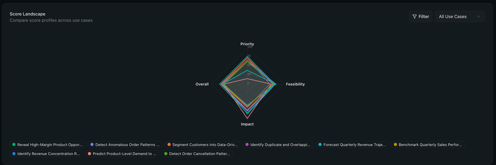

- **Score Distribution** -- histogram of overall scores across all use cases.
- **Domain Breakdown** -- bar chart showing use case counts per business domain.
- **Type Split** -- AI vs Statistical use case breakdown.
- **Pipeline Timeline** -- duration of each pipeline step.

**Schema Coverage:**

  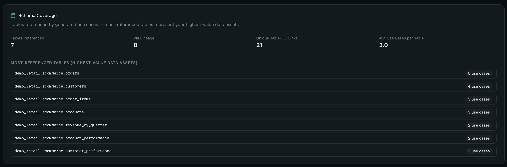

Shows which tables from your Unity Catalog scope are referenced by generated use cases, how many were discovered via lineage, and the most frequently referenced tables.

### 5.2 Use Cases Tab

Click the **Use Cases** tab to see the full table of generated use cases.

  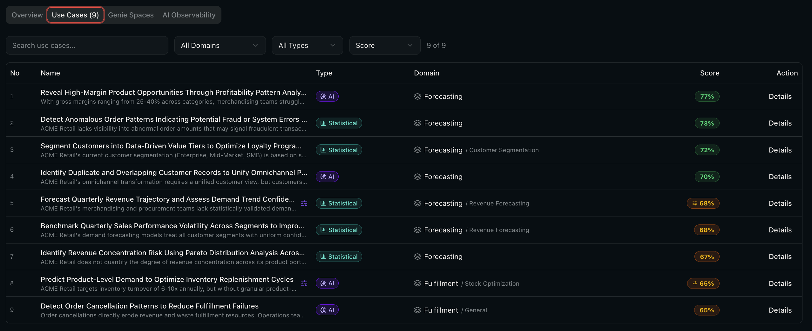

**Filtering and sorting:**

- **Search** -- type to filter by use case name or statement.
- **Domain filter** -- select a specific business domain.
- **Type filter** -- show only AI or Statistical use cases.
- **Sort** -- by overall score, name, or domain.

**Use case detail:**

Click any row to open the detail sheet.

  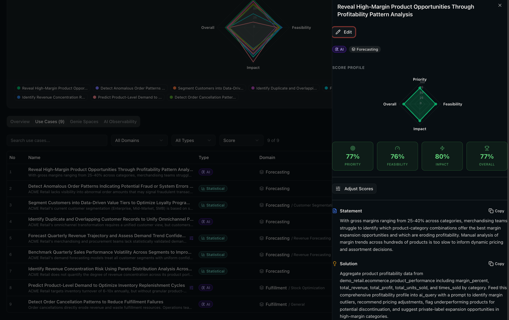

The detail sheet shows:

- **Name** and **type** (AI or Statistical)
- **Problem statement** -- what business problem this use case addresses
- **Solution** -- how the use case solves the problem
- **Business value** -- the expected benefit
- **Beneficiary** and **Sponsor**
- **Analytics technique** (e.g. ai_forecast, anomaly_detection)
- **Tables involved** -- the Unity Catalog tables referenced
- **Scores** -- Priority, Feasibility, Impact, and Overall (0--100)
- **SQL code** -- the generated Databricks SQL query

You can copy any section using the copy buttons.

**Editing use cases:**

Click the **Edit** button to modify the name, statement, or tables involved.

  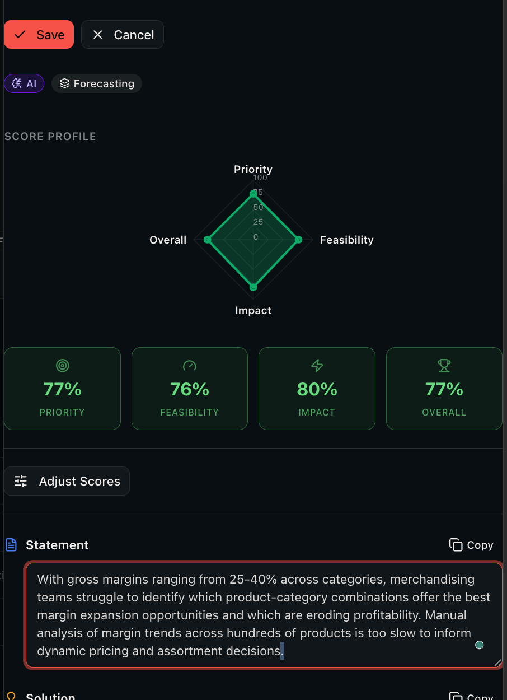

**Adjusting scores:**

Click **Adjust Scores** to override the system-generated scores with your own judgment using the sliders.

  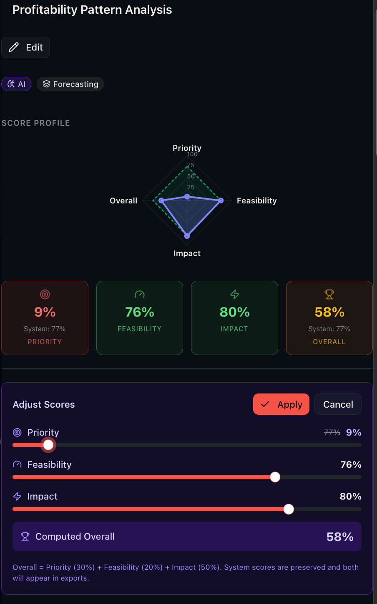

- Drag the **Priority**, **Feasibility**, and **Impact** sliders.
- The **Overall** score updates automatically.
- Click **Apply** to save, or **Reset to System** to revert to the AI-generated scores.

### 5.3 Outcome Map Tab

When you select an industry during configuration, the **Outcome Map** tab appears on the completed run. It shows how your discovered use cases map to the industry's strategic outcomes, highlighting which outcomes are well-covered, partially covered, or have gaps.

  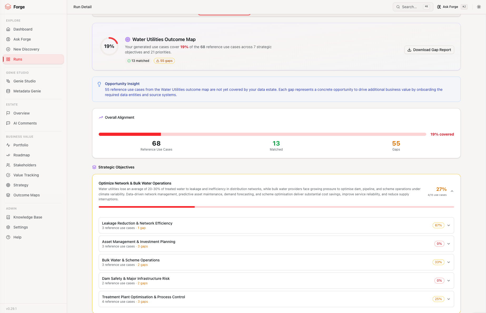

### 5.4 Genie Spaces Tab

The **Genie Spaces** tab shows AI-generated Genie Space recommendations for the run, grouped by business domain.

  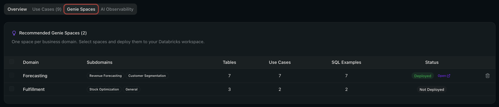

Each recommendation includes a title, table count, and domain. You can:

- **Preview** the space configuration (tables, measures, instructions, trusted assets).
- **Deploy** individual spaces or select multiple and click **Deploy Selected**.
- **Edit engine config** to adjust parameters (max tables, benchmarks, metric views) and re-generate.

This tab also acts as the entry point to the Genie Workbench for per-run Genie Engine management.

### 5.5 Dashboards Tab

The **Dashboards** tab shows AI/BI (Lakeview) dashboard recommendations generated from your use cases and domain metadata.

  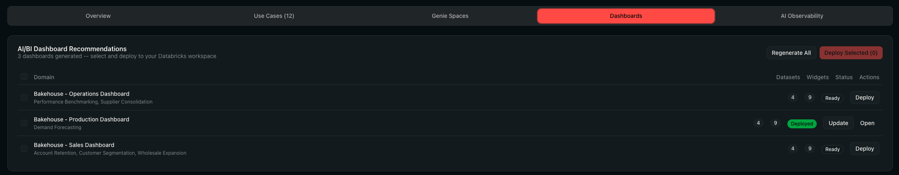

Each recommendation includes a domain, description, and widget summary. You can:

- **Preview** the dashboard layout and widget details.
- **Deploy** to your Databricks workspace as a Lakeview dashboard.
- **Regenerate** a dashboard if you want a different approach.

### 5.6 Business Value Tab

The **Business Value** tab shows per-run financial analysis generated during step 8 of the pipeline.

  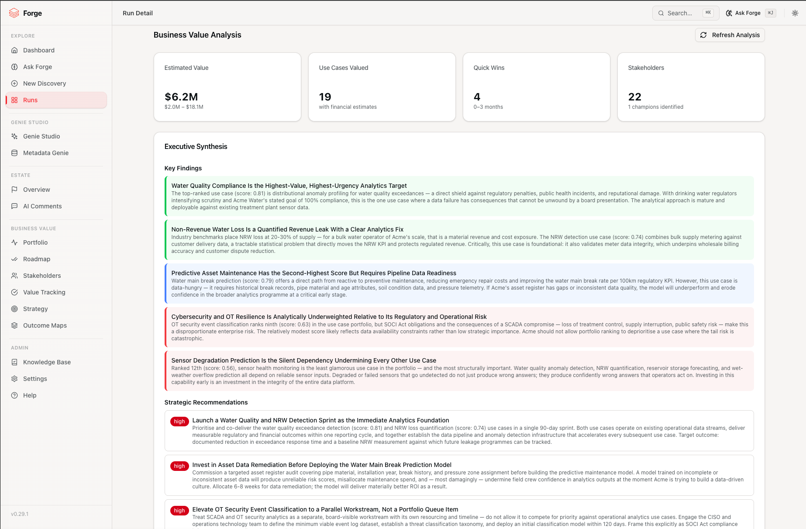

**What you see:**

- **Value summary** -- total estimated value for this run, broken down by category (cost savings, revenue uplift, risk reduction, efficiency gain).
- **Key Findings** -- AI-generated strategic findings from the executive synthesis.
- **Recommendations** and **Risk Callouts** -- extracted from the synthesis.
- **Roadmap phases** -- how many use cases fall into Quick Wins, Foundation, and Transformation.
- **Rerun button** -- re-run the Business Value Analysis step if you have edited or rescored use cases.

For the cross-run portfolio view, see [Section 6: Business Value](#6-business-value).

### 5.7 AI Observability Tab

The **AI Observability** tab provides transparency into every LLM call made during the pipeline run.

  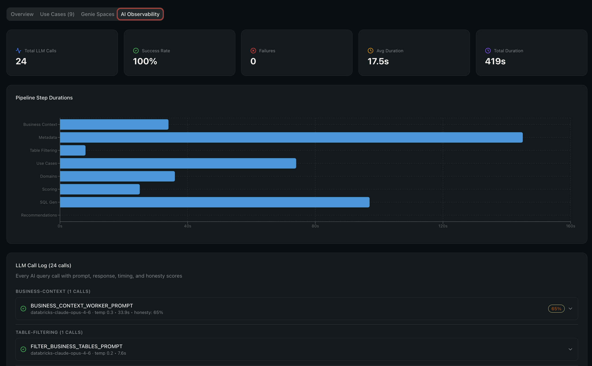

**Summary stats:**

- Total LLM calls, success rate, failure count, average call duration, and total LLM time.

**Prompt logs:**

Each row shows a pipeline step, the prompt template used, status (success/error), and duration. Expand any row to see:

- **Rendered prompt** -- the full prompt sent to the model (with your business context and metadata injected).
- **Raw response** -- the LLM's response.
- **Error details** -- if the call failed, the error message.

> This is useful for debugging unexpected results, understanding why certain use cases were generated, or tuning prompt quality.

### 5.8 Exporting Results

The export toolbar is available in the run detail header.

  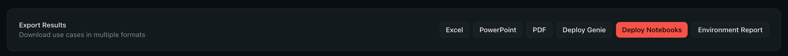

| Export | What you get |
| --- | --- |
| **Excel** | Multi-sheet workbook with summary, all use cases (filterable), domain breakdown, and business value sheets |
| **PowerPoint** | Presentation deck with title slide, executive summary, domain breakdown, top use cases, and optional synthesis slides (findings, recommendations, risks) |
| **PDF** | Branded A4 landscape report with cover page, executive summary, domain pages, and individual use case pages |
| **Deploy Notebooks** | One SQL notebook per domain, deployed to your Databricks workspace |
| **Environment Report** | Excel export of the linked estate scan (if one was run) |

> Notebook deployment creates folders in your workspace at the configured path (default: `./forge_gen/`). A toast notification with a link to the workspace folder appears on success.

For portfolio-level exports (cross-run), see [Section 6.7: Portfolio Exports](#67-portfolio-exports).

---

## 6. Business Value

The **Business Value** section provides financially-grounded analysis across all your pipeline runs. Access it from the sidebar under the **Business Value** section.

### 6.1 Portfolio

Navigate to **Portfolio** in the sidebar.

  

The portfolio aggregates business value data from all completed runs into a single view.

**What you see:**

- **Hero cards** -- Total Estimated Value, Quick Wins value, Delivered Value, and total Use Case count.
- **Portfolio Velocity** -- a conversion funnel showing how many use cases have moved from Discovered through to Measured, with conversion and realisation rates.
- **Strategic Themes** -- the top domains by estimated value.
- **Phase Distribution** -- breakdown across Quick Wins, Foundation, and Transformation.
- **Domain Heatmap** -- each domain with average score, feasibility, use case count, and value.

**Drill-down:**

Click any domain or phase card to expand and see the individual use cases within it, including value estimates and phase badges. Vote buttons are available in the drill-down view (see [6.6 Use Case Voting](#66-use-case-voting)).

### 6.2 Implementation Roadmap

Navigate to **Roadmap** in the sidebar.

  

The roadmap shows all use cases assigned to delivery phases:

- **Quick Wins** -- achievable in weeks with existing capabilities.
- **Foundation** -- requires months of work, possibly new data or processes.
- **Transformation** -- multi-quarter initiatives that reshape how the business operates.

Each phase includes a bar chart, effort estimates, dependencies, and enablers. Click a phase to drill down into its use cases.

### 6.3 Stakeholder Intelligence

Navigate to **Stakeholders** in the sidebar.

  

**What you see:**

- **Recommended Champions** -- the top 6 stakeholders identified as potential champions based on department alignment and use case coverage.
- **Department Impact** -- a table showing each department's estimated value, use case count, and complexity.
- **Skills Assessment** -- the distribution of use case types (AI, statistical, analytical) to inform team capability planning.

Click any stakeholder to expand and see the linked use cases.

### 6.4 Value Tracking

Navigate to **Value Tracking** in the sidebar.

  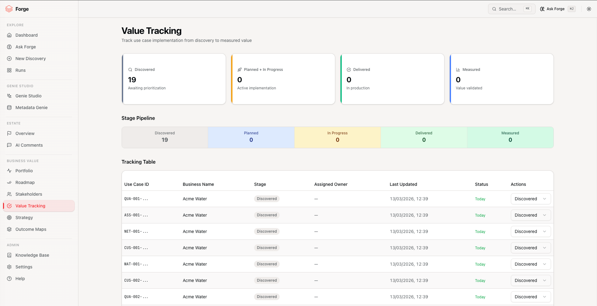

Track every use case through its lifecycle:

- **Scorecard** -- counts of use cases at each stage (Discovered, Planned, In Progress, Delivered, Measured).
- **Stage pipeline bar** -- a visual representation of the lifecycle funnel.
- **Tracking table** -- every use case with its current stage, owner, and days since last update.

**Actions in the table:**

- **Change stage** -- use the dropdown on each row to move a use case between stages.
- **Edit owner** -- click the pencil icon to assign or change ownership.
- **Stalled indicators** -- use cases with no stage change in 14+ days are highlighted in amber with a "Stalled" badge.

> Use Value Tracking to demonstrate progress from discovery through delivery. The stalled indicators help identify blockers before they become invisible.

### 6.5 Strategy Alignment

Navigate to **Strategy** in the sidebar.

  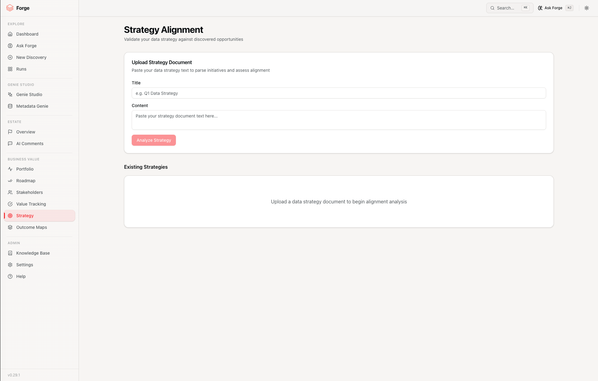

Upload your organisation's strategy documents and see how discovered use cases align to strategic initiatives.

**Workflow:**

1. Click **Upload Strategy** and paste the text of your strategy document.
2. The LLM parses it into structured initiatives.
3. Each initiative shows an alignment badge: **Supported** (discovered use cases directly address it), **Partial** (related but not fully covered), or **Blocked** (no matching use cases found).
4. Click any initiative to see which use cases support it.

You can upload multiple strategy documents and delete them individually.

### 6.6 Use Case Voting

Workshop-style voting is available in the **Portfolio drill-down** view. Each use case has a vote button that team members can use to signal which opportunities they consider highest priority.

Voting blends data-driven AI scores with human judgement, making it ideal for collaborative prioritisation workshops.

### 6.7 Portfolio Exports

The Portfolio page includes an **Export** dropdown with four formats:

| Export | Description |
| --- | --- |
| **Portfolio Excel** | 8-sheet workbook: Executive Summary, Key Findings, Recommendations, Risk Callouts, Domain Performance, Delivery Pipeline, Use Cases with ROI, Stakeholders |
| **Portfolio PowerPoint** | 8-slide Databricks-branded deck with KPIs, findings, recommendations, risks, pipeline, domains, and stakeholders |
| **Executive PDF** | 2-page brief: Page 1 has KPIs, findings, and recommendations; Page 2 has pipeline chart, domain heatmap, and risks |
| **D4B Workshop Pack** | 5-section workshop deck: Case for Change, Executive Findings, Delivery Roadmap, Recommended Genie Spaces, Workshop Agenda |

These exports aggregate data across all runs, making them suitable for executive briefings and steering committees.

---

## 7. Genie Studio

**Genie Studio** is the unified hub for creating, managing, and continuously improving [Databricks Genie Spaces](https://docs.databricks.com/en/genie/index.html). Navigate to **Genie Studio** in the sidebar.

### 7.1 Creating Genie Spaces

Forge provides five ways to create a Genie Space, depending on your starting point.

**Scan Schema:** Navigate to **Genie Studio > Create > Scan Schema**. Select a catalog and schema, optionally provide a business context hint, and click **Scan**. Forge profiles the tables, selects the most relevant ones via the LLM, and builds a production-grade space. You can review and adjust the selected tables before generating.

  

**Upload Requirements:** Navigate to **Genie Studio > Create > Upload Requirements**. Drop in a PDF, markdown, or text document that describes what you need. Forge extracts tables, questions, SQL patterns, join hints, and instructions, then generates a space that matches your brief.

  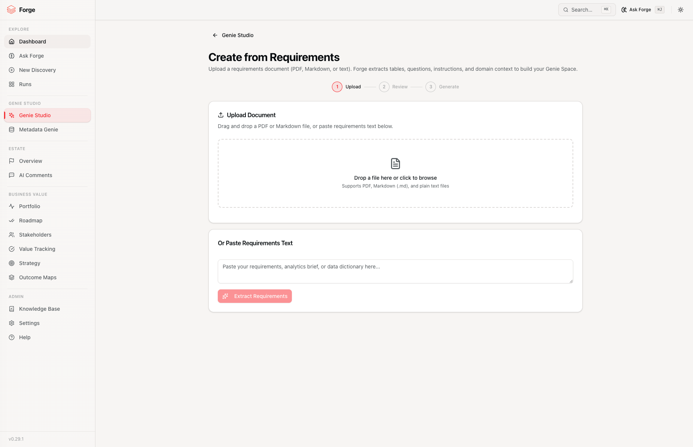

**Describe Your Space:** Click **Describe Your Space** from the Genie Studio hub to open Ask Forge in Genie Builder mode. Describe what you need in plain language. The assistant gathers requirements through conversation and builds the space for you.

**Pipeline Run:** From any completed pipeline run, open the **Genie Spaces** tab. The Genie Engine generates domain-based recommendations automatically. Preview, edit the engine config, and deploy the spaces you want.

**Import JSON:** Click **Import JSON** on the Genie Studio hub and paste the JSON of any existing Genie Space. Forge analyses it, runs a health check, and shows improvement recommendations.

### 7.2 The Genie Studio Hub

The main Genie Studio page shows all your Genie Spaces in a card layout.

  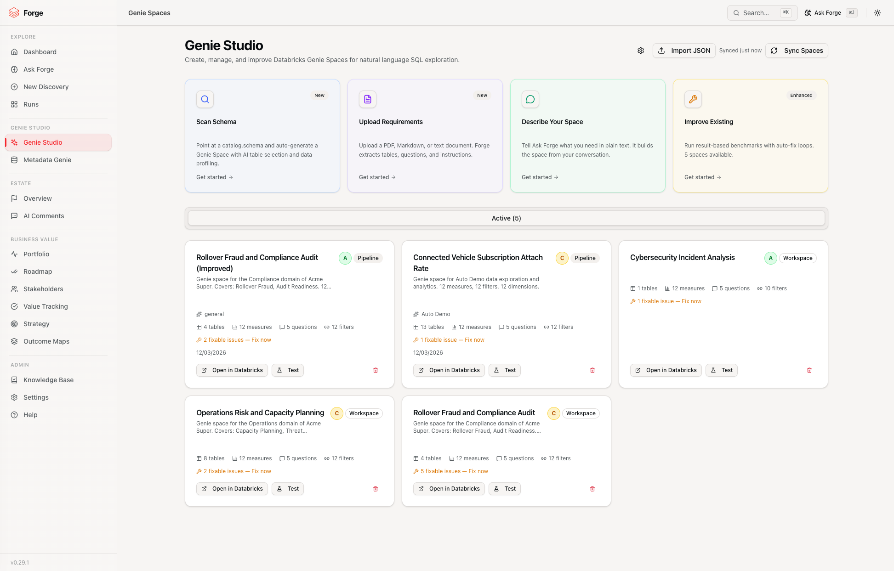

Each card shows:

- **Space name** and domain
- **Table and measure counts**
- **Health grade** (A--F) with colour coding
- **Source** -- whether the space was created from a pipeline, a schema scan, Ask Forge, or synced from the workspace

**Actions:**

- **Search** and **sort** (by health score, name, or table count).
- **Sync Spaces** -- pull Genie Spaces from your Databricks workspace into Forge for health scoring and improvement.
- **Create** entry point cards at the top for each creation path.
- Click any card to open the space detail view.

### 7.3 Space Detail View

Click into any space to see the full detail view with tabs:

- **Overview** -- title, description, tables, measures, filters, expressions, joins, instructions, sample questions, and trusted assets.
- **Health** -- the full health report with category breakdowns and fixable issue indicators.
- **Benchmarks** -- the test runner for evaluating query accuracy.

  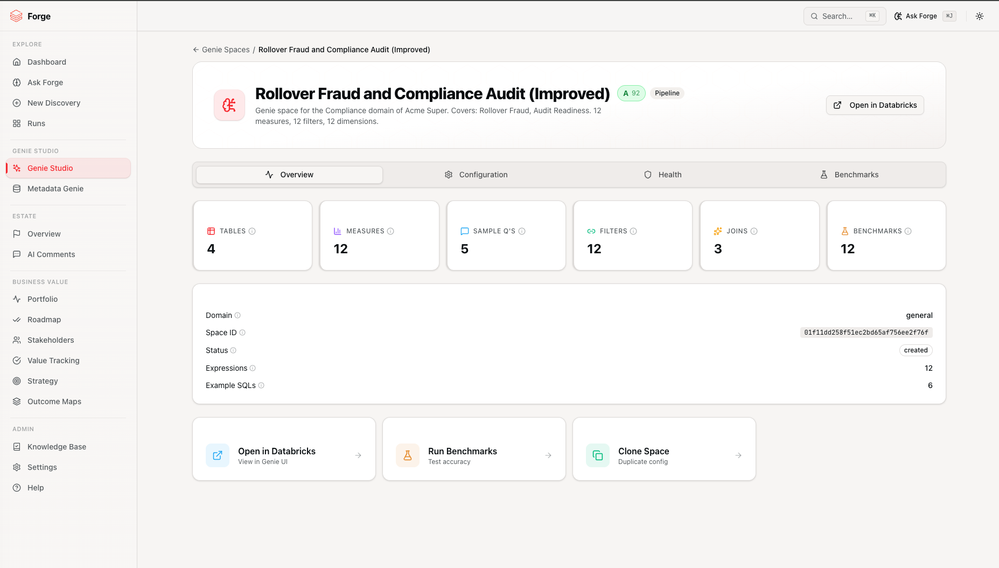

The detail view header provides **Deploy**, **Open in Databricks**, **Clone**, and **Trash** actions.

### 7.4 Health Scoring

Every Genie Space receives a health grade (A--F) computed from approximately 40 deterministic checks across 4 categories:

- **Data Sources** -- column configurations, column descriptions, table count within optimal range.
- **Instructions** -- join comments, example SQL usage guidance, text instructions.
- **Semantic Richness** -- measures, filters, and expressions with display names, comments, synonyms, and instructions.
- **Quality Assurance** -- benchmark questions, SQL quality, parameterised queries.

  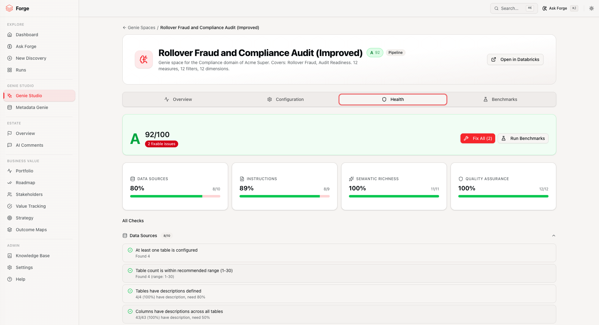

Click any category to expand and see individual check results, including the current value versus the required threshold.

**Quick wins** are surfaced at the top -- these are the checks with the highest score impact that can be fixed automatically.

### 7.5 Fix Workflow

Click **Fix** on any failing check or **Fix All** on the space to address fixable failures automatically. The fix system runs targeted engine passes:

- **Column intelligence** -- adds display names, comments, and descriptions.
- **Semantic expressions** -- generates missing measures, filters, and dimensions.
- **Trusted assets** -- creates parameterised example queries.
- **Join inference** -- adds comments explaining join relationships.
- **Benchmark generation** -- creates test questions for quality assurance.

After fixes are generated, an **Optimisation Review** shows the proposed changes in a diff preview. You can accept, discard, or clone the space with changes applied.

### 7.6 Improve with Genie Engine

For deeper improvements, click **Improve with Engine** to run the full multi-pass Genie Engine against an existing space. A progress banner appears showing:

- Current pass name and progress percentage.
- Status message describing what is happening.
- **Cancel** button to abort.

The banner remains visible across all tabs. After completion, the Optimisation Review shows all proposed changes for your approval.

### 7.7 Benchmark Test Runner

Navigate to the **Benchmarks** tab on any space to test Genie query accuracy.

  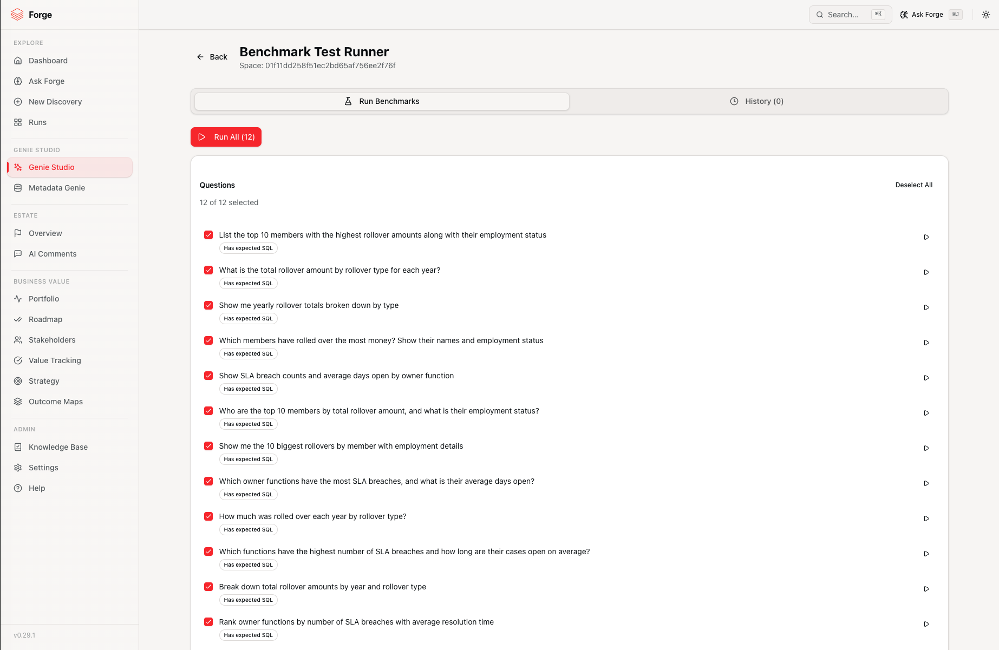

**Running tests:**

1. Select individual questions or click **Run All** to test every benchmark.
2. The button shows real-time progress (e.g. "Running 3/12...").
3. Each test sends the question to the Databricks Genie Conversation API and compares the result.

**Evaluation tiers:**

1. **High SQL similarity** (>=90%) -- the generated SQL closely matches the expected SQL.
2. **Result-set comparison** -- column count and row count match expectations.
3. **Basic SQL similarity** (>=60%) -- fallback threshold for structural similarity.

**Failure diagnostics:**

Failed tests display the failure category (e.g. wrong_tables, missing_join, wrong_aggregation), comparison method, SQL similarity score, and failure reason. Use these diagnostics to guide fixes.

**Improve from benchmarks:**

After labelling benchmark results as correct or incorrect (with optional feedback), click **Improve** to generate targeted fixes based on the failure patterns. The fixes go through Optimisation Review before applying.

### 7.8 Auto-Improve

Navigate to **Genie Studio > Improve Existing** to see all spaces with health scores and fixable issue counts.

  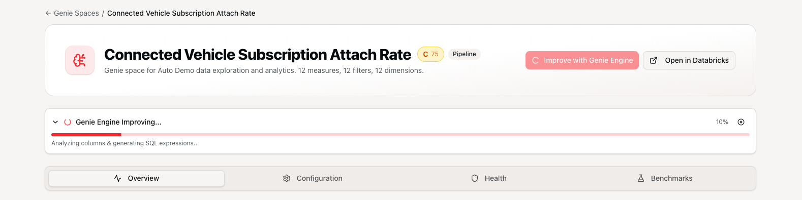

Select a space and click **Auto-Improve** to start an iterative improvement loop:

1. Run benchmarks against the deployed space.
2. Analyse failures and generate targeted fixes.
3. Apply fixes and re-run benchmarks.
4. Repeat until the target score is met (default: 80%) or the maximum iterations are reached (default: 5).

Progress is shown in real time with toast notifications on completion.

### 7.9 Workspace Sync

Click **Sync Spaces** on the Genie Studio hub to pull all Genie Spaces from your Databricks workspace into Forge. Sync runs in the background and updates the space listing with metadata and health scores. This lets you health-check and improve spaces that were created outside of Forge.

---

## 8. Ask Forge

Navigate to **Ask Forge** in the sidebar to open the conversational AI assistant.

  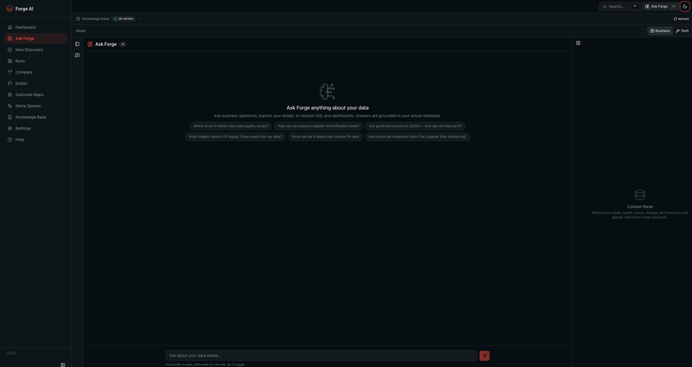

Ask Forge is a RAG-powered assistant with context from your data estate, pipeline results, Knowledge Base documents, and Genie recommendations. It supports streaming responses with rich markdown formatting.

**What you can do:**

- **Ask questions** about your data, discovered use cases, business value, or data estate.
- **Propose SQL** -- the assistant can generate SQL and validate it with EXPLAIN before suggesting execution.
- **Create Genie Spaces** -- when you reference tables in conversation, the assistant can propose and build a Genie Space on the spot.
- **Deploy dashboards and notebooks** -- trigger deployment actions directly from the chat.
- **Explore findings** -- ask follow-up questions to drill into specific domains, use cases, or strategy alignment.

**Features:**

- **Conversation history** -- a ChatGPT-style sidebar lists previous conversations. You can rename or delete them.
- **Context panel** -- a slide-out panel shows the tables, sources, and enrichments the assistant used to generate its answer.
- **Action cards** -- clickable cards in responses let you navigate to relevant pages (e.g. View Portfolio, View Stakeholders, View Roadmap).

> Ask Forge requires an embedding endpoint to be configured (see Settings). It uses your Knowledge Base documents and pipeline data to provide grounded, contextual answers.

---

## 9. AI Comments

Navigate to **AI Comments** under **Estate** in the sidebar.

  

AI Comments generates industry-aware table and column descriptions for Unity Catalog, optimised for Genie Space discoverability and general metadata quality.

**Workflow:**

1. **Create a job** -- select the catalog/schema scope and optionally set the industry.
2. **Generate** -- the engine runs in four phases: schema context analysis, table comments, column comments, and consistency review. Progress streams in real time.
3. **Review** -- browse tables in the left navigator. For each table, see old-vs-new comments side by side. Accept, reject, or edit individual proposals.
4. **Apply** -- click **Apply All** (or apply per-table) to execute DDL against Unity Catalog. The original comments are saved so you can **Undo** if needed.

**Pre-flight check:**

Before applying, Forge runs a permissions check (`SHOW GRANTS`) to verify you have the required `MODIFY` privileges on the target schemas.

> Running AI Comments before creating Genie Spaces significantly improves space health scores, because well-documented columns produce better semantic expressions and instructions.

---

## 10. Estate Intelligence

Navigate to **Overview** under **Estate** in the sidebar. Estate Intelligence provides a holistic view of your Unity Catalog data estate, independent of discovery runs.

### Starting a Scan

Click **New Scan** and use the Catalog Browser to select which catalogs or schemas to scan.

  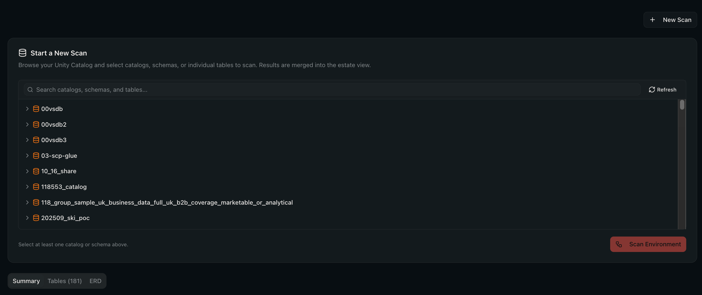

Click **Scan Environment** to start. The scan runs through several phases: listing tables, fetching metadata (DESCRIBE DETAIL/HISTORY), walking lineage, enriching with LLM intelligence, scoring health, and saving results.

### Aggregate View

The aggregate view merges data from all scans to give you the latest picture of every table.

**Summary tab:**

  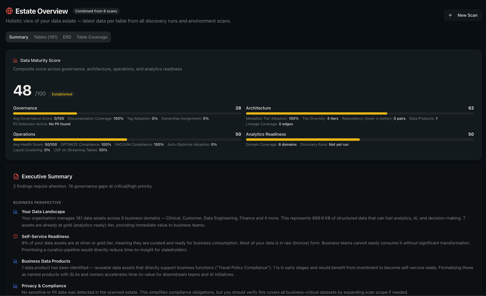

- **Data Maturity Score** -- a composite 0--100 score across four pillars: Governance (documentation, tags, ownership, PII detection), Architecture (medallion tiers, redundancy, data products, lineage), Operations (health, OPTIMIZE/VACUUM, auto-optimize, clustering), and Analytics Readiness (use case density, schema coverage, domain coverage).
- **Maturity level** -- Foundational, Developing, Established, Advanced, or Leading.
- **Executive Summary** -- AI-generated business and technical findings about your data estate.
- **Stats** -- total tables, total size, total rows, domains, average governance score, PII table count.
- **Scan trends** -- how metrics have changed across scans (when you have 2 or more).

**Tables tab:**

  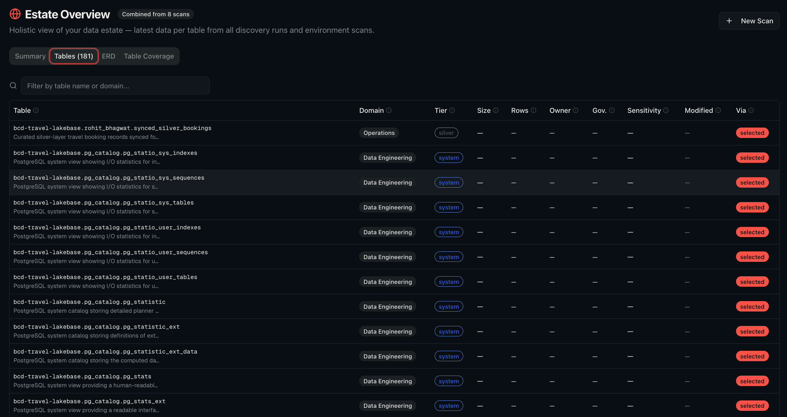

A searchable, sortable list of every table in your estate with domain, tier (gold/silver/bronze), size, rows, owner, governance score, sensitivity level, last modified date, and discovery source.

**ERD tab:**

  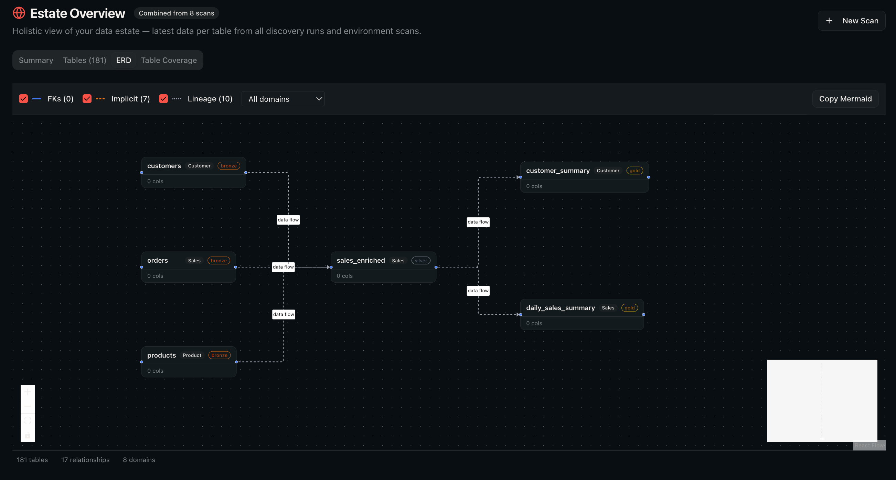

An interactive entity-relationship diagram showing tables as nodes and foreign key / lineage relationships as edges.

**Table Coverage tab:**

Links estate tables to discovered use cases from your pipeline runs. Tables with no use cases are highlighted as "untapped" opportunities.

**Exporting:**

From a single scan view, click **Download Excel Report** to get a comprehensive 12-sheet workbook covering executive summary, inventory, domains, PII, relationships, redundancy, governance, health, and lineage.

---

## 11. Industry Outcome Maps

Navigate to **Outcome Maps** under **Business Value** in the sidebar.

  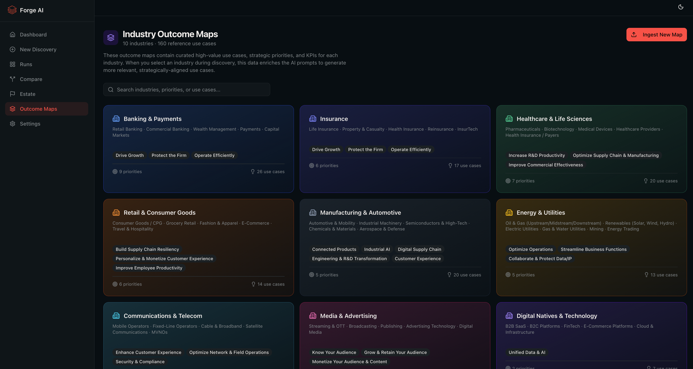

Outcome maps are curated reference frameworks for specific industries. Each map contains strategic objectives, business priorities, and reference use cases that guide the discovery pipeline.

**Browsing maps:**

- Search by industry name, priority, or use case.
- Click an industry card to see its detail view.

  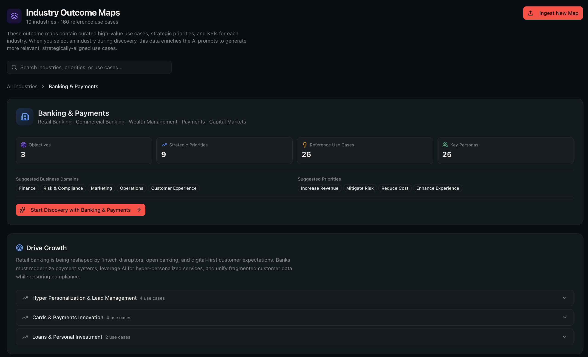

The detail view shows:

- **Objectives** -- strategic business objectives for the industry.
- **Priorities** -- expandable sections with associated reference use cases, KPIs, and target personas.
- **Reference use cases** -- examples of what the pipeline should generate for this industry.

**Using an outcome map:**

Click **Start Discovery with [Industry]** to go to the New Discovery form with that industry pre-selected. The pipeline will use the outcome map to guide use case generation and scoring.

**Ingesting new maps:**

Click **Ingest New Map** to upload a markdown-formatted outcome map. The AI parses it into structured objectives, priorities, and use cases. You can review and edit before saving.

---

## 12. Knowledge Base

Navigate to **Knowledge Base** under **Admin** in the sidebar.

  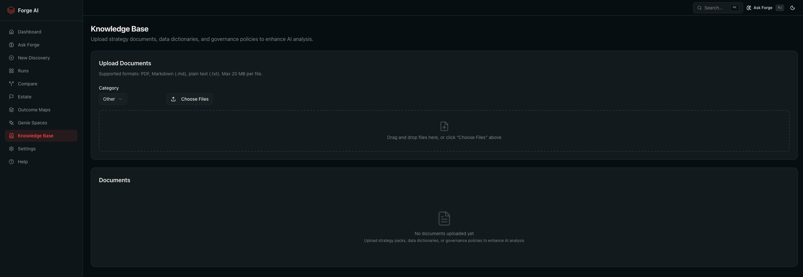

The Knowledge Base lets you upload documents that enrich the AI context used by Ask Forge, the pipeline, and the Genie Engine.

**Supported formats:** PDF, Markdown, and plain text.

**Categories:** Strategy Pack, Data Dictionary, Governance Policy, Architecture Docs, Other.

**Workflow:**

1. Drag and drop files or use the file picker.
2. Forge chunks the document (512 tokens, 64-token overlap), generates embeddings, and stores them in the vector index.
3. The document appears in the list with a status badge: **Processing**, **Ready**, or **Failed**.
4. Once ready, the document's content is available for RAG retrieval across the app.

**Integration:**

- **Ask Forge** retrieves relevant chunks when answering questions.
- **Pipeline** uses knowledge base context during use case generation and scoring.
- **Genie Engine** draws on uploaded documents for richer instructions and trusted assets.
- **Strategy Alignment** can reference uploaded strategy documents.

> The Knowledge Base requires an embedding endpoint to be configured (see Settings).

---

## 13. Comparing Runs

Navigate to **Runs** in the sidebar, then click **Compare Runs** (requires at least 2 completed runs).

  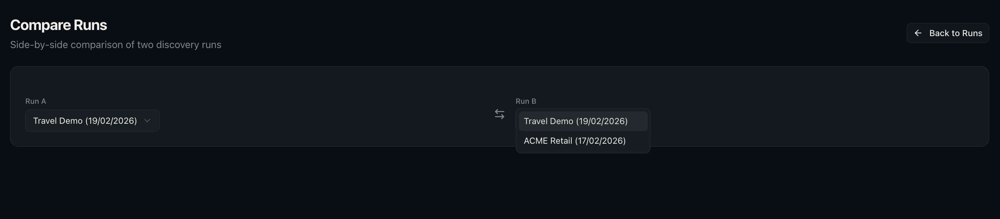

**How to compare:**

1. Select **Run A** and **Run B** from the dropdowns (only completed runs are shown).
2. The page shows a side-by-side comparison:
   - **Metrics** -- use case count, average score, domain count, AI vs Statistical counts, with diff indicators.
   - **Use case overlap** -- how many use cases are unique to Run A, shared between both, and unique to Run B. Shared use cases are listed by name.
   - **Configuration differences** -- business name, UC metadata, AI model, priorities, and languages, highlighted when they differ.

> Comparing runs is useful after changing the scope, depth, or model to see what improved.

---

## 14. Managing Runs

Navigate to **Runs** in the sidebar.

  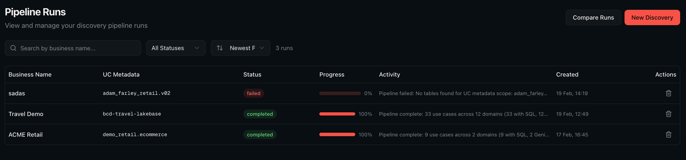

**Features:**

- **Search** -- filter runs by business name.
- **Status filter** -- show All, Completed, Running, Pending, or Failed runs.
- **Sort** -- by date (newest/oldest) or by name.
- **Pagination** -- 15 runs per page.

**Actions:**

- Click any row to open the run detail.
- Click the **trash icon** to delete a run (with confirmation dialog). This permanently removes the run and all its use cases.
- Click **New Discovery** to start a new run.
- Click **Compare Runs** to go to the comparison page (requires at least 2 completed runs).

**Run header actions** (on the run detail page):

- **Duplicate Config** -- copies the run's configuration and opens the New Discovery form with all fields pre-filled. Useful for re-running with minor tweaks.
- **Compare** -- opens the Compare page with this run pre-selected.

---

## 15. Settings

Navigate to **Settings** under **Admin** in the sidebar.

  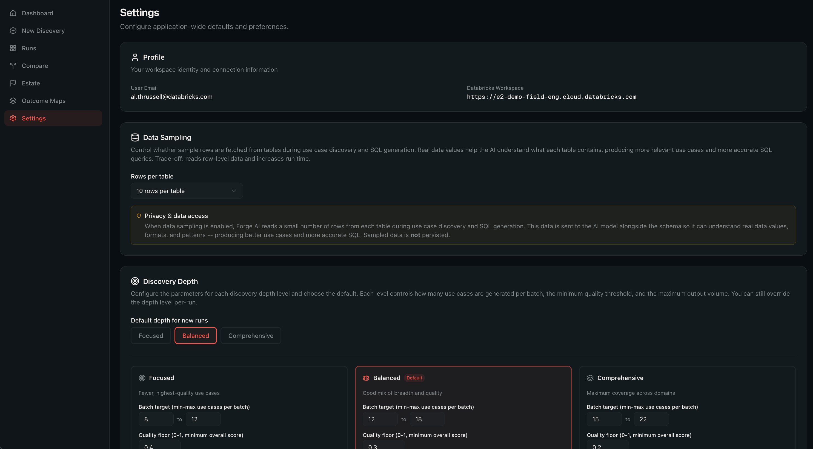

### Profile

Shows your user email and the Databricks workspace host the app is connected to.

### Data Sampling

Configure how many rows per table to sample during discovery and SQL generation.

| Setting | Effect |
| --- | --- |
| **0 (disabled)** | Metadata only -- no row-level data is read (most private) |
| **5--50 rows** | Sample rows are sent to the AI model for improved SQL accuracy |

> When sampling is enabled, row-level data is sent to the AI model but is never persisted. It exists only in memory during the generation step.

### Estate Scan

Configure estate intelligence options:

- **Estate Scan Enabled** -- enable or disable the estate scanning capability.
- **Asset Discovery Enabled** -- enable discovery of data products and assets during scans.
- **Benchmarks Server Enabled** -- enable server-side benchmark evaluation for Genie Spaces.

### Semantic Search and RAG

Configure the embedding and vector search capabilities that power Ask Forge and the Knowledge Base:

- **Semantic Search Enabled** -- enable or disable RAG-powered features.
- **Embedding Count** -- shows the number of embeddings currently stored.
- **Rebuild Embeddings** -- re-index all pipeline data and knowledge base documents.

> This section only appears when an embedding endpoint is available.

### Discovery Depth Defaults

Set the default discovery depth and fine-tune per-depth parameters:

- **Batch target** (min/max) -- how many use cases per batch the LLM generates.
- **Quality floor** -- minimum score threshold below which use cases are filtered out.
- **Adaptive cap** -- maximum total use cases per run.
- **Lineage depth** -- how many hops to walk in the data lineage graph.

Each depth (Focused, Balanced, Comprehensive) has independent defaults. Click **Reset** to restore factory settings.

### Genie Engine Defaults

Configure default behaviour for Genie Space generation:

- **Genie defaults** -- max tables, benchmark count, metric views, time periods, trusted assets, and other engine parameters.
- **Deploy auth mode** -- how Genie Spaces authenticate when deployed.
- **Question complexity** -- the complexity level of auto-generated benchmark questions.
- **Metric Views server enabled** -- enable metric view generation as part of the Genie Engine.

### Export and Naming

- **Default export format** -- which format is pre-selected when you export (Excel, PDF, PowerPoint, or Notebooks).
- **Notebook deployment path** -- the workspace folder where SQL notebooks are deployed (default: `./forge_gen/`).
- **Catalog resource prefix** -- prefix for deployed resources in Unity Catalog.

### About

Shows the current version, application name, and runtime environment.

### Data Management

- **Clear local settings** -- reset all browser-local preferences to defaults. Your Lakebase data (runs, use cases) is not affected.
- **Delete all data** -- factory reset that removes all runs, use cases, Genie data, business value data, and estate scans from Lakebase. Use with caution.

---

## 16. Tips and Best Practices

### Choosing the Right Scope

- **Start small** -- begin with a single schema to understand the output quality before scanning your entire catalog.
- **Business-relevant schemas** -- focus on schemas that contain business data rather than system or staging tables. The table filtering step will remove technical tables, but a tighter scope means faster runs and more relevant results.
- **Multiple catalogs** -- you can select across catalogs in a single run. Use this when business data spans multiple catalogs.

### Discovery Depth

- **Focused** is ideal for demos, quick assessments, or when you only have a few schemas. Runs complete in minutes.
- **Balanced** is the default and works well for most production workloads. Good balance of breadth and quality.
- **Comprehensive** generates the most use cases but takes longer and may require score adjustment to surface the best results. Use this for full estate analysis.

### Improving Results

- **Set business priorities** -- the more priorities you select, the better the scoring aligns with your strategic goals.
- **Add business domains** -- if you know what domains matter (e.g. Finance, Customer, Supply Chain), adding them helps the clustering step produce cleaner groups.
- **Select an industry** -- choosing an industry outcome map provides reference use cases that steer generation toward industry-specific patterns.
- **Enable data sampling** -- even 5 rows per table significantly improves SQL accuracy by giving the LLM real column values and data patterns.

### Working with Results

- **Adjust scores** -- the AI scores are a starting point. Use the score sliders to reflect your team's priorities and knowledge. User-adjusted scores override the system scores in all exports.
- **Edit use cases** -- refine names and statements to match your organisation's terminology before exporting.
- **Compare runs** -- run the same scope with different depths or models, then compare to find the best configuration for your data.
- **Use voting** -- run a prioritisation workshop with your team using the Portfolio drill-down. Combining AI scores with stakeholder votes produces better alignment.

### Business Value

- **Review per-run first** -- check the Business Value tab on a run to verify findings before looking at the cross-run portfolio.
- **Upload strategy** -- adding a strategy document makes the alignment analysis much more valuable. Without it, you only get financial estimates and roadmap phasing.
- **Track progress** -- update the Value Tracking page regularly to show leadership that discovery is translating into delivery.
- **Export for executives** -- use the Portfolio PowerPoint or Executive PDF for steering committee updates. Use the D4B Workshop Pack for field-led workshops.

### Genie Studio

- **Run AI Comments first** -- generating column descriptions before creating Genie Spaces dramatically improves health scores and Genie query accuracy.
- **Start with Scan Schema for ad-hoc needs** -- if you know the schema, Scan Schema is the fastest path to a working space.
- **Use Ask Forge for exploratory builds** -- describe what you need in conversation and let the assistant build the space for you.
- **Sort by health score** -- on the Improve page, sort by health score (worst first) to quickly find spaces that need attention.
- **Use Fix All before manual edits** -- the automated fix strategies handle most common issues. Apply them first, then fine-tune manually.
- **Run benchmarks after fixes** -- after Fix All or Engine Improve, run the benchmark test suite to verify accuracy improved.
- **Sync workspace spaces** -- bring in existing Genie Spaces for health scoring to find quick improvement opportunities.

### Ask Forge

- **Upload context first** -- add relevant documents to the Knowledge Base and run at least one pipeline before using Ask Forge. The more context available, the better the answers.
- **Use action cards** -- when the assistant suggests actions (View Portfolio, Deploy Notebook), click them to navigate directly.
- **Build Genie Spaces conversationally** -- reference specific tables in your question and the assistant will offer to create a space.

### Estate Intelligence

- **Run estate scans regularly** -- scanning builds a historical view of your data estate. With 2+ scans, the dashboard shows trends in table counts, governance, and data maturity.
- **Use Table Coverage** -- after running both an estate scan and a discovery, the Table Coverage tab highlights tables that are not yet covered by any use case -- these are untapped opportunities.
- **Monitor Data Maturity** -- the maturity score gives leadership a single number to track improvement over time.

---
*For deployment and configuration, see the [Deployment Guide](DEPLOYMENT.md). For the value proposition, see the [Home page](index.md).*
